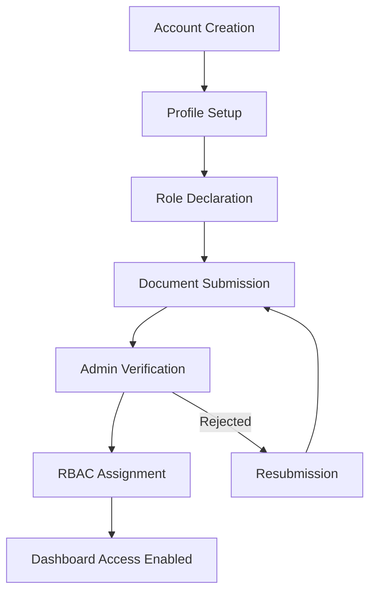
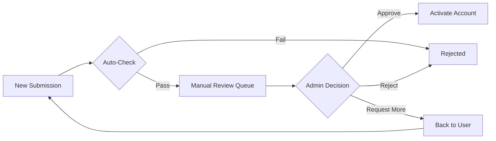

<<<<<<< HEAD
# 🧩 VendorConnect – Registration & Verification Workflow

*Multi-Stage | Role-Driven | Compliance-Ready*

---

## 🎯 OBJECTIVE

Create a secure, auditable, role-based onboarding system where:

✅ **Anyone can start registration**  
✅ **No operational access is granted until identity + role are verified**  
✅ **RBAC activates only after approval**  
✅ **Vendors can onboard from mobile devices on site**  
✅ **Admin retains full control & legal accountability**

---

## 🔐 HIGH-LEVEL FLOW (OVERVIEW)



**Stages:**
1. Account Creation (Login Identity)
2. Basic Profile Setup
3. Role-Specific Detail Collection
4. Document Submission & Consent
5. Super Admin Verification (Critical)
6. Role Confirmation & RBAC Activation
7. First-Time Dashboard Onboarding

---

## 🟦 STAGE 1: ACCOUNT CREATION (LOGIN IDENTITY)

### Purpose
Create a basic system identity, **not a role**.

### Data Collected
- ✅ Full Name
- ✅ Email (Primary Identifier)
- ✅ Mobile Number
- ✅ Password (min 8 chars, complexity rules)
- ✅ Consent to Terms & Privacy

### System Actions
1. Email verification link sent
2. Mobile OTP verification (recommended)
3. Account created with:
   ```json
   {
     "status": "PENDING_PROFILE",
     "role": null,
     "permissions": [],
     "emailVerified": false,
     "mobileVerified": false
   }
   ```

### Result
- ✔ User can log in
- ❌ User **cannot** access any dashboard
- 🔒 Restricted to profile completion flow

---

## 🟦 STAGE 2: BASIC PROFILE SETUP

### Purpose
Understand who the person is, **independent of role**.

### User Selects Intent
**"I am registering as"** (self-declared intent):

| Option | Description |
|--------|-------------|
| 🏗️ **Vendor** | Material/service provider |
| 👨‍💼 **Project Manager** | Project oversight |
| 👷 **Supervisor** | On-site supervision |
| 🚚 **Self-Employed Supplier** | Independent supplier |
| 🏢 **Company Representative** | Corporate account |

> ⚠️ **This is NOT final role assignment** — only intent.

### Data Collected
- Profile photo (optional)
- Address (city, state)
- Preferred language
- Operating region(s)

### System State
```json
{
  "status": "ROLE_DECLARED",
  "requestedRole": "VENDOR" | "PROJECT_MANAGER" | "SUPERVISOR" | etc,
  "profileCompleteness": 40
}
```

---

## 🟦 STAGE 3: ROLE-SPECIFIC DETAIL COLLECTION

*(Dynamic multi-component flow)*

The system now **branches** based on selected intent.

---

### 🔹 A. VENDOR / SUPPLIER FLOW

#### Business Information

**Business Type:**
- ○ Individual
- ○ Proprietorship
- ○ Partnership
- ○ Pvt Ltd / LLP
- ○ Public Limited

**Details:**
- Business Name
- Years of operation
- Service categories (multi-select):
  - ☑ Machinery
  - ☑ Labour
  - ☑ Materials
  - ☑ Transport
  - ☑ Other (specify)
- Operating locations (autocomplete)

#### Legal Details

| Field | Required | Format |
|-------|----------|--------|
| GST Number | If applicable | 15 chars |
| PAN | Yes | 10 chars |
| Aadhaar | Yes (masked) | Last 4 digits shown |
| Bank Account | Yes | Account number |
| IFSC Code | Yes | 11 chars |
| Cancelled Cheque | Yes | Upload PDF/JPG |

---

### 🔹 B. PROJECT MANAGER FLOW

#### Professional Details

**Employment Type:**
- ○ Company-employed
- ○ Independent consultant
- ○ Freelance
- ○ Government deputation

**Details:**
- Current organization
- Years of experience
- Past projects (summary - 3-5 bullet points)
- Professional certifications

#### Mandatory Declaration

> ✋ **"I understand this role requires admin approval and legal verification. I have the authority to represent projects on this platform."**
>
> [ ] I agree

---

### 🔹 C. SUPERVISOR FLOW

#### Site Details

- Site experience (years)
- Skill category:
  - Civil works
  - Electrical
  - Mechanical
  - Quality control
  - Safety officer
- Working under:
  - ○ Company
  - ○ Vendor
  - ○ Project Head (name if known)

> ⚠️ **Supervisor roles are never auto-approved**

---

## 🟦 STAGE 4: DOCUMENT SUBMISSION & CONSENT

### Mandatory Uploads (Role-Based)

| Role | Required Documents |
|------|-------------------|
| **Vendor** | • Government ID<br>• Business registration<br>• GST certificate<br>• Bank proof<br>• Address proof |
| **Project Manager** | • Government ID<br>• Authorization letter<br>• Professional ID<br>• Experience certificate |
| **Supervisor** | • Government ID<br>• Skill certificates<br>• Reference letter |

### File Requirements
- **Max size:** 5MB per file
- **Formats:** PDF, JPG, PNG
- **Total uploads:** Up to 10 files

### System Actions
1. ✅ File integrity checks
2. 🦠 Virus scan
3. 📁 Timestamped storage (S3/Azure)
4. 📜 Immutable audit log
5. 🔐 Encrypted at rest

### Status Update
```json
{
  "status": "UNDER_VERIFICATION",
  "accessLevel": "RESTRICTED",
  "documentsSubmittedAt": "2024-12-14T15:30:00Z",
  "documentsCount": 5
}
```

### User Sees
> 📩 **"Your details are under verification. You will be notified within 24-48 hours."**

---

## 🟥 STAGE 5: SUPER ADMIN VERIFICATION (CRITICAL)

### Admin Dashboard Shows

**User Summary Card:**
```
┌─────────────────────────────────────┐
│ 👤 Rajesh Kumar                      │
│ 📧 rajesh@vendor.com                │
│ 📱 +91-9876543210                   │
│ 🏷️ Requested: VENDOR               │
│ 📅 Submitted: 2 hours ago           │
│ ⚠️ Risk Score: LOW                  │
└─────────────────────────────────────┘
```

**Document Completeness:**
- ✅ Aadhaar - Verified
- ✅ PAN - Verified
- ✅ GST - Pending cross-check
- ❌ Bank Proof - Missing
- ✅ Business Reg - Verified

**Risk Flags:**
- ⚠️ Email domain generic (gmail.com)
- ✅ Phone verified
- ✅ No duplicate PAN
- ⚠️ New IP location

### Admin Actions

| Action | Effect |
|--------|--------|
| ✅ **Approve** | Grant access, assign role |
| ❌ **Reject** | Send reason, allow resubmission |
| 🔄 **Request Resubmission** | Specific document feedback |
| 🔒 **Downgrade Role** | Assign lower permission role |
| 🕒 **Hold** | Manual review required |

### Optional Verification Steps
1. 📧 Email to official company domain
2. 📞 Phone verification call
3. 🔍 Cross-check GST with govt portal
4. 🔍 PAN verification via API

---

## 🟩 STAGE 6: ROLE CONFIRMATION & RBAC ACTIVATION

### On Approval

**System Update:**
```json
{
  "status": "ACTIVE",
  "role": "VENDOR",
  "permissions": [
    "view_projects",
    "submit_quotes",
    "upload_invoices",
    "view_payments"
  ],
  "verifiedBy": "ADMIN_675d123",
  "verifiedAt": "2024-12-14T16:00:00Z",
  "onboardingCompleted": false
}
```

### System Actions
1. 🔑 JWT issued with role claims
2. 🛡️ RBAC rules enforced
3. 📊 Dashboard unlocked
4. 👁️ Project visibility enabled
5. 📧 Welcome email sent

### Email Notification

> **Subject:** Welcome to VendorConnect - Account Approved ✅
>
> Hi Rajesh,
>
> Your vendor account has been approved! You can now:
> - View assigned projects
> - Submit quotations
> - Track invoices
>
> [Login to Dashboard →]

---

## 🟦 STAGE 7: FIRST-TIME DASHBOARD ONBOARDING

### User Guided Through:

**Mandatory Checklist:**
- [ ] Complete tax information
- [ ] Set up payment preferences
- [ ] Upload company logo
- [ ] Add team members (if applicable)

**Role-Specific Tutorials:**

| Role | First Task |
|------|-----------|
| **Vendor** | 📄 Upload first invoice template |
| **Project Manager** | 📋 Create first work plan |
| **Supervisor** | ✅ Mark first attendance |

**Compliance Reminders:**
- 📅 GST filing reminder setup
- 📧 Monthly compliance notifications
- 🔔 Document expiry alerts

---

## 📊 DATABASE SCHEMA CHANGES

### User Model Extension

```typescript
interface IUser {
  // ... existing fields
  
  // Registration flow
  registrationStep: 1 | 2 | 3 | 4 | 5 | 6 | 7
  registrationStatus: 'PENDING_PROFILE' | 'ROLE_DECLARED' | 'UNDER_VERIFICATION' | 'ACTIVE' | 'REJECTED'
  requestedRole: UserRole | null
  
  // Profile data
  profilePhoto?: string
  address?: {
    street?: string
    city: string
    state: string
    pincode: string
  }
  preferredLanguage?: string
  operatingRegions?: string[]
  
  // Verification
  documentsSubmitted?: boolean
  documentsSubmittedAt?: Date
  verifiedBy?: string
  verifiedAt?: Date
  rejectionReason?: string
  
  // Vendor-specific
  businessType?: 'INDIVIDUAL' | 'PROPRIETORSHIP' | 'PARTNERSHIP' | 'PVT_LTD'
  businessName?: string
  yearsOfOperation?: number
  serviceCategories?: string[]
  gstNumber?: string
  panNumber?: string
  bankAccount?: {
    accountNumber: string
    ifscCode: string
    accountName: string
  }
  
  // PM-specific
  employmentType?: string
  currentOrganization?: string
  yearsOfExperience?: number
  pastProjects?: string[]
  
  // Supervisor-specific
  skillCategory?: string[]
  workingUnder?: string
}
```

### Document Model (New)

```typescript
interface IDocument {
  id: string
  userId: string
  documentType: 'GOV_ID' | 'GST_CERT' | 'BANK_PROOF' | 'BUSINESS_REG' | 'OTHER'
  fileName: string
  fileUrl: string
  fileSize: number
  uploadedAt: Date
  verificationStatus: 'PENDING' | 'VERIFIED' | 'REJECTED'
  verifiedBy?: string
  verifiedAt?: Date
  rejectionReason?: string
}
```

---

## 📁 FILE STRUCTURE

```
src/
├── components/
│   └── register/
│       ├── layout/
│       │   ├── RegistrationLayout.tsx       # Wrapper with progress bar
│       │   └── StepIndicator.tsx            # Visual step progress
│       │
│       ├── steps/
│       │   ├── Step1AccountCreation.tsx     # Email, password, mobile
│       │   ├── Step2ProfileSetup.tsx        # Basic info, role selection
│       │   ├── Step3RoleDetails.tsx         # Dynamic role-specific forms
│       │   │   ├── VendorDetails.tsx        # Vendor-specific fields
│       │   │   ├── ProjectManagerDetails.tsx
│       │   │   └── SupervisorDetails.tsx
│       │   ├── Step4DocumentUpload.tsx      # File uploads with preview
│       │   ├── Step5VerificationPending.tsx # Waiting screen
│       │   └── Step6Welcome.tsx             # Onboarding checklist
│       │
│       ├── shared/
│       │   ├── FormInput.tsx                # Reusable input component
│       │   ├── FormSelect.tsx               # Dropdown component
│       │   ├── FileUploader.tsx             # Drag-drop file upload
│       │   ├── ProgressBar.tsx              # Completion percentage
│       │   └── InfoCard.tsx                 # Info box component
│       │
│       └── RegistrationWizard.tsx           # Main orchestrator component
│
├── app/
│   ├── register-new/
│   │   └── page.tsx                         # New multi-step registration page
│   │
│   └── api/
│       └── registration/
│           ├── step1/route.ts               # Save Step 1 data
│           ├── step2/route.ts               # Save Step 2 data
│           ├── step3/route.ts               # Save Step 3 data
│           ├── upload-document/route.ts     # File upload endpoint
│           └── status/route.ts              # Get registration status
│
└── models/
    ├── User.ts                              # Extended User model
    └── Document.ts                          # New Document model
```

---

## 🎨 UI/UX GUIDELINES

### Design Principles
1. **Mobile-First**: All forms must work on 360px screens
2. **Progressive Disclosure**: Show only relevant fields
3. **Clear Feedback**: Validation messages inline
4. **Smooth Transitions**: Framer Motion animations
5. **Accessibility**: ARIA labels, keyboard navigation

### Color Scheme
- **Primary:** Blue 600 (`#2563eb`)
- **Success:** Green 600 (`#16a34a`)
- **Warning:** Orange 600 (`#ea580c`)
- **Error:** Red 600 (`#dc2626`)
- **Info:** Slate 600 (`#475569`)

### Component Styling
```typescript
// Consistent button styles
const primaryBtn = "bg-gradient-to-r from-blue-600 to-blue-700 text-white px-8 py-3 rounded-xl font-semibold shadow-lg hover:shadow-xl transition-all"

const secondaryBtn = "bg-white dark:bg-slate-800 text-blue-600 border-2 border-blue-200 px-8 py-3 rounded-xl font-semibold hover:border-blue-400"
```

---

## 🔒 SECURITY CONSIDERATIONS

1. **Rate Limiting**: Max 3 registration attempts per hour per IP
2. **File Scanning**: All uploads scanned for malware
3. **Data Encryption**: PII encrypted at rest
4. **Audit Logs**: All state changes logged
5. **Session Management**: 30-min timeout on registration flow
6. **CSRF Protection**: Token validation on each step

---

## 📈 ADMIN VERIFICATION WORKFLOW



---

## ✅ IMPLEMENTATION CHECKLIST

### Backend
- [ ] Extend User model with registration fields
- [ ] Create Document model
- [ ] Create API endpoints for each step
- [ ] Implement file upload to cloud storage
- [ ] Add email verification service
- [ ] Add SMS OTP service
- [ ] Create admin verification dashboard API
- [ ] Implement RBAC permissions

### Frontend
- [ ] Create registration layout with progress bar
- [ ] Build Step 1: Account Creation
- [ ] Build Step 2: Profile Setup
- [ ] Build Step 3: Role-specific forms
- [ ] Build Step 4: Document upload
- [ ] Build Step 5: Pending verification screen
- [ ] Build Step 6: Welcome onboarding
- [ ] Add form validation (client + server)
- [ ] Add file upload with preview
- [ ] Implement state management (Zustand/Context)

### Admin Panel
- [ ] Create verification dashboard
- [ ] Build document viewer
- [ ] Add approval/rejection workflow
- [ ] Implement notification system
- [ ] Add audit log viewer

---

## 🚀 DEPLOYMENT NOTES

1. **Environment Variables Needed:**
   ```env
   AWS_S3_BUCKET=vendorconnect-documents
   AWS_ACCESS_KEY_ID=...
   AWS_SECRET_ACCESS_KEY=...
   SENDGRID_API_KEY=...
   TWILIO_ACCOUNT_SID=...
   TWILIO_AUTH_TOKEN=...
   ```

2. **Database Migrations:**
   - Run `npm run migrate:registration` to add new fields

3. **Testing:**
   - Test all role flows in staging
   - Verify document upload limits
   - Test mobile responsiveness

---

## 📞 SUPPORT & COMPLIANCE

**For Registration Issues:**
- Email: support@vendorconnect.com
- Phone: 1800-123-4567
- Live Chat: Available 9 AM - 6 PM IST

**Legal Compliance:**
- All data collected under IT Act 2000
- Privacy Policy consent mandatory
- Data retention: 7 years as per law
- Right to deletion after account closure

---

**Document Version:** 1.0  
**Last Updated:** December 14, 2024  
**Owner:** VendorConnect Tech Team
=======
# 🧩 VendorConnect – Registration & Verification Workflow

*Multi-Stage | Role-Driven | Compliance-Ready*

---

## 🎯 OBJECTIVE

Create a secure, auditable, role-based onboarding system where:

✅ **Anyone can start registration**  
✅ **No operational access is granted until identity + role are verified**  
✅ **RBAC activates only after approval**  
✅ **Vendors can onboard from mobile devices on site**  
✅ **Admin retains full control & legal accountability**

---

## 🔐 HIGH-LEVEL FLOW (OVERVIEW)


**Stages:**
1. Account Creation (Login Identity)
2. Basic Profile Setup
3. Role-Specific Detail Collection
4. Document Submission & Consent
5. Super Admin Verification (Critical)
6. Role Confirmation & RBAC Activation
7. First-Time Dashboard Onboarding

---

## 🟦 STAGE 1: ACCOUNT CREATION (LOGIN IDENTITY)

### Purpose
Create a basic system identity, **not a role**.

### Data Collected
- ✅ Full Name
- ✅ Email (Primary Identifier)
- ✅ Mobile Number
- ✅ Password (min 8 chars, complexity rules)
- ✅ Consent to Terms & Privacy

### System Actions
1. Email verification link sent
2. Mobile OTP verification (recommended)
3. Account created with:
   ```json
   {
     "status": "PENDING_PROFILE",
     "role": null,
     "permissions": [],
     "emailVerified": false,
     "mobileVerified": false
   }
   ```

### Result
- ✔ User can log in
- ❌ User **cannot** access any dashboard
- 🔒 Restricted to profile completion flow

---

## 🟦 STAGE 2: BASIC PROFILE SETUP

### Purpose
Understand who the person is, **independent of role**.

### User Selects Intent
**"I am registering as"** (self-declared intent):

| Option | Description |
|--------|-------------|
| 🏗️ **Vendor** | Material/service provider |
| 👨‍💼 **Project Manager** | Project oversight |
| 👷 **Supervisor** | On-site supervision |
| 🚚 **Self-Employed Supplier** | Independent supplier |
| 🏢 **Company Representative** | Corporate account |

> ⚠️ **This is NOT final role assignment** — only intent.

### Data Collected
- Profile photo (optional)
- Address (city, state)
- Preferred language
- Operating region(s)

### System State
```json
{
  "status": "ROLE_DECLARED",
  "requestedRole": "VENDOR" | "PROJECT_MANAGER" | "SUPERVISOR" | etc,
  "profileCompleteness": 40
}
```

---

## 🟦 STAGE 3: ROLE-SPECIFIC DETAIL COLLECTION

*(Dynamic multi-component flow)*

The system now **branches** based on selected intent.

---

### 🔹 A. VENDOR / SUPPLIER FLOW

#### Business Information

**Business Type:**
- ○ Individual
- ○ Proprietorship
- ○ Partnership
- ○ Pvt Ltd / LLP
- ○ Public Limited

**Details:**
- Business Name
- Years of operation
- Service categories (multi-select):
  - ☑ Machinery
  - ☑ Labour
  - ☑ Materials
  - ☑ Transport
  - ☑ Other (specify)
- Operating locations (autocomplete)

#### Legal Details

| Field | Required | Format |
|-------|----------|--------|
| GST Number | If applicable | 15 chars |
| PAN | Yes | 10 chars |
| Aadhaar | Yes (masked) | Last 4 digits shown |
| Bank Account | Yes | Account number |
| IFSC Code | Yes | 11 chars |
| Cancelled Cheque | Yes | Upload PDF/JPG |

---

### 🔹 B. PROJECT MANAGER FLOW

#### Professional Details

**Employment Type:**
- ○ Company-employed
- ○ Independent consultant
- ○ Freelance
- ○ Government deputation

**Details:**
- Current organization
- Years of experience
- Past projects (summary - 3-5 bullet points)
- Professional certifications

#### Mandatory Declaration

> ✋ **"I understand this role requires admin approval and legal verification. I have the authority to represent projects on this platform."**
>
> [ ] I agree

---

### 🔹 C. SUPERVISOR FLOW

#### Site Details

- Site experience (years)
- Skill category:
  - Civil works
  - Electrical
  - Mechanical
  - Quality control
  - Safety officer
- Working under:
  - ○ Company
  - ○ Vendor
  - ○ Project Head (name if known)

> ⚠️ **Supervisor roles are never auto-approved**

---

## 🟦 STAGE 4: DOCUMENT SUBMISSION & CONSENT

### Mandatory Uploads (Role-Based)

| Role | Required Documents |
|------|-------------------|
| **Vendor** | • Government ID<br>• Business registration<br>• GST certificate<br>• Bank proof<br>• Address proof |
| **Project Manager** | • Government ID<br>• Authorization letter<br>• Professional ID<br>• Experience certificate |
| **Supervisor** | • Government ID<br>• Skill certificates<br>• Reference letter |

### File Requirements
- **Max size:** 5MB per file
- **Formats:** PDF, JPG, PNG
- **Total uploads:** Up to 10 files

### System Actions
1. ✅ File integrity checks
2. 🦠 Virus scan
3. 📁 Timestamped storage (S3/Azure)
4. 📜 Immutable audit log
5. 🔐 Encrypted at rest

### Status Update
```json
{
  "status": "UNDER_VERIFICATION",
  "accessLevel": "RESTRICTED",
  "documentsSubmittedAt": "2024-12-14T15:30:00Z",
  "documentsCount": 5
}
```

### User Sees
> 📩 **"Your details are under verification. You will be notified within 24-48 hours."**

---

## 🟥 STAGE 5: SUPER ADMIN VERIFICATION (CRITICAL)

### Admin Dashboard Shows

**User Summary Card:**
```
┌─────────────────────────────────────┐
│ 👤 Rajesh Kumar                      │
│ 📧 rajesh@vendor.com                │
│ 📱 +91-9876543210                   │
│ 🏷️ Requested: VENDOR               │
│ 📅 Submitted: 2 hours ago           │
│ ⚠️ Risk Score: LOW                  │
└─────────────────────────────────────┘
```

**Document Completeness:**
- ✅ Aadhaar - Verified
- ✅ PAN - Verified
- ✅ GST - Pending cross-check
- ❌ Bank Proof - Missing
- ✅ Business Reg - Verified

**Risk Flags:**
- ⚠️ Email domain generic (gmail.com)
- ✅ Phone verified
- ✅ No duplicate PAN
- ⚠️ New IP location

### Admin Actions

| Action | Effect |
|--------|--------|
| ✅ **Approve** | Grant access, assign role |
| ❌ **Reject** | Send reason, allow resubmission |
| 🔄 **Request Resubmission** | Specific document feedback |
| 🔒 **Downgrade Role** | Assign lower permission role |
| 🕒 **Hold** | Manual review required |

### Optional Verification Steps
1. 📧 Email to official company domain
2. 📞 Phone verification call
3. 🔍 Cross-check GST with govt portal
4. 🔍 PAN verification via API

---

## 🟩 STAGE 6: ROLE CONFIRMATION & RBAC ACTIVATION

### On Approval

**System Update:**
```json
{
  "status": "ACTIVE",
  "role": "VENDOR",
  "permissions": [
    "view_projects",
    "submit_quotes",
    "upload_invoices",
    "view_payments"
  ],
  "verifiedBy": "ADMIN_675d123",
  "verifiedAt": "2024-12-14T16:00:00Z",
  "onboardingCompleted": false
}
```

### System Actions
1. 🔑 JWT issued with role claims
2. 🛡️ RBAC rules enforced
3. 📊 Dashboard unlocked
4. 👁️ Project visibility enabled
5. 📧 Welcome email sent

### Email Notification

> **Subject:** Welcome to VendorConnect - Account Approved ✅
>
> Hi Rajesh,
>
> Your vendor account has been approved! You can now:
> - View assigned projects
> - Submit quotations
> - Track invoices
>
> [Login to Dashboard →]

---

## 🟦 STAGE 7: FIRST-TIME DASHBOARD ONBOARDING

### User Guided Through:

**Mandatory Checklist:**
- [ ] Complete tax information
- [ ] Set up payment preferences
- [ ] Upload company logo
- [ ] Add team members (if applicable)

**Role-Specific Tutorials:**

| Role | First Task |
|------|-----------|
| **Vendor** | 📄 Upload first invoice template |
| **Project Manager** | 📋 Create first work plan |
| **Supervisor** | ✅ Mark first attendance |

**Compliance Reminders:**
- 📅 GST filing reminder setup
- 📧 Monthly compliance notifications
- 🔔 Document expiry alerts

---

## 📊 DATABASE SCHEMA CHANGES

### User Model Extension

```typescript
interface IUser {
  // ... existing fields
  
  // Registration flow
  registrationStep: 1 | 2 | 3 | 4 | 5 | 6 | 7
  registrationStatus: 'PENDING_PROFILE' | 'ROLE_DECLARED' | 'UNDER_VERIFICATION' | 'ACTIVE' | 'REJECTED'
  requestedRole: UserRole | null
  
  // Profile data
  profilePhoto?: string
  address?: {
    street?: string
    city: string
    state: string
    pincode: string
  }
  preferredLanguage?: string
  operatingRegions?: string[]
  
  // Verification
  documentsSubmitted?: boolean
  documentsSubmittedAt?: Date
  verifiedBy?: string
  verifiedAt?: Date
  rejectionReason?: string
  
  // Vendor-specific
  businessType?: 'INDIVIDUAL' | 'PROPRIETORSHIP' | 'PARTNERSHIP' | 'PVT_LTD'
  businessName?: string
  yearsOfOperation?: number
  serviceCategories?: string[]
  gstNumber?: string
  panNumber?: string
  bankAccount?: {
    accountNumber: string
    ifscCode: string
    accountName: string
  }
  
  // PM-specific
  employmentType?: string
  currentOrganization?: string
  yearsOfExperience?: number
  pastProjects?: string[]
  
  // Supervisor-specific
  skillCategory?: string[]
  workingUnder?: string
}
```

### Document Model (New)

```typescript
interface IDocument {
  id: string
  userId: string
  documentType: 'GOV_ID' | 'GST_CERT' | 'BANK_PROOF' | 'BUSINESS_REG' | 'OTHER'
  fileName: string
  fileUrl: string
  fileSize: number
  uploadedAt: Date
  verificationStatus: 'PENDING' | 'VERIFIED' | 'REJECTED'
  verifiedBy?: string
  verifiedAt?: Date
  rejectionReason?: string
}
```

---

## 📁 FILE STRUCTURE

```
src/
├── components/
│   └── register/
│       ├── layout/
│       │   ├── RegistrationLayout.tsx       # Wrapper with progress bar
│       │   └── StepIndicator.tsx            # Visual step progress
│       │
│       ├── steps/
│       │   ├── Step1AccountCreation.tsx     # Email, password, mobile
│       │   ├── Step2ProfileSetup.tsx        # Basic info, role selection
│       │   ├── Step3RoleDetails.tsx         # Dynamic role-specific forms
│       │   │   ├── VendorDetails.tsx        # Vendor-specific fields
│       │   │   ├── ProjectManagerDetails.tsx
│       │   │   └── SupervisorDetails.tsx
│       │   ├── Step4DocumentUpload.tsx      # File uploads with preview
│       │   ├── Step5VerificationPending.tsx # Waiting screen
│       │   └── Step6Welcome.tsx             # Onboarding checklist
│       │
│       ├── shared/
│       │   ├── FormInput.tsx                # Reusable input component
│       │   ├── FormSelect.tsx               # Dropdown component
│       │   ├── FileUploader.tsx             # Drag-drop file upload
│       │   ├── ProgressBar.tsx              # Completion percentage
│       │   └── InfoCard.tsx                 # Info box component
│       │
│       └── RegistrationWizard.tsx           # Main orchestrator component
│
├── app/
│   ├── register-new/
│   │   └── page.tsx                         # New multi-step registration page
│   │
│   └── api/
│       └── registration/
│           ├── step1/route.ts               # Save Step 1 data
│           ├── step2/route.ts               # Save Step 2 data
│           ├── step3/route.ts               # Save Step 3 data
│           ├── upload-document/route.ts     # File upload endpoint
│           └── status/route.ts              # Get registration status
│
└── models/
    ├── User.ts                              # Extended User model
    └── Document.ts                          # New Document model
```

---

## 🎨 UI/UX GUIDELINES

### Design Principles
1. **Mobile-First**: All forms must work on 360px screens
2. **Progressive Disclosure**: Show only relevant fields
3. **Clear Feedback**: Validation messages inline
4. **Smooth Transitions**: Framer Motion animations
5. **Accessibility**: ARIA labels, keyboard navigation

### Color Scheme
- **Primary:** Blue 600 (`#2563eb`)
- **Success:** Green 600 (`#16a34a`)
- **Warning:** Orange 600 (`#ea580c`)
- **Error:** Red 600 (`#dc2626`)
- **Info:** Slate 600 (`#475569`)

### Component Styling
```typescript
// Consistent button styles
const primaryBtn = "bg-gradient-to-r from-blue-600 to-blue-700 text-white px-8 py-3 rounded-xl font-semibold shadow-lg hover:shadow-xl transition-all"

const secondaryBtn = "bg-white dark:bg-slate-800 text-blue-600 border-2 border-blue-200 px-8 py-3 rounded-xl font-semibold hover:border-blue-400"
```

---

## 🔒 SECURITY CONSIDERATIONS

1. **Rate Limiting**: Max 3 registration attempts per hour per IP
2. **File Scanning**: All uploads scanned for malware
3. **Data Encryption**: PII encrypted at rest
4. **Audit Logs**: All state changes logged
5. **Session Management**: 30-min timeout on registration flow
6. **CSRF Protection**: Token validation on each step

---

## 📈 ADMIN VERIFICATION WORKFLOW


---

## ✅ IMPLEMENTATION CHECKLIST

### Backend
- [ ] Extend User model with registration fields
- [ ] Create Document model
- [ ] Create API endpoints for each step
- [ ] Implement file upload to cloud storage
- [ ] Add email verification service
- [ ] Add SMS OTP service
- [ ] Create admin verification dashboard API
- [ ] Implement RBAC permissions

### Frontend
- [ ] Create registration layout with progress bar
- [ ] Build Step 1: Account Creation
- [ ] Build Step 2: Profile Setup
- [ ] Build Step 3: Role-specific forms
- [ ] Build Step 4: Document upload
- [ ] Build Step 5: Pending verification screen
- [ ] Build Step 6: Welcome onboarding
- [ ] Add form validation (client + server)
- [ ] Add file upload with preview
- [ ] Implement state management (Zustand/Context)

### Admin Panel
- [ ] Create verification dashboard
- [ ] Build document viewer
- [ ] Add approval/rejection workflow
- [ ] Implement notification system
- [ ] Add audit log viewer

---

## 🚀 DEPLOYMENT NOTES

1. **Environment Variables Needed:**
   ```env
   AWS_S3_BUCKET=vendorconnect-documents
   AWS_ACCESS_KEY_ID=...
   AWS_SECRET_ACCESS_KEY=...
   SENDGRID_API_KEY=...
   TWILIO_ACCOUNT_SID=...
   TWILIO_AUTH_TOKEN=...
   ```

2. **Database Migrations:**
   - Run `npm run migrate:registration` to add new fields

3. **Testing:**
   - Test all role flows in staging
   - Verify document upload limits
   - Test mobile responsiveness

---

## 📞 SUPPORT & COMPLIANCE

**For Registration Issues:**
- Email: support@vendorconnect.com
- Phone: 1800-123-4567
- Live Chat: Available 9 AM - 6 PM IST

**Legal Compliance:**
- All data collected under IT Act 2000
- Privacy Policy consent mandatory
- Data retention: 7 years as per law
- Right to deletion after account closure

---

**Document Version:** 1.0  
**Last Updated:** December 14, 2024  
**Owner:** VendorConnect Tech Team
>>>>>>> 1e7c767fd985a8b365fdb5ec78cc5cecdee02c84
