```mermaid
sequenceDiagram
    actor User
    participant Login as 1️⃣ Login Page
    participant Projects as 2️⃣ Project Selection
    participant Backend as 3️⃣ Backend (Role Resolution)
    participant Dashboard as 4️⃣ Role Dashboard

    User->>Login: Enters credentials
    Login->>User: Returns JWT token
    Note over Login: No role assigned yet<br/>No project selected yet<br/>Only identity established
    
    User->>Projects: Navigates to /projects
    Projects->>Backend: Fetch user's projects
    Backend->>Projects: Returns projects with roles
    Projects->>User: Shows project cards
    Note over Projects: Project A - Supervisor<br/>Project B - Vendor
    
    User->>Projects: Selects "Project A"
    Projects->>Backend: getUserRole(userId, "Project A")
    Backend->>Projects: Returns "supervisor"
    Projects->>Dashboard: Redirect to /app/project-a/dashboards/supervisor
    Dashboard->>User: Shows supervisor dashboard
```

<<<<<<< HEAD
# Dashboard Architecture & RBAC Specification

## 📊 Overview

This document defines the **role-based dashboard system** for VendorConnect. Each role has a specialized dashboard tailored to their responsibilities, with strict permission boundaries enforced at both the frontend and backend.

---

## 🔐 Authentication Flow (CRITICAL)

> [!IMPORTANT]
> **Security First**: Users do NOT manually choose their role. The backend automatically resolves the user's role based on `userId + projectId` combination. This prevents privilege escalation attacks.

### The 4-Step Authentication Flow



### Step 1️⃣: Login (Global Identity)

**Route**: `/login`

**Purpose**: Authenticate user and establish global identity

```typescript
// POST /api/auth/login
{
  "email": "john@example.com",
  "password": "securePassword"
}

// Response
{
  "user": {
    "id": "usr_123",
    "name": "John Doe",
    "email": "john@example.com"
    // ❌ NO role field here
    // ❌ NO projectId here
  },
  "tokens": {
    "accessToken": "jwt_token_here",
    "refreshToken": "refresh_token_here"
  }
}
```

**Key Points**:
- ✅ User identity is established (JWT issued)
- ❌ No role assigned yet
- ❌ No project context yet
- ➡️ After login, redirect to `/projects`

---

### Step 2️⃣: Project Selection (Context Establishment)

**Route**: `/projects`

**Purpose**: Let user select which project to work on

**UI Display**:

```tsx
// src/app/projects/page.tsx
export default async function ProjectsPage() {
  const userId = await getUserIdFromSession();
  const projects = await fetchUserProjects(userId);
  
  return (
    <div className="grid grid-cols-1 md:grid-cols-2 lg:grid-cols-3 gap-6">
      {projects.map((project) => (
        <ProjectCard
          key={project.id}
          id={project.id}
          name={project.name}
          location={project.location}
          userRole={project.userRole}  // ← Display only, not selectable
          onSelect={() => handleProjectSelect(project.id)}
        />
      ))}
    </div>
  );
}
```

**Example Project Card**:

```
┌─────────────────────────────────┐
│  Site Alpha - Tower Construction │
│  📍 New York, NY                  │
│  👤 Your role: Supervisor         │  ← Display only
│                                  │
│  [Select Project →]              │
└─────────────────────────────────┘
```

**Key Points**:
- ✅ Shows all projects user has access to
- ✅ Displays user's role in each project (read-only)
- ❌ User does NOT choose their role (security critical)
- ➡️ On project selection, trigger Step 3

---

### Step 3️⃣: Role Auto-Resolution (Backend Logic)

**Purpose**: Determine user's role for the selected project (invisible to user)

**Backend Implementation**:

```typescript
// src/app/projects/actions.ts
'use server';

export async function handleProjectSelection(projectId: string) {
  const userId = await getUserIdFromSession();
  
  // ⚠️ CRITICAL: Backend determines role, NOT the user
  const userRole = await db.projectMember.findUnique({
    where: {
      userId_projectId: {
        userId,
        projectId,
      },
    },
    select: {
      role: true,
    },
  });
  
  if (!userRole) {
    throw new Error('Access denied: User is not a member of this project');
  }
  
  // Store project context in session
  await setProjectContext({ projectId, role: userRole.role });
  
  // Redirect to role-specific dashboard
  redirect(`/app/${projectId}/dashboards/${userRole.role}`);
}
```

**Security Checks**:
1. ✅ Verify user is a member of the project
2. ✅ Fetch role from database (single source of truth)
3. ✅ Reject if user tampers with role parameter
4. ✅ Log unauthorized access attempts

**What Happens If User Tries to Bypass**:

```typescript
// ❌ Malicious attempt: User manually navigates to
// /app/project-a/dashboards/admin (but they're actually a vendor)

// Middleware catches this:
export async function middleware(request: NextRequest) {
  const { pathname } = request.nextUrl;
  const match = pathname.match(/\/app\/([^/]+)\/dashboards\/([^/]+)/);
  
  if (match) {
    const [, projectId, attemptedRole] = match;
    
    // Backend re-verifies role
    const actualRole = await getUserRoleInProject(userId, projectId);
    
    if (actualRole !== attemptedRole) {
      // ⚠️ Security violation detected
      await logSecurityEvent({
        type: 'unauthorized_role_access',
        userId,
        attemptedRole,
        actualRole,
      });
      
      // Force redirect to correct dashboard
      return NextResponse.redirect(
        new URL(`/app/${projectId}/dashboards/${actualRole}`, request.url)
      );
    }
  }
  
  return NextResponse.next();
}
```

**Key Points**:
- ✅ Role is determined by database lookup (userId + projectId)
- ✅ User cannot manipulate their role
- ✅ All role changes go through admin/project-head approval
- ✅ Middleware enforces role on every request

---

### Step 4️⃣: Redirect to Role Dashboard

**Purpose**: Show the appropriate dashboard based on resolved role

**Route**: `/app/[projectId]/dashboards/[role]`

**Examples**:
- User selects "Project A" → Backend resolves role as `supervisor` → Redirect to `/app/project-a/dashboards/supervisor`
- User selects "Project B" → Backend resolves role as `vendor` → Redirect to `/app/project-b/dashboards/vendor`

**Dashboard Component**:

```tsx
// src/app/app/[projectId]/dashboards/[role]/page.tsx
export default async function RoleDashboard({
  params,
}: {
  params: { projectId: string; role: string };
}) {
  const userId = await getUserIdFromSession();
  
  // ⚠️ CRITICAL: Re-verify role on server-side
  const actualRole = await getUserRoleInProject(userId, params.projectId);
  
  if (actualRole !== params.role) {
    redirect(`/app/${params.projectId}/dashboards/${actualRole}`);
  }
  
  // Render role-specific dashboard
  switch (params.role) {
    case 'admin':
      return <AdminDashboard projectId={params.projectId} />;
    case 'project-head':
      return <ProjectHeadDashboard projectId={params.projectId} />;
    case 'supervisor':
      return <SupervisorDashboard projectId={params.projectId} />;
    case 'vendor':
      return <VendorDashboard projectId={params.projectId} />;
    case 'warehouse':
      return <WarehouseDashboard projectId={params.projectId} />;
    case 'driver':
      return <DriverDashboard projectId={params.projectId} />;
    default:
      notFound();
  }
}
```

**Key Points**:
- ✅ Every page load re-verifies user's role
- ✅ No client-side role switching (security)
- ✅ URL parameters are validated against database
- ✅ Unauthorized access attempts are logged and blocked

---

### Complete Flow Example

**Scenario**: Sarah works on multiple projects with different roles

```typescript
// Sarah's profile in database
const sarah = {
  id: 'usr_456',
  email: 'sarah@example.com',
  projectMemberships: [
    { projectId: 'proj_alpha', role: 'supervisor' },
    { projectId: 'proj_beta', role: 'vendor' },
    { projectId: 'proj_gamma', role: 'warehouse' },
  ],
};
```

**Flow**:

1. **Sarah logs in at `/login`**
   - Receives JWT token
   - No role assigned yet

2. **Sarah navigates to `/projects`**
   - Sees 3 project cards:
     - "Site Alpha" - Your role: Supervisor
     - "Site Beta" - Your role: Vendor
     - "Site Gamma" - Your role: Warehouse

3. **Sarah selects "Site Alpha"**
   - Backend: `getUserRole('usr_456', 'proj_alpha')` → Returns `'supervisor'`
   - Redirects to: `/app/proj_alpha/dashboards/supervisor`
   - Sarah sees supervisor-specific widgets and navigation

4. **Sarah switches to "Site Beta"**
   - Backend: `getUserRole('usr_456', 'proj_beta')` → Returns `'vendor'`
   - Redirects to: `/app/proj_beta/dashboards/vendor`
   - Sarah sees vendor-specific widgets (completely different UI)

5. **Sarah tries to manually access** `/app/proj_alpha/dashboards/admin`
   - Middleware checks: `getUserRole('usr_456', 'proj_alpha')` → Returns `'supervisor'`
   - ⚠️ Role mismatch detected (`admin` ≠ `supervisor`)
   - Auto-redirects to: `/app/proj_alpha/dashboards/supervisor`
   - Security event logged

---

### Why This Flow is Secure

| Attack Vector | How We Prevent It |
|---------------|-------------------|
| **URL Manipulation** | Middleware re-verifies role on every request |
| **JWT Token Tampering** | Token signature validation + database lookup |
| **Session Hijacking** | JWT refresh rotation + IP validation (optional) |
| **Privilege Escalation** | Role comes from DB, not user input |
| **CSRF Attacks** | CSRF tokens on all state-changing operations |
| **XSS Attacks** | CSP headers + sanitized outputs |

---

### Database Query for Role Resolution

```sql
-- The single source of truth for user roles
SELECT role 
FROM project_members 
WHERE user_id = $1 AND project_id = $2 AND is_active = true;
```

This query happens on:
- Project selection
- Every protected page load
- Every API request
- Middleware checks

---

## 🎯 Core Concept: RBAC (Role-Based Access Control)

### The 6 Roles

| Role | Code | Hierarchy Level | Primary Function |
|------|------|-----------------|------------------|
| **Admin** | `admin` | 1 (highest) | System-wide configuration, user management |
| **Project Head** | `project-head` | 2 | Multi-project oversight, strategic planning |
| **Supervisor** | `supervisor` | 3 | Day-to-day site operations, task coordination |
| **Vendor** | `vendor` | 4 | Task execution, progress reporting |
| **Warehouse** | `warehouse` | 4 | Inventory management, material dispatch |
| **Driver** | `driver` | 5 | Delivery logistics, route optimization |

> [!IMPORTANT]
> Roles are **project-scoped**. A user can be an Admin in Project A and a Supervisor in Project B.

---

## 🏗️ Dashboard Routing Structure

```
/app/[projectId]/dashboards/
├── admin/page.tsx
├── project-head/page.tsx
├── supervisor/page.tsx
├── vendor/page.tsx
├── warehouse/page.tsx
└── driver/page.tsx
```

### Auto-Redirect Logic (After Project Selection)

> [!NOTE]
> This redirect happens **automatically** when the user selects a project on the `/projects` page. The backend determines the role, not the user.

```typescript
// src/app/projects/actions.ts
'use server';

export async function selectProject(projectId: string) {
  const userId = await getUserIdFromSession();
  
  // Backend determines user's role for this project
  const userRole = await getUserRoleInProject(userId, projectId);
  
  if (!userRole) {
    throw new Error('You do not have access to this project');
  }
  
  // Automatically redirect to the correct role dashboard
  switch (userRole) {
    case 'admin':
      redirect(`/app/${projectId}/dashboards/admin`);
      break;
    case 'project-head':
      redirect(`/app/${projectId}/dashboards/project-head`);
      break;
    case 'supervisor':
      redirect(`/app/${projectId}/dashboards/supervisor`);
      break;
    case 'vendor':
      redirect(`/app/${projectId}/dashboards/vendor`);
      break;
    case 'warehouse':
      redirect(`/app/${projectId}/dashboards/warehouse`);
      break;
    case 'driver':
      redirect(`/app/${projectId}/dashboards/driver`);
      break;
    default:
      throw new Error('Invalid role');
  }
}
```

**Helper Function**:

```typescript
// src/lib/auth.ts
export async function getUserRoleInProject(
  userId: string,
  projectId: string
): Promise<UserRole | null> {
  const membership = await db.projectMember.findUnique({
    where: {
      userId_projectId: {
        userId,
        projectId,
      },
      isActive: true,
    },
    select: {
      role: true,
    },
  });
  
  return membership?.role ?? null;
}
```


---

## 🔐 Permission Matrix

### Feature Access by Role

| Feature | Admin | Project Head | Supervisor | Vendor | Warehouse | Driver |
|---------|-------|--------------|------------|--------|-----------|--------|
| **View All Projects** | ✅ | ✅ | ❌ | ❌ | ❌ | ❌ |
| **Create Projects** | ✅ | ✅ | ❌ | ❌ | ❌ | ❌ |
| **Invite Users** | ✅ | ✅ | ⚠️ Vendors only | ❌ | ❌ | ❌ |
| **Assign Tasks** | ✅ | ✅ | ✅ | ❌ | ❌ | ❌ |
| **View Financials** | ✅ | ✅ | ⚠️ Limited | ❌ | ❌ | ❌ |
| **Manage Inventory** | ✅ | ✅ | ⚠️ View only | ❌ | ✅ | ❌ |
| **Submit Progress** | ✅ | ✅ | ✅ | ✅ | ✅ | ✅ |
| **View Reports** | ✅ | ✅ | ✅ | ⚠️ Own only | ⚠️ Own only | ⚠️ Own only |
| **System Settings** | ✅ | ❌ | ❌ | ❌ | ❌ | ❌ |

**Legend**:
- ✅ Full access
- ⚠️ Partial access (with restrictions)
- ❌ No access

---

## 📱 Dashboard Layouts

### Common Layout Structure

All dashboards share this base layout:

```tsx
// src/app/app/[projectId]/layout.tsx
export default function AppLayout({ children }: { children: React.ReactNode }) {
  return (
    <div className="flex h-screen">
      {/* Left Sidebar - RBAC controlled */}
      <AppSidebar />
      
      <div className="flex-1 flex flex-col">
        {/* Top Bar */}
        <AppTopBar />
        
        {/* Main Content Area */}
        <main className="flex-1 overflow-y-auto p-6 bg-gray-50">
          {children}
        </main>
      </div>
    </div>
  );
}
```

### Sidebar Navigation (RBAC)

```tsx
// Sidebar links change based on role
const getSidebarLinks = (role: UserRole) => {
  const baseLinks = [
    { href: `/app/${projectId}/dashboards/${role}`, label: 'Dashboard', icon: Home },
  ];
  
  if (['admin', 'project-head', 'supervisor'].includes(role)) {
    baseLinks.push(
      { href: `/app/${projectId}/scheduling`, label: 'Scheduling', icon: Calendar },
      { href: `/app/${projectId}/machines`, label: 'Machines', icon: Truck },
    );
  }
  
  if (['admin', 'project-head'].includes(role)) {
    baseLinks.push(
      { href: `/app/${projectId}/users`, label: 'Team', icon: Users },
      { href: `/app/${projectId}/reports`, label: 'Reports', icon: BarChart },
    );
  }
  
  if (role === 'warehouse') {
    baseLinks.push(
      { href: `/app/${projectId}/warehouse`, label: 'Inventory', icon: Package },
    );
  }
  
  // ... etc
  
  return baseLinks;
};
```

---

## 🎨 Dashboard Designs by Role

### 1. Admin Dashboard

**Route**: `/app/[projectId]/dashboards/admin`

**Purpose**: System-wide overview, user management, billing

#### Widgets

```tsx
<DashboardGrid>
  {/* Row 1: Key Metrics */}
  <MetricCard
    title="Active Projects"
    value={12}
    change="+3 this month"
    icon={<FolderIcon />}
  />
  <MetricCard
    title="Total Users"
    value={247}
    change="+18 this week"
    icon={<UsersIcon />}
  />
  <MetricCard
    title="System Health"
    value="99.8%"
    change="Uptime"
    icon={<ActivityIcon />}
  />
  
  {/* Row 2: Recent Activity */}
  <ActivityFeed
    title="Recent Actions"
    items={[
      { user: 'John Doe', action: 'Created project "Site Alpha"', time: '2h ago' },
      { user: 'Jane Smith', action: 'Invited 5 vendors', time: '4h ago' },
    ]}
  />
  
  {/* Row 3: User Management */}
  <UserManagementTable
    columns={['Name', 'Email', 'Role', 'Last Active', 'Actions']}
  />
</DashboardGrid>
```

**Unique Features**:
- Global analytics (across all projects)
- Billing & subscription management
- Audit logs
- Feature flags

---

### 2. Project Head Dashboard

**Route**: `/app/[projectId]/dashboards/project-head`

**Purpose**: Strategic oversight, resource allocation, performance tracking

#### Widgets

```tsx
<DashboardGrid>
  {/* Row 1: Project Overview */}
  <ProjectSummaryCard
    name="Site Alpha - Tower Construction"
    progress={67}
    budget={{ used: 1200000, total: 1800000 }}
    timeline={{ current: new Date('2025-03-15'), deadline: new Date('2025-06-30') }}
  />
  
  {/* Row 2: Resource Utilization */}
  <ChartCard title="Machine Utilization">
    <BarChart data={machineUtilizationData} />
  </ChartCard>
  
  <ChartCard title="Vendor Performance">
    <LineChart data={vendorPerformanceData} />
  </ChartCard>
  
  {/* Row 3: Critical Alerts */}
  <AlertsWidget
    alerts={[
      { severity: 'high', message: 'Material shortage: Cement (2 days left)', time: '1h ago' },
      { severity: 'medium', message: 'Vendor "ABC Co" delayed delivery', time: '3h ago' },
    ]}
  />
  
  {/* Row 4: Team Performance */}
  <TeamPerformanceTable
    columns={['Supervisor', 'Tasks Assigned', 'Completion Rate', 'Issues']}
  />
</DashboardGrid>
```

**Unique Features**:
- Multi-project comparison view
- Budget tracking & forecasting
- Vendor performance ratings
- Gantt chart for timelines

---

### 3. Supervisor Dashboard

**Route**: `/app/[projectId]/dashboards/supervisor`

**Purpose**: Daily task management, vendor coordination, on-site issue resolution

#### Widgets

```tsx
<DashboardGrid>
  {/* Row 1: Today's Overview */}
  <TodaysSummary
    tasksTotal={24}
    tasksCompleted={18}
    vendorsActive={12}
    machinesInUse={8}
  />
  
  {/* Row 2: Task List */}
  <TaskListWidget
    title="Today's Tasks"
    tasks={[
      { id: 1, title: 'Concrete pour - Floor 3', assignee: 'ABC Vendor', status: 'in-progress', priority: 'high' },
      { id: 2, title: 'Scaffolding setup - Floor 4', assignee: 'XYZ Co', status: 'pending', priority: 'medium' },
    ]}
    actions={['Reassign', 'Mark Complete', 'Report Issue']}
  />
  
  {/* Row 3: Vendor Status */}
  <VendorStatusWidget
    vendors={[
      { name: 'ABC Vendor', status: 'on-site', currentTask: 'Concrete pour' },
      { name: 'XYZ Co', status: 'delayed', eta: '14:30' },
    ]}
  />
  
  {/* Row 4: Material Requests */}
  <MaterialRequestsWidget
    requests={[
      { item: 'Steel rods (10mm)', quantity: 500, status: 'approved', eta: 'Tomorrow 10am' },
      { item: 'Cement bags', quantity: 100, status: 'pending', requestedBy: 'Vendor ABC' },
    ]}
  />
</DashboardGrid>
```

**Unique Features**:
- Real-time vendor location tracking (future)
- Quick task reassignment
- Weather alerts (affects outdoor work)
- Daily site reports

---

### 4. Vendor Dashboard

**Route**: `/app/[projectId]/dashboards/vendor`

**Purpose**: Task execution, progress reporting, material requests

#### Widgets

```tsx
<DashboardGrid>
  {/* Row 1: Active Tasks */}
  <ActiveTasksCard
    tasks={[
      { id: 1, title: 'Concrete pour - Floor 3', deadline: '2025-03-15 16:00', status: 'in-progress' },
      { id: 2, title: 'Cleanup - Floor 2', deadline: '2025-03-16 12:00', status: 'pending' },
    ]}
  />
  
  {/* Row 2: Progress Submission */}
  <ProgressFormWidget
    taskId={1}
    fields={[
      { label: 'Completion %', type: 'number', max: 100 },
      { label: 'Notes', type: 'textarea' },
      { label: 'Photos', type: 'file', accept: 'image/*', multiple: true },
    ]}
  />
  
  {/* Row 3: Payment History */}
  <PaymentHistoryWidget
    payments={[
      { date: '2025-03-01', amount: 5000, status: 'paid', invoiceId: 'INV-001' },
      { date: '2025-02-15', amount: 4500, status: 'paid', invoiceId: 'INV-002' },
    ]}
  />
  
  {/* Row 4: Material Needs */}
  <MaterialRequestButton
    onClick={() => openMaterialRequestModal()}
  />
</DashboardGrid>
```

**Unique Features**:
- Task acceptance/rejection
- Real-time supervisor chat
- Photo upload for progress proof
- Availability calendar

---

### 5. Warehouse Dashboard

**Route**: `/app/[projectId]/dashboards/warehouse`

**Purpose**: Inventory management, dispatch tracking, reorder automation

#### Widgets

```tsx
<DashboardGrid>
  {/* Row 1: Inventory Overview */}
  <InventorySummary
    totalItems={152}
    lowStock={8}
    outOfStock={3}
    pendingOrders={12}
  />
  
  {/* Row 2: Low Stock Alerts */}
  <LowStockAlertsWidget
    items={[
      { name: 'Cement (50kg bags)', current: 45, minimum: 100, reorderSuggested: 200 },
      { name: 'Steel rods (10mm)', current: 120, minimum: 200, reorderSuggested: 500 },
    ]}
  />
  
  {/* Row 3: Dispatch Requests */}
  <DispatchRequestsWidget
    requests={[
      { id: 1, item: 'Cement bags', quantity: 50, requestedBy: 'Supervisor - Site Alpha', status: 'pending' },
      { id: 2, item: 'Paint cans', quantity: 20, requestedBy: 'Vendor ABC', status: 'dispatched', driverId: 'D-001' },
    ]}
  />
  
  {/* Row 4: Inventory Table */}
  <InventoryTable
    columns={['Item Name', 'SKU', 'Quantity', 'Unit', 'Location', 'Last Updated', 'Actions']}
    actions={['Edit', 'Reorder', 'Transfer']}
  />
</DashboardGrid>
```

**Unique Features**:
- Barcode/QR scanning integration
- Automatic reorder triggers
- Supplier management
- Expiry date tracking (for perishables)

---

### 6. Driver Dashboard

**Route**: `/app/[projectId]/dashboards/driver`

**Purpose**: Delivery management, route optimization, proof of delivery

#### Widgets

```tsx
<DashboardGrid>
  {/* Row 1: Today's Deliveries */}
  <TodaysDeliveriesCard
    total={8}
    completed={5}
    pending={3}
    nextDelivery={{ address: '123 Site Alpha', eta: '14:30', item: 'Cement bags' }}
  />
  
  {/* Row 2: Route Map */}
  <RouteMapWidget
    deliveries={[
      { lat: 40.7128, lng: -74.0060, address: '123 Site Alpha', status: 'completed' },
      { lat: 40.7589, lng: -73.9851, address: '456 Site Beta', status: 'next' },
    ]}
  />
  
  {/* Row 3: Delivery Checklist */}
  <DeliveryChecklistWidget
    deliveryId={1}
    items={[
      { name: 'Verify quantity', checked: true },
      { name: 'Check for damage', checked: true },
      { name: 'Get signature', checked: false },
      { name: 'Upload photo', checked: false },
    ]}
  />
  
  {/* Row 4: Delivery History */}
  <DeliveryHistoryWidget
    deliveries={[
      { date: '2025-03-14', location: 'Site Alpha', items: 'Cement (50 bags)', signature: 'John D.' },
    ]}
  />
</DashboardGrid>
```

**Unique Features**:
- GPS navigation integration
- Proof of delivery (signature + photo)
- Route optimization algorithm
- Incident reporting (delays, damages)

---

## 🔄 Real-Time Updates

### WebSocket Integration

All dashboards should receive real-time updates for:
- Task status changes
- New alerts
- Message notifications
- Inventory level changes

```tsx
// Dashboard real-time hook
const useDashboardLiveData = (projectId: string, role: UserRole) => {
  useEffect(() => {
    const socket = io(`wss://api.vendorconnect.com`, {
      query: { projectId, role },
    });
    
    socket.on('task-updated', (task) => {
      updateTaskInUI(task);
    });
    
    socket.on('new-alert', (alert) => {
      showNotification(alert);
    });
    
    return () => socket.disconnect();
  }, [projectId, role]);
};
```

---

## 📊 Dashboard Metrics & KPIs

### Admin Metrics
- Total active users
- System uptime
- Revenue (monthly recurring)
- Support ticket volume

### Project Head Metrics
- Project completion %
- Budget utilization %
- Vendor satisfaction score
- Timeline variance (ahead/behind schedule)

### Supervisor Metrics
- Tasks completed (daily/weekly)
- Vendor response time
- Issue resolution time
- Safety incidents

### Vendor Metrics
- Tasks completed
- On-time completion rate
- Earnings (current month)
- Ratings received

### Warehouse Metrics
- Inventory turnover rate
- Stockout incidents
- Reorder accuracy
- Dispatch time (average)

### Driver Metrics
- Deliveries completed
- On-time delivery rate
- Distance traveled
- Fuel efficiency

---

## 🎨 Dashboard UI Components

### Reusable Components

```
src/components/dashboards/
├── MetricCard.tsx              ← KPI display card
├── ChartCard.tsx               ← Wrapper for charts
├── AlertsWidget.tsx            ← Alert list
├── TaskListWidget.tsx          ← Task management
├── ActivityFeed.tsx            ← Timeline of events
├── ProgressBar.tsx             ← Visual progress indicators
├── StatusBadge.tsx             ← Status labels (pending, completed, etc.)
└── QuickActions.tsx            ← Role-specific action buttons
```

See [ui.md](./ui.md) for detailed component specifications.

---

## 🔒 Backend Permission Enforcement

> [!IMPORTANT]
> **Defense in Depth**: Every request is verified at multiple layers. Even if a user bypasses the frontend, the backend always validates their role from the database.

### Middleware Example (Route Protection)

```typescript
// src/middleware.ts
import { NextRequest, NextResponse } from 'next/server';
import { getUserIdFromToken } from '@/lib/auth';
import { getUserRoleInProject } from '@/lib/db';

export async function middleware(request: NextRequest) {
  const { pathname } = request.nextUrl;
  
  // Public routes - allow without auth
  if (pathname.startsWith('/login') || 
      pathname.startsWith('/api/auth') ||
      pathname === '/' ||
      pathname.startsWith('/_next')) {
    return NextResponse.next();
  }
  
  // Extract JWT token
  const token = request.cookies.get('auth_token')?.value;
  if (!token) {
    return NextResponse.redirect(new URL('/login', request.url));
  }
  
  const userId = await getUserIdFromToken(token);
  if (!userId) {
    return NextResponse.redirect(new URL('/login', request.url));
  }
  
  // App routes - verify project access and role
  const dashboardMatch = pathname.match(/\/app\/([^/]+)\/dashboards\/([^/]+)/);
  
  if (dashboardMatch) {
    const [, projectId, attemptedRole] = dashboardMatch;
    
    // ⚠️ CRITICAL: Backend re-verifies role from database
    const actualRole = await getUserRoleInProject(userId, projectId);
    
    if (!actualRole) {
      // User is not a member of this project
      await logSecurityEvent({
        type: 'unauthorized_project_access',
        userId,
        projectId,
        timestamp: new Date(),
      });
      return NextResponse.redirect(new URL('/projects', request.url));
    }
    
    if (actualRole !== attemptedRole) {
      // User is trying to access a dashboard for a different role
      await logSecurityEvent({
        type: 'role_mismatch',
        userId,
        projectId,
        attemptedRole,
        actualRole,
        timestamp: new Date(),
      });
      
      // Force redirect to correct dashboard
      return NextResponse.redirect(
        new URL(`/app/${projectId}/dashboards/${actualRole}`, request.url)
      );
    }
  }
  
  // All other app routes - verify project membership
  const appMatch = pathname.match(/\/app\/([^/]+)/);
  if (appMatch) {
    const [, projectId] = appMatch;
    const userRole = await getUserRoleInProject(userId, projectId);
    
    if (!userRole) {
      return NextResponse.redirect(new URL('/projects', request.url));
    }
  }
  
  return NextResponse.next();
}

export const config = {
  matcher: [
    '/((?!_next/static|_next/image|favicon.ico).*)',
  ],
};
```

### API Route Protection

```typescript
// src/app/api/tasks/route.ts
import { NextRequest, NextResponse } from 'next/server';
import { getUserIdFromRequest } from '@/lib/auth';
import { getUserRoleInProject, hasPermission } from '@/lib/permissions';

export async function POST(request: NextRequest) {
  try {
    // 1. Verify authentication
    const userId = await getUserIdFromRequest(request);
    if (!userId) {
      return NextResponse.json(
        { error: 'Unauthorized' },
        { status: 401 }
      );
    }
    
    const { taskData, projectId } = await request.json();
    
    // 2. Verify project membership and get role
    const userRole = await getUserRoleInProject(userId, projectId);
    if (!userRole) {
      return NextResponse.json(
        { error: 'You are not a member of this project' },
        { status: 403 }
      );
    }
    
    // 3. Verify role has permission to create tasks
    const canCreateTasks = hasPermission(userRole, 'create-task');
    if (!canCreateTasks) {
      await logSecurityEvent({
        type: 'unauthorized_action',
        userId,
        projectId,
        role: userRole,
        attemptedAction: 'create-task',
        timestamp: new Date(),
      });
      
      return NextResponse.json(
        { error: 'Your role does not have permission to create tasks' },
        { status: 403 }
      );
    }
    
    // 4. Proceed with task creation
    const task = await createTask({
      ...taskData,
      projectId,
      createdById: userId,
    });
    
    return NextResponse.json(task, { status: 201 });
    
  } catch (error) {
    console.error('Error creating task:', error);
    return NextResponse.json(
      { error: 'Internal server error' },
      { status: 500 }
    );
  }
}
```

### Permission Helper Functions

```typescript
// src/lib/permissions.ts
type UserRole = 'admin' | 'project-head' | 'supervisor' | 'vendor' | 'warehouse' | 'driver';
type Permission = 'create-project' | 'create-task' | 'manage-inventory' | 'view-reports' | 'update-task-progress';

const ROLE_PERMISSIONS: Record<UserRole, Permission[]> = {
  admin: [
    'create-project',
    'create-task',
    'manage-inventory',
    'view-reports',
    'update-task-progress',
  ],
  'project-head': [
    'create-project',
    'create-task',
    'manage-inventory',
    'view-reports',
    'update-task-progress',
  ],
  supervisor: [
    'create-task',
    'view-reports',
    'update-task-progress',
  ],
  vendor: [
    'update-task-progress',
  ],
  warehouse: [
    'manage-inventory',
    'update-task-progress',
  ],
  driver: [
    'update-task-progress',
  ],
};

export function hasPermission(role: UserRole, permission: Permission): boolean {
  return ROLE_PERMISSIONS[role]?.includes(permission) ?? false;
}

export function canAccessFeature(role: UserRole, feature: string): boolean {
  const featureAccess: Record<string, UserRole[]> = {
    'user-management': ['admin', 'project-head'],
    'scheduling': ['admin', 'project-head', 'supervisor'],
    'inventory': ['admin', 'project-head', 'warehouse'],
    'reports': ['admin', 'project-head', 'supervisor'],
  };
  
  return featureAccess[feature]?.includes(role) ?? false;
}
```

### Security Event Logging

```typescript
// src/lib/security.ts
interface SecurityEvent {
  type: 'unauthorized_project_access' | 'role_mismatch' | 'unauthorized_action';
  userId: string;
  projectId?: string;
  attemptedRole?: string;
  actualRole?: string;
  attemptedAction?: string;
  timestamp: Date;
}

export async function logSecurityEvent(event: SecurityEvent) {
  // Log to database for audit trail
  await db.securityLog.create({
    data: event,
  });
  
  // Send alert for critical security events
  if (event.type === 'unauthorized_action') {
    await sendSecurityAlert({
      severity: 'high',
      message: `User ${event.userId} attempted unauthorized action: ${event.attemptedAction}`,
      event,
    });
  }
  
  // Log to monitoring service (e.g., Sentry, DataDog)
  console.warn('[SECURITY]', event);
}
```


---

## 📱 Mobile Responsiveness

### Dashboard Adaptations

**Desktop (> 1024px)**:
- 3-4 column grid
- Sidebar always visible
- All widgets shown

**Tablet (640px - 1024px)**:
- 2 column grid
- Collapsible sidebar
- Prioritized widgets

**Mobile (< 640px)**:
- Single column
- Bottom navigation bar
- Swipeable widget carousel

---

## 🧪 Testing Strategy

### Role Switching Tests

```typescript
// Test: User with multiple roles can switch dashboards
test('Admin can access admin dashboard in Project A', async () => {
  const user = await loginAs('admin-user');
  await user.selectProject('project-a');
  expect(window.location.pathname).toBe('/app/project-a/dashboards/admin');
});

test('Same user as Supervisor can access supervisor dashboard in Project B', async () => {
  const user = await loginAs('admin-user'); // Same user
  await user.selectProject('project-b');
  expect(window.location.pathname).toBe('/app/project-b/dashboards/supervisor');
});
```

### Permission Tests

```typescript
// Test: Vendor cannot access user management
test('Vendor cannot view user management page', async () => {
  const vendor = await loginAs('vendor-user');
  const response = await vendor.navigate('/app/project-a/users');
  expect(response.status).toBe(403);
});
```

---

## 🚀 Future Enhancements

- [ ] **Custom Dashboards**: Drag-and-drop widget builder
- [ ] **Dark Mode**: Per-user preference
- [ ] **Export to PDF**: Dashboard snapshots
- [ ] **Voice Commands**: Hands-free updates (for drivers/vendors on-site)
- [ ] **AI Insights**: Predictive analytics (e.g., "Cement will run out in 3 days")

---

**Last Updated**: 2025-12-14  
**Version**: 2.0 (Added comprehensive authentication flow documentation)  
**Status**: 🟡 Planning Phase

=======
# Dashboard Architecture & RBAC Specification

## 📊 Overview

This document defines the **role-based dashboard system** for VendorConnect. Each role has a specialized dashboard tailored to their responsibilities, with strict permission boundaries enforced at both the frontend and backend.

---

## 🔐 Authentication Flow (CRITICAL)

> [!IMPORTANT]
> **Security First**: Users do NOT manually choose their role. The backend automatically resolves the user's role based on `userId + projectId` combination. This prevents privilege escalation attacks.

### The 4-Step Authentication Flow


### Step 1️⃣: Login (Global Identity)

**Route**: `/login`

**Purpose**: Authenticate user and establish global identity

```typescript
// POST /api/auth/login
{
  "email": "john@example.com",
  "password": "securePassword"
}

// Response
{
  "user": {
    "id": "usr_123",
    "name": "John Doe",
    "email": "john@example.com"
    // ❌ NO role field here
    // ❌ NO projectId here
  },
  "tokens": {
    "accessToken": "jwt_token_here",
    "refreshToken": "refresh_token_here"
  }
}
```

**Key Points**:
- ✅ User identity is established (JWT issued)
- ❌ No role assigned yet
- ❌ No project context yet
- ➡️ After login, redirect to `/projects`

---

### Step 2️⃣: Project Selection (Context Establishment)

**Route**: `/projects`

**Purpose**: Let user select which project to work on

**UI Display**:

```tsx
// src/app/projects/page.tsx
export default async function ProjectsPage() {
  const userId = await getUserIdFromSession();
  const projects = await fetchUserProjects(userId);
  
  return (
    <div className="grid grid-cols-1 md:grid-cols-2 lg:grid-cols-3 gap-6">
      {projects.map((project) => (
        <ProjectCard
          key={project.id}
          id={project.id}
          name={project.name}
          location={project.location}
          userRole={project.userRole}  // ← Display only, not selectable
          onSelect={() => handleProjectSelect(project.id)}
        />
      ))}
    </div>
  );
}
```

**Example Project Card**:

```
┌─────────────────────────────────┐
│  Site Alpha - Tower Construction │
│  📍 New York, NY                  │
│  👤 Your role: Supervisor         │  ← Display only
│                                  │
│  [Select Project →]              │
└─────────────────────────────────┘
```

**Key Points**:
- ✅ Shows all projects user has access to
- ✅ Displays user's role in each project (read-only)
- ❌ User does NOT choose their role (security critical)
- ➡️ On project selection, trigger Step 3

---

### Step 3️⃣: Role Auto-Resolution (Backend Logic)

**Purpose**: Determine user's role for the selected project (invisible to user)

**Backend Implementation**:

```typescript
// src/app/projects/actions.ts
'use server';

export async function handleProjectSelection(projectId: string) {
  const userId = await getUserIdFromSession();
  
  // ⚠️ CRITICAL: Backend determines role, NOT the user
  const userRole = await db.projectMember.findUnique({
    where: {
      userId_projectId: {
        userId,
        projectId,
      },
    },
    select: {
      role: true,
    },
  });
  
  if (!userRole) {
    throw new Error('Access denied: User is not a member of this project');
  }
  
  // Store project context in session
  await setProjectContext({ projectId, role: userRole.role });
  
  // Redirect to role-specific dashboard
  redirect(`/app/${projectId}/dashboards/${userRole.role}`);
}
```

**Security Checks**:
1. ✅ Verify user is a member of the project
2. ✅ Fetch role from database (single source of truth)
3. ✅ Reject if user tampers with role parameter
4. ✅ Log unauthorized access attempts

**What Happens If User Tries to Bypass**:

```typescript
// ❌ Malicious attempt: User manually navigates to
// /app/project-a/dashboards/admin (but they're actually a vendor)

// Middleware catches this:
export async function middleware(request: NextRequest) {
  const { pathname } = request.nextUrl;
  const match = pathname.match(/\/app\/([^/]+)\/dashboards\/([^/]+)/);
  
  if (match) {
    const [, projectId, attemptedRole] = match;
    
    // Backend re-verifies role
    const actualRole = await getUserRoleInProject(userId, projectId);
    
    if (actualRole !== attemptedRole) {
      // ⚠️ Security violation detected
      await logSecurityEvent({
        type: 'unauthorized_role_access',
        userId,
        attemptedRole,
        actualRole,
      });
      
      // Force redirect to correct dashboard
      return NextResponse.redirect(
        new URL(`/app/${projectId}/dashboards/${actualRole}`, request.url)
      );
    }
  }
  
  return NextResponse.next();
}
```

**Key Points**:
- ✅ Role is determined by database lookup (userId + projectId)
- ✅ User cannot manipulate their role
- ✅ All role changes go through admin/project-head approval
- ✅ Middleware enforces role on every request

---

### Step 4️⃣: Redirect to Role Dashboard

**Purpose**: Show the appropriate dashboard based on resolved role

**Route**: `/app/[projectId]/dashboards/[role]`

**Examples**:
- User selects "Project A" → Backend resolves role as `supervisor` → Redirect to `/app/project-a/dashboards/supervisor`
- User selects "Project B" → Backend resolves role as `vendor` → Redirect to `/app/project-b/dashboards/vendor`

**Dashboard Component**:

```tsx
// src/app/app/[projectId]/dashboards/[role]/page.tsx
export default async function RoleDashboard({
  params,
}: {
  params: { projectId: string; role: string };
}) {
  const userId = await getUserIdFromSession();
  
  // ⚠️ CRITICAL: Re-verify role on server-side
  const actualRole = await getUserRoleInProject(userId, params.projectId);
  
  if (actualRole !== params.role) {
    redirect(`/app/${params.projectId}/dashboards/${actualRole}`);
  }
  
  // Render role-specific dashboard
  switch (params.role) {
    case 'admin':
      return <AdminDashboard projectId={params.projectId} />;
    case 'project-head':
      return <ProjectHeadDashboard projectId={params.projectId} />;
    case 'supervisor':
      return <SupervisorDashboard projectId={params.projectId} />;
    case 'vendor':
      return <VendorDashboard projectId={params.projectId} />;
    case 'warehouse':
      return <WarehouseDashboard projectId={params.projectId} />;
    case 'driver':
      return <DriverDashboard projectId={params.projectId} />;
    default:
      notFound();
  }
}
```

**Key Points**:
- ✅ Every page load re-verifies user's role
- ✅ No client-side role switching (security)
- ✅ URL parameters are validated against database
- ✅ Unauthorized access attempts are logged and blocked

---

### Complete Flow Example

**Scenario**: Sarah works on multiple projects with different roles

```typescript
// Sarah's profile in database
const sarah = {
  id: 'usr_456',
  email: 'sarah@example.com',
  projectMemberships: [
    { projectId: 'proj_alpha', role: 'supervisor' },
    { projectId: 'proj_beta', role: 'vendor' },
    { projectId: 'proj_gamma', role: 'warehouse' },
  ],
};
```

**Flow**:

1. **Sarah logs in at `/login`**
   - Receives JWT token
   - No role assigned yet

2. **Sarah navigates to `/projects`**
   - Sees 3 project cards:
     - "Site Alpha" - Your role: Supervisor
     - "Site Beta" - Your role: Vendor
     - "Site Gamma" - Your role: Warehouse

3. **Sarah selects "Site Alpha"**
   - Backend: `getUserRole('usr_456', 'proj_alpha')` → Returns `'supervisor'`
   - Redirects to: `/app/proj_alpha/dashboards/supervisor`
   - Sarah sees supervisor-specific widgets and navigation

4. **Sarah switches to "Site Beta"**
   - Backend: `getUserRole('usr_456', 'proj_beta')` → Returns `'vendor'`
   - Redirects to: `/app/proj_beta/dashboards/vendor`
   - Sarah sees vendor-specific widgets (completely different UI)

5. **Sarah tries to manually access** `/app/proj_alpha/dashboards/admin`
   - Middleware checks: `getUserRole('usr_456', 'proj_alpha')` → Returns `'supervisor'`
   - ⚠️ Role mismatch detected (`admin` ≠ `supervisor`)
   - Auto-redirects to: `/app/proj_alpha/dashboards/supervisor`
   - Security event logged

---

### Why This Flow is Secure

| Attack Vector | How We Prevent It |
|---------------|-------------------|
| **URL Manipulation** | Middleware re-verifies role on every request |
| **JWT Token Tampering** | Token signature validation + database lookup |
| **Session Hijacking** | JWT refresh rotation + IP validation (optional) |
| **Privilege Escalation** | Role comes from DB, not user input |
| **CSRF Attacks** | CSRF tokens on all state-changing operations |
| **XSS Attacks** | CSP headers + sanitized outputs |

---

### Database Query for Role Resolution

```sql
-- The single source of truth for user roles
SELECT role 
FROM project_members 
WHERE user_id = $1 AND project_id = $2 AND is_active = true;
```

This query happens on:
- Project selection
- Every protected page load
- Every API request
- Middleware checks

---

## 🎯 Core Concept: RBAC (Role-Based Access Control)

### The 6 Roles

| Role | Code | Hierarchy Level | Primary Function |
|------|------|-----------------|------------------|
| **Admin** | `admin` | 1 (highest) | System-wide configuration, user management |
| **Project Head** | `project-head` | 2 | Multi-project oversight, strategic planning |
| **Supervisor** | `supervisor` | 3 | Day-to-day site operations, task coordination |
| **Vendor** | `vendor` | 4 | Task execution, progress reporting |
| **Warehouse** | `warehouse` | 4 | Inventory management, material dispatch |
| **Driver** | `driver` | 5 | Delivery logistics, route optimization |

> [!IMPORTANT]
> Roles are **project-scoped**. A user can be an Admin in Project A and a Supervisor in Project B.

---

## 🏗️ Dashboard Routing Structure

```
/app/[projectId]/dashboards/
├── admin/page.tsx
├── project-head/page.tsx
├── supervisor/page.tsx
├── vendor/page.tsx
├── warehouse/page.tsx
└── driver/page.tsx
```

### Auto-Redirect Logic (After Project Selection)

> [!NOTE]
> This redirect happens **automatically** when the user selects a project on the `/projects` page. The backend determines the role, not the user.

```typescript
// src/app/projects/actions.ts
'use server';

export async function selectProject(projectId: string) {
  const userId = await getUserIdFromSession();
  
  // Backend determines user's role for this project
  const userRole = await getUserRoleInProject(userId, projectId);
  
  if (!userRole) {
    throw new Error('You do not have access to this project');
  }
  
  // Automatically redirect to the correct role dashboard
  switch (userRole) {
    case 'admin':
      redirect(`/app/${projectId}/dashboards/admin`);
      break;
    case 'project-head':
      redirect(`/app/${projectId}/dashboards/project-head`);
      break;
    case 'supervisor':
      redirect(`/app/${projectId}/dashboards/supervisor`);
      break;
    case 'vendor':
      redirect(`/app/${projectId}/dashboards/vendor`);
      break;
    case 'warehouse':
      redirect(`/app/${projectId}/dashboards/warehouse`);
      break;
    case 'driver':
      redirect(`/app/${projectId}/dashboards/driver`);
      break;
    default:
      throw new Error('Invalid role');
  }
}
```

**Helper Function**:

```typescript
// src/lib/auth.ts
export async function getUserRoleInProject(
  userId: string,
  projectId: string
): Promise<UserRole | null> {
  const membership = await db.projectMember.findUnique({
    where: {
      userId_projectId: {
        userId,
        projectId,
      },
      isActive: true,
    },
    select: {
      role: true,
    },
  });
  
  return membership?.role ?? null;
}
```


---

## 🔐 Permission Matrix

### Feature Access by Role

| Feature | Admin | Project Head | Supervisor | Vendor | Warehouse | Driver |
|---------|-------|--------------|------------|--------|-----------|--------|
| **View All Projects** | ✅ | ✅ | ❌ | ❌ | ❌ | ❌ |
| **Create Projects** | ✅ | ✅ | ❌ | ❌ | ❌ | ❌ |
| **Invite Users** | ✅ | ✅ | ⚠️ Vendors only | ❌ | ❌ | ❌ |
| **Assign Tasks** | ✅ | ✅ | ✅ | ❌ | ❌ | ❌ |
| **View Financials** | ✅ | ✅ | ⚠️ Limited | ❌ | ❌ | ❌ |
| **Manage Inventory** | ✅ | ✅ | ⚠️ View only | ❌ | ✅ | ❌ |
| **Submit Progress** | ✅ | ✅ | ✅ | ✅ | ✅ | ✅ |
| **View Reports** | ✅ | ✅ | ✅ | ⚠️ Own only | ⚠️ Own only | ⚠️ Own only |
| **System Settings** | ✅ | ❌ | ❌ | ❌ | ❌ | ❌ |

**Legend**:
- ✅ Full access
- ⚠️ Partial access (with restrictions)
- ❌ No access

---

## 📱 Dashboard Layouts

### Common Layout Structure

All dashboards share this base layout:

```tsx
// src/app/app/[projectId]/layout.tsx
export default function AppLayout({ children }: { children: React.ReactNode }) {
  return (
    <div className="flex h-screen">
      {/* Left Sidebar - RBAC controlled */}
      <AppSidebar />
      
      <div className="flex-1 flex flex-col">
        {/* Top Bar */}
        <AppTopBar />
        
        {/* Main Content Area */}
        <main className="flex-1 overflow-y-auto p-6 bg-gray-50">
          {children}
        </main>
      </div>
    </div>
  );
}
```

### Sidebar Navigation (RBAC)

```tsx
// Sidebar links change based on role
const getSidebarLinks = (role: UserRole) => {
  const baseLinks = [
    { href: `/app/${projectId}/dashboards/${role}`, label: 'Dashboard', icon: Home },
  ];
  
  if (['admin', 'project-head', 'supervisor'].includes(role)) {
    baseLinks.push(
      { href: `/app/${projectId}/scheduling`, label: 'Scheduling', icon: Calendar },
      { href: `/app/${projectId}/machines`, label: 'Machines', icon: Truck },
    );
  }
  
  if (['admin', 'project-head'].includes(role)) {
    baseLinks.push(
      { href: `/app/${projectId}/users`, label: 'Team', icon: Users },
      { href: `/app/${projectId}/reports`, label: 'Reports', icon: BarChart },
    );
  }
  
  if (role === 'warehouse') {
    baseLinks.push(
      { href: `/app/${projectId}/warehouse`, label: 'Inventory', icon: Package },
    );
  }
  
  // ... etc
  
  return baseLinks;
};
```

---

## 🎨 Dashboard Designs by Role

### 1. Admin Dashboard

**Route**: `/app/[projectId]/dashboards/admin`

**Purpose**: System-wide overview, user management, billing

#### Widgets

```tsx
<DashboardGrid>
  {/* Row 1: Key Metrics */}
  <MetricCard
    title="Active Projects"
    value={12}
    change="+3 this month"
    icon={<FolderIcon />}
  />
  <MetricCard
    title="Total Users"
    value={247}
    change="+18 this week"
    icon={<UsersIcon />}
  />
  <MetricCard
    title="System Health"
    value="99.8%"
    change="Uptime"
    icon={<ActivityIcon />}
  />
  
  {/* Row 2: Recent Activity */}
  <ActivityFeed
    title="Recent Actions"
    items={[
      { user: 'John Doe', action: 'Created project "Site Alpha"', time: '2h ago' },
      { user: 'Jane Smith', action: 'Invited 5 vendors', time: '4h ago' },
    ]}
  />
  
  {/* Row 3: User Management */}
  <UserManagementTable
    columns={['Name', 'Email', 'Role', 'Last Active', 'Actions']}
  />
</DashboardGrid>
```

**Unique Features**:
- Global analytics (across all projects)
- Billing & subscription management
- Audit logs
- Feature flags

---

### 2. Project Head Dashboard

**Route**: `/app/[projectId]/dashboards/project-head`

**Purpose**: Strategic oversight, resource allocation, performance tracking

#### Widgets

```tsx
<DashboardGrid>
  {/* Row 1: Project Overview */}
  <ProjectSummaryCard
    name="Site Alpha - Tower Construction"
    progress={67}
    budget={{ used: 1200000, total: 1800000 }}
    timeline={{ current: new Date('2025-03-15'), deadline: new Date('2025-06-30') }}
  />
  
  {/* Row 2: Resource Utilization */}
  <ChartCard title="Machine Utilization">
    <BarChart data={machineUtilizationData} />
  </ChartCard>
  
  <ChartCard title="Vendor Performance">
    <LineChart data={vendorPerformanceData} />
  </ChartCard>
  
  {/* Row 3: Critical Alerts */}
  <AlertsWidget
    alerts={[
      { severity: 'high', message: 'Material shortage: Cement (2 days left)', time: '1h ago' },
      { severity: 'medium', message: 'Vendor "ABC Co" delayed delivery', time: '3h ago' },
    ]}
  />
  
  {/* Row 4: Team Performance */}
  <TeamPerformanceTable
    columns={['Supervisor', 'Tasks Assigned', 'Completion Rate', 'Issues']}
  />
</DashboardGrid>
```

**Unique Features**:
- Multi-project comparison view
- Budget tracking & forecasting
- Vendor performance ratings
- Gantt chart for timelines

---

### 3. Supervisor Dashboard

**Route**: `/app/[projectId]/dashboards/supervisor`

**Purpose**: Daily task management, vendor coordination, on-site issue resolution

#### Widgets

```tsx
<DashboardGrid>
  {/* Row 1: Today's Overview */}
  <TodaysSummary
    tasksTotal={24}
    tasksCompleted={18}
    vendorsActive={12}
    machinesInUse={8}
  />
  
  {/* Row 2: Task List */}
  <TaskListWidget
    title="Today's Tasks"
    tasks={[
      { id: 1, title: 'Concrete pour - Floor 3', assignee: 'ABC Vendor', status: 'in-progress', priority: 'high' },
      { id: 2, title: 'Scaffolding setup - Floor 4', assignee: 'XYZ Co', status: 'pending', priority: 'medium' },
    ]}
    actions={['Reassign', 'Mark Complete', 'Report Issue']}
  />
  
  {/* Row 3: Vendor Status */}
  <VendorStatusWidget
    vendors={[
      { name: 'ABC Vendor', status: 'on-site', currentTask: 'Concrete pour' },
      { name: 'XYZ Co', status: 'delayed', eta: '14:30' },
    ]}
  />
  
  {/* Row 4: Material Requests */}
  <MaterialRequestsWidget
    requests={[
      { item: 'Steel rods (10mm)', quantity: 500, status: 'approved', eta: 'Tomorrow 10am' },
      { item: 'Cement bags', quantity: 100, status: 'pending', requestedBy: 'Vendor ABC' },
    ]}
  />
</DashboardGrid>
```

**Unique Features**:
- Real-time vendor location tracking (future)
- Quick task reassignment
- Weather alerts (affects outdoor work)
- Daily site reports

---

### 4. Vendor Dashboard

**Route**: `/app/[projectId]/dashboards/vendor`

**Purpose**: Task execution, progress reporting, material requests

#### Widgets

```tsx
<DashboardGrid>
  {/* Row 1: Active Tasks */}
  <ActiveTasksCard
    tasks={[
      { id: 1, title: 'Concrete pour - Floor 3', deadline: '2025-03-15 16:00', status: 'in-progress' },
      { id: 2, title: 'Cleanup - Floor 2', deadline: '2025-03-16 12:00', status: 'pending' },
    ]}
  />
  
  {/* Row 2: Progress Submission */}
  <ProgressFormWidget
    taskId={1}
    fields={[
      { label: 'Completion %', type: 'number', max: 100 },
      { label: 'Notes', type: 'textarea' },
      { label: 'Photos', type: 'file', accept: 'image/*', multiple: true },
    ]}
  />
  
  {/* Row 3: Payment History */}
  <PaymentHistoryWidget
    payments={[
      { date: '2025-03-01', amount: 5000, status: 'paid', invoiceId: 'INV-001' },
      { date: '2025-02-15', amount: 4500, status: 'paid', invoiceId: 'INV-002' },
    ]}
  />
  
  {/* Row 4: Material Needs */}
  <MaterialRequestButton
    onClick={() => openMaterialRequestModal()}
  />
</DashboardGrid>
```

**Unique Features**:
- Task acceptance/rejection
- Real-time supervisor chat
- Photo upload for progress proof
- Availability calendar

---

### 5. Warehouse Dashboard

**Route**: `/app/[projectId]/dashboards/warehouse`

**Purpose**: Inventory management, dispatch tracking, reorder automation

#### Widgets

```tsx
<DashboardGrid>
  {/* Row 1: Inventory Overview */}
  <InventorySummary
    totalItems={152}
    lowStock={8}
    outOfStock={3}
    pendingOrders={12}
  />
  
  {/* Row 2: Low Stock Alerts */}
  <LowStockAlertsWidget
    items={[
      { name: 'Cement (50kg bags)', current: 45, minimum: 100, reorderSuggested: 200 },
      { name: 'Steel rods (10mm)', current: 120, minimum: 200, reorderSuggested: 500 },
    ]}
  />
  
  {/* Row 3: Dispatch Requests */}
  <DispatchRequestsWidget
    requests={[
      { id: 1, item: 'Cement bags', quantity: 50, requestedBy: 'Supervisor - Site Alpha', status: 'pending' },
      { id: 2, item: 'Paint cans', quantity: 20, requestedBy: 'Vendor ABC', status: 'dispatched', driverId: 'D-001' },
    ]}
  />
  
  {/* Row 4: Inventory Table */}
  <InventoryTable
    columns={['Item Name', 'SKU', 'Quantity', 'Unit', 'Location', 'Last Updated', 'Actions']}
    actions={['Edit', 'Reorder', 'Transfer']}
  />
</DashboardGrid>
```

**Unique Features**:
- Barcode/QR scanning integration
- Automatic reorder triggers
- Supplier management
- Expiry date tracking (for perishables)

---

### 6. Driver Dashboard

**Route**: `/app/[projectId]/dashboards/driver`

**Purpose**: Delivery management, route optimization, proof of delivery

#### Widgets

```tsx
<DashboardGrid>
  {/* Row 1: Today's Deliveries */}
  <TodaysDeliveriesCard
    total={8}
    completed={5}
    pending={3}
    nextDelivery={{ address: '123 Site Alpha', eta: '14:30', item: 'Cement bags' }}
  />
  
  {/* Row 2: Route Map */}
  <RouteMapWidget
    deliveries={[
      { lat: 40.7128, lng: -74.0060, address: '123 Site Alpha', status: 'completed' },
      { lat: 40.7589, lng: -73.9851, address: '456 Site Beta', status: 'next' },
    ]}
  />
  
  {/* Row 3: Delivery Checklist */}
  <DeliveryChecklistWidget
    deliveryId={1}
    items={[
      { name: 'Verify quantity', checked: true },
      { name: 'Check for damage', checked: true },
      { name: 'Get signature', checked: false },
      { name: 'Upload photo', checked: false },
    ]}
  />
  
  {/* Row 4: Delivery History */}
  <DeliveryHistoryWidget
    deliveries={[
      { date: '2025-03-14', location: 'Site Alpha', items: 'Cement (50 bags)', signature: 'John D.' },
    ]}
  />
</DashboardGrid>
```

**Unique Features**:
- GPS navigation integration
- Proof of delivery (signature + photo)
- Route optimization algorithm
- Incident reporting (delays, damages)

---

## 🔄 Real-Time Updates

### WebSocket Integration

All dashboards should receive real-time updates for:
- Task status changes
- New alerts
- Message notifications
- Inventory level changes

```tsx
// Dashboard real-time hook
const useDashboardLiveData = (projectId: string, role: UserRole) => {
  useEffect(() => {
    const socket = io(`wss://api.vendorconnect.com`, {
      query: { projectId, role },
    });
    
    socket.on('task-updated', (task) => {
      updateTaskInUI(task);
    });
    
    socket.on('new-alert', (alert) => {
      showNotification(alert);
    });
    
    return () => socket.disconnect();
  }, [projectId, role]);
};
```

---

## 📊 Dashboard Metrics & KPIs

### Admin Metrics
- Total active users
- System uptime
- Revenue (monthly recurring)
- Support ticket volume

### Project Head Metrics
- Project completion %
- Budget utilization %
- Vendor satisfaction score
- Timeline variance (ahead/behind schedule)

### Supervisor Metrics
- Tasks completed (daily/weekly)
- Vendor response time
- Issue resolution time
- Safety incidents

### Vendor Metrics
- Tasks completed
- On-time completion rate
- Earnings (current month)
- Ratings received

### Warehouse Metrics
- Inventory turnover rate
- Stockout incidents
- Reorder accuracy
- Dispatch time (average)

### Driver Metrics
- Deliveries completed
- On-time delivery rate
- Distance traveled
- Fuel efficiency

---

## 🎨 Dashboard UI Components

### Reusable Components

```
src/components/dashboards/
├── MetricCard.tsx              ← KPI display card
├── ChartCard.tsx               ← Wrapper for charts
├── AlertsWidget.tsx            ← Alert list
├── TaskListWidget.tsx          ← Task management
├── ActivityFeed.tsx            ← Timeline of events
├── ProgressBar.tsx             ← Visual progress indicators
├── StatusBadge.tsx             ← Status labels (pending, completed, etc.)
└── QuickActions.tsx            ← Role-specific action buttons
```

See [ui.md](./ui.md) for detailed component specifications.

---

## 🔒 Backend Permission Enforcement

> [!IMPORTANT]
> **Defense in Depth**: Every request is verified at multiple layers. Even if a user bypasses the frontend, the backend always validates their role from the database.

### Middleware Example (Route Protection)

```typescript
// src/middleware.ts
import { NextRequest, NextResponse } from 'next/server';
import { getUserIdFromToken } from '@/lib/auth';
import { getUserRoleInProject } from '@/lib/db';

export async function middleware(request: NextRequest) {
  const { pathname } = request.nextUrl;
  
  // Public routes - allow without auth
  if (pathname.startsWith('/login') || 
      pathname.startsWith('/api/auth') ||
      pathname === '/' ||
      pathname.startsWith('/_next')) {
    return NextResponse.next();
  }
  
  // Extract JWT token
  const token = request.cookies.get('auth_token')?.value;
  if (!token) {
    return NextResponse.redirect(new URL('/login', request.url));
  }
  
  const userId = await getUserIdFromToken(token);
  if (!userId) {
    return NextResponse.redirect(new URL('/login', request.url));
  }
  
  // App routes - verify project access and role
  const dashboardMatch = pathname.match(/\/app\/([^/]+)\/dashboards\/([^/]+)/);
  
  if (dashboardMatch) {
    const [, projectId, attemptedRole] = dashboardMatch;
    
    // ⚠️ CRITICAL: Backend re-verifies role from database
    const actualRole = await getUserRoleInProject(userId, projectId);
    
    if (!actualRole) {
      // User is not a member of this project
      await logSecurityEvent({
        type: 'unauthorized_project_access',
        userId,
        projectId,
        timestamp: new Date(),
      });
      return NextResponse.redirect(new URL('/projects', request.url));
    }
    
    if (actualRole !== attemptedRole) {
      // User is trying to access a dashboard for a different role
      await logSecurityEvent({
        type: 'role_mismatch',
        userId,
        projectId,
        attemptedRole,
        actualRole,
        timestamp: new Date(),
      });
      
      // Force redirect to correct dashboard
      return NextResponse.redirect(
        new URL(`/app/${projectId}/dashboards/${actualRole}`, request.url)
      );
    }
  }
  
  // All other app routes - verify project membership
  const appMatch = pathname.match(/\/app\/([^/]+)/);
  if (appMatch) {
    const [, projectId] = appMatch;
    const userRole = await getUserRoleInProject(userId, projectId);
    
    if (!userRole) {
      return NextResponse.redirect(new URL('/projects', request.url));
    }
  }
  
  return NextResponse.next();
}

export const config = {
  matcher: [
    '/((?!_next/static|_next/image|favicon.ico).*)',
  ],
};
```

### API Route Protection

```typescript
// src/app/api/tasks/route.ts
import { NextRequest, NextResponse } from 'next/server';
import { getUserIdFromRequest } from '@/lib/auth';
import { getUserRoleInProject, hasPermission } from '@/lib/permissions';

export async function POST(request: NextRequest) {
  try {
    // 1. Verify authentication
    const userId = await getUserIdFromRequest(request);
    if (!userId) {
      return NextResponse.json(
        { error: 'Unauthorized' },
        { status: 401 }
      );
    }
    
    const { taskData, projectId } = await request.json();
    
    // 2. Verify project membership and get role
    const userRole = await getUserRoleInProject(userId, projectId);
    if (!userRole) {
      return NextResponse.json(
        { error: 'You are not a member of this project' },
        { status: 403 }
      );
    }
    
    // 3. Verify role has permission to create tasks
    const canCreateTasks = hasPermission(userRole, 'create-task');
    if (!canCreateTasks) {
      await logSecurityEvent({
        type: 'unauthorized_action',
        userId,
        projectId,
        role: userRole,
        attemptedAction: 'create-task',
        timestamp: new Date(),
      });
      
      return NextResponse.json(
        { error: 'Your role does not have permission to create tasks' },
        { status: 403 }
      );
    }
    
    // 4. Proceed with task creation
    const task = await createTask({
      ...taskData,
      projectId,
      createdById: userId,
    });
    
    return NextResponse.json(task, { status: 201 });
    
  } catch (error) {
    console.error('Error creating task:', error);
    return NextResponse.json(
      { error: 'Internal server error' },
      { status: 500 }
    );
  }
}
```

### Permission Helper Functions

```typescript
// src/lib/permissions.ts
type UserRole = 'admin' | 'project-head' | 'supervisor' | 'vendor' | 'warehouse' | 'driver';
type Permission = 'create-project' | 'create-task' | 'manage-inventory' | 'view-reports' | 'update-task-progress';

const ROLE_PERMISSIONS: Record<UserRole, Permission[]> = {
  admin: [
    'create-project',
    'create-task',
    'manage-inventory',
    'view-reports',
    'update-task-progress',
  ],
  'project-head': [
    'create-project',
    'create-task',
    'manage-inventory',
    'view-reports',
    'update-task-progress',
  ],
  supervisor: [
    'create-task',
    'view-reports',
    'update-task-progress',
  ],
  vendor: [
    'update-task-progress',
  ],
  warehouse: [
    'manage-inventory',
    'update-task-progress',
  ],
  driver: [
    'update-task-progress',
  ],
};

export function hasPermission(role: UserRole, permission: Permission): boolean {
  return ROLE_PERMISSIONS[role]?.includes(permission) ?? false;
}

export function canAccessFeature(role: UserRole, feature: string): boolean {
  const featureAccess: Record<string, UserRole[]> = {
    'user-management': ['admin', 'project-head'],
    'scheduling': ['admin', 'project-head', 'supervisor'],
    'inventory': ['admin', 'project-head', 'warehouse'],
    'reports': ['admin', 'project-head', 'supervisor'],
  };
  
  return featureAccess[feature]?.includes(role) ?? false;
}
```

### Security Event Logging

```typescript
// src/lib/security.ts
interface SecurityEvent {
  type: 'unauthorized_project_access' | 'role_mismatch' | 'unauthorized_action';
  userId: string;
  projectId?: string;
  attemptedRole?: string;
  actualRole?: string;
  attemptedAction?: string;
  timestamp: Date;
}

export async function logSecurityEvent(event: SecurityEvent) {
  // Log to database for audit trail
  await db.securityLog.create({
    data: event,
  });
  
  // Send alert for critical security events
  if (event.type === 'unauthorized_action') {
    await sendSecurityAlert({
      severity: 'high',
      message: `User ${event.userId} attempted unauthorized action: ${event.attemptedAction}`,
      event,
    });
  }
  
  // Log to monitoring service (e.g., Sentry, DataDog)
  console.warn('[SECURITY]', event);
}
```


---

## 📱 Mobile Responsiveness

### Dashboard Adaptations

**Desktop (> 1024px)**:
- 3-4 column grid
- Sidebar always visible
- All widgets shown

**Tablet (640px - 1024px)**:
- 2 column grid
- Collapsible sidebar
- Prioritized widgets

**Mobile (< 640px)**:
- Single column
- Bottom navigation bar
- Swipeable widget carousel

---

## 🧪 Testing Strategy

### Role Switching Tests

```typescript
// Test: User with multiple roles can switch dashboards
test('Admin can access admin dashboard in Project A', async () => {
  const user = await loginAs('admin-user');
  await user.selectProject('project-a');
  expect(window.location.pathname).toBe('/app/project-a/dashboards/admin');
});

test('Same user as Supervisor can access supervisor dashboard in Project B', async () => {
  const user = await loginAs('admin-user'); // Same user
  await user.selectProject('project-b');
  expect(window.location.pathname).toBe('/app/project-b/dashboards/supervisor');
});
```

### Permission Tests

```typescript
// Test: Vendor cannot access user management
test('Vendor cannot view user management page', async () => {
  const vendor = await loginAs('vendor-user');
  const response = await vendor.navigate('/app/project-a/users');
  expect(response.status).toBe(403);
});
```

---

## 🚀 Future Enhancements

- [ ] **Custom Dashboards**: Drag-and-drop widget builder
- [ ] **Dark Mode**: Per-user preference
- [ ] **Export to PDF**: Dashboard snapshots
- [ ] **Voice Commands**: Hands-free updates (for drivers/vendors on-site)
- [ ] **AI Insights**: Predictive analytics (e.g., "Cement will run out in 3 days")

---

**Last Updated**: 2025-12-14  
**Version**: 2.0 (Added comprehensive authentication flow documentation)  
**Status**: 🟡 Planning Phase

>>>>>>> 1e7c767fd985a8b365fdb5ec78cc5cecdee02c84
