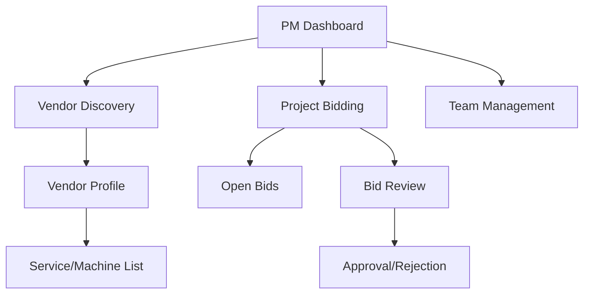
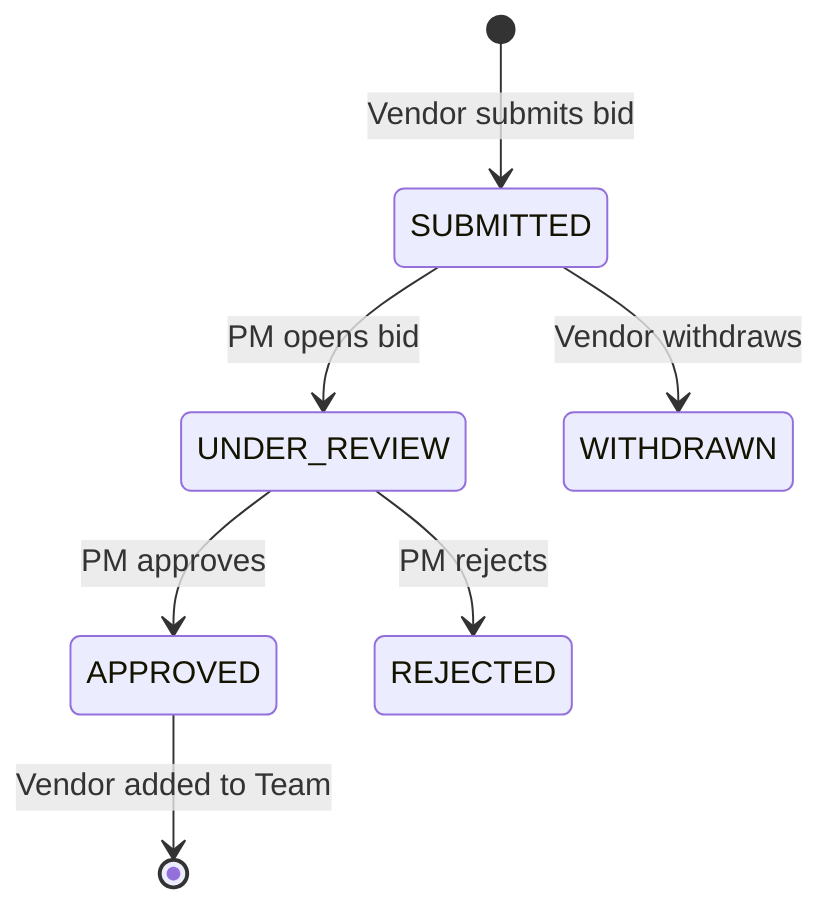

# Project Head (PM) Dashboard — Deep Analysis & Discovery Specification

## Overview
This document provides a technical and functional analysis of the Project Head / Project Manager (PM) experience within the VendorConnect system. It covers vendor discovery, the bidding lifecycle, project collaboration, and security controls.

### 🎯 Key Objectives
- **Vendor Discovery**: How PMs find and evaluate vendors.
- **Bidding Lifecycle**: From project posting to bid approval.
- **Project Team**: Management of internal and external collaborators.
- **Security**: Token validation and role-based access control.

---

## 🗺️ Navigation & Architecture

### User Flow

### Key Components & APIs
| Area | UI Component (Representative) | API Endpoint | Primary Model |
| :--- | :--- | :--- | :--- |
| **Vendor Discovery** | `pm/vendors/page.tsx` | `/api/vendors` | `Vendor` |
| **Vendor Profile** | `pm/vendors/[id]/page.tsx` | `/api/vendors/[id]` | `Vendor` |
| **Bidding (Open)** | `bidding/open/page.tsx` | `/api/bids/open` | `Project` |
| **Bid Actions** | `dashboard/bids/[id]` | `/api/bids/[id]` | `Bid` |
| **Team/Members** | `dashboard/projects/team` | `/api/team` | `ProjectMember` |

---

## 🛠️ Feature Breakdown

### 1. Vendor Discovery & Evaluation
PMs can search for vendors globally across the platform.

- **Global Search**: `/api/vendors` supports `search`, `category`, and `region` filters.
- **Data Masking**:
  > [!NOTE]
  > Contact information (Email/Phone) is masked (e.g., `***@***.com`) for most roles, but is **automatically unmasked** for users with `PROJECT_MANAGER` or `ADMIN` roles.
- **Service Breakdown**: `/api/vendors/:id/services` provides a grouped view of a vendor's machines, availability, and average rates.

### 2. Bidding Lifecycle
The system manages bids through a structured state machine.

#### ✅ Bid Approval Process
- **Endpoint**: `PUT /api/bids/[bidId]`
- **Action**: `{ "action": "APPROVE", "reviewNotes": "..." }`
- **Side Effects**:
    1. **Auto-Assignment**: The system automatically creates a `ProjectMember` entry for the vendor.
    2. **Transparency**: `contactVisible` is set to `true`, revealing full contact details to the project team.
    3. **Notification**: The vendor receives a `TASK_COMPLETED` type notification.

### 3. Project Collaboration
Collaboration is governed by the `ProjectMember` and `ProjectCollaborator` models.

- **ProjectMember**: Tracks all users (PMs, Vendors, Supervisors) associated with a specific project.
- **Roles**: Supports `ADMIN_PM`, `COLLABORATOR_PM`, `VENDOR`, and `SUPERVISOR`.
- **Permissions**: Fine-grained controls like `MANAGE_BIDS`, `INVITE_VENDORS`, and `MANAGE_TEAM`.

---

## 🔒 Security & Access Control

### Authentication
All API handlers utilize `verifyToken()` from `src/lib/auth.ts`.
- **Validation**: Requires a valid JWT in the `Authorization` header.
- **Response**: Returns 401 `UNAUTHORIZED` if the token is missing or invalid.

### ⚠️ Potential Risks & Findings
> [!WARNING]
> **Bidding Mode Enforcement**: High Priority
> Current implementation of `POST /api/projects/[projectId]/bids` does not check if a project is in `INVITE_ONLY` mode or if the bidder is in the `allowedVendorIds` list. This should be addressed to prevent unauthorized bid submissions.

---

## 📈 Recommendations

1. **Enforce Invite-Only Mode**: Add server-side checks in the bid submission API to validate `biddingMode` and `allowedVendorIds`.
2. **Audit Logging**: While an `AuditLog` model exists, explicit logging should be added to the bid approval/rejection handlers for better accountability.
3. **Project-Scoped Vendor Lists**: Implement an endpoint (e.g., `/api/projects/:id/vendors`) to easily view all vendors approved for a specific project.

---

## 🔗 Appendix: Technical Reference

- **Route Handlers**:
  - [Bid Actions](src/app/api/bids/[bidId]/route.ts)
  - [Project Bids](src/app/api/projects/[projectId]/bids/route.ts)
  - [Vendor Search](src/app/api/vendors/route.ts)
- **Data Models**:
  - [Bid.ts](src/models/Bid.ts)
  - [ProjectMember.ts](src/models/ProjectMember.ts)
  - [Vendor.ts](src/models/Vendor.ts)
