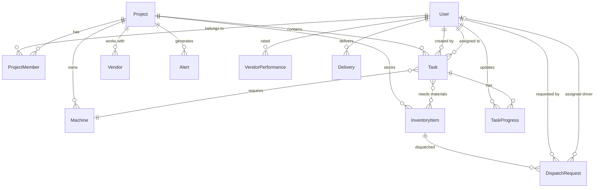

<<<<<<< HEAD
# Database Models & Schema

## 🗄️ Overview

This document defines the **complete database schema** for VendorConnect. The schema is designed for **multi-tenancy** (project-based isolation), **RBAC** (role-based access), and **scalability**. We use **Prisma** as the ORM with **PostgreSQL** as the database.

---

## 🏗️ Database Architecture Principles

### Core Design Decisions

1. **Multi-Tenancy**: All data is scoped to `projectId` (except Users, which are global)
2. **Soft Deletes**: Records are marked `deletedAt` instead of hard deletion
3. **Audit Trail**: All models have `createdAt`, `updatedAt`, `createdBy` fields
4. **Normalization**: 3NF compliance to reduce data redundancy
5. **Indexing**: Strategic indexes on foreign keys and frequently queried fields

---

## 📊 Entity Relationship Diagram



---

## 📋 Core Models

### 1. User Model

**Purpose**: Global user accounts (shared across all projects)

```prisma
model User {
  id            String   @id @default(cuid())
  email         String   @unique
  passwordHash  String
  name          String
  phone         String?
  avatar        String?
  emailVerified Boolean  @default(false)
  isActive      Boolean  @default(true)
  
  // Audit fields
  createdAt     DateTime @default(now())
  updatedAt     DateTime @updatedAt
  lastLoginAt   DateTime?
  
  // Relations
  projectMemberships ProjectMember[]
  createdTasks       Task[]         @relation("TaskCreator")
  assignedTasks      Task[]         @relation("TaskAssignee")
  taskUpdates        TaskProgress[]
  dispatchRequests   DispatchRequest[] @relation("DispatchRequester")
  driverDeliveries   Delivery[]
  alertsReceived     Alert[]
  
  @@index([email])
  @@map("users")
}
```

**Indexes**:
- `email` (unique, for login lookups)

---

### 2. Project Model

**Purpose**: Represents a construction project (multi-tenant boundary)

```prisma
model Project {
  id          String   @id @default(cuid())
  name        String
  description String?
  location    String
  
  // Financial
  budget      Decimal  @db.Decimal(12, 2)
  budgetUsed  Decimal  @default(0) @db.Decimal(12, 2)
  
  // Timeline
  startDate   DateTime
  deadline    DateTime
  completedAt DateTime?
  
  // Status
  status      ProjectStatus @default(ACTIVE)
  
  // Audit
  createdAt   DateTime @default(now())
  updatedAt   DateTime @updatedAt
  deletedAt   DateTime?
  createdBy   String
  
  // Relations
  members     ProjectMember[]
  tasks       Task[]
  machines    Machine[]
  inventory   InventoryItem[]
  vendors     Vendor[]
  alerts      Alert[]
  schedules   Schedule[]
  
  @@index([status])
  @@index([createdBy])
  @@map("projects")
}

enum ProjectStatus {
  PLANNING
  ACTIVE
  ON_HOLD
  COMPLETED
  ARCHIVED
}
```

---

### 3. ProjectMember Model

**Purpose**: Junction table linking Users to Projects with Roles

```prisma
model ProjectMember {
  id        String   @id @default(cuid())
  
  // Foreign Keys
  userId    String
  projectId String
  
  // Role in this specific project
  role      UserRole
  
  // Permissions override (optional)
  permissions Json?
  
  // Status
  isActive  Boolean  @default(true)
  invitedAt DateTime @default(now())
  joinedAt  DateTime?
  
  // Audit
  createdAt DateTime @default(now())
  updatedAt DateTime @updatedAt
  
  // Relations
  user      User     @relation(fields: [userId], references: [id], onDelete: Cascade)
  project   Project  @relation(fields: [projectId], references: [id], onDelete: Cascade)
  
  @@unique([userId, projectId])
  @@index([projectId, role])
  @@map("project_members")
}

enum UserRole {
  ADMIN
  PROJECT_HEAD
  SUPERVISOR
  VENDOR
  WAREHOUSE
  DRIVER
}
```

**Unique Constraint**: A user can only have ONE role per project

---

### 4. Task Model

**Purpose**: Represents work items in a project

```prisma
model Task {
  id          String   @id @default(cuid())
  projectId   String
  
  // Task details
  title       String
  description String?
  priority    TaskPriority @default(MEDIUM)
  status      TaskStatus   @default(PENDING)
  
  // Assignment
  assignedToId String?
  machineId    String?
  
  // Timeline
  startDate   DateTime?
  deadline    DateTime?
  completedAt DateTime?
  
  // Progress
  completionPercentage Int @default(0)
  
  // Audit
  createdAt   DateTime @default(now())
  updatedAt   DateTime @updatedAt
  deletedAt   DateTime?
  createdById String
  
  // Relations
  project     Project        @relation(fields: [projectId], references: [id], onDelete: Cascade)
  assignedTo  User?          @relation("TaskAssignee", fields: [assignedToId], references: [id])
  createdBy   User           @relation("TaskCreator", fields: [createdById], references: [id])
  machine     Machine?       @relation(fields: [machineId], references: [id])
  progressUpdates TaskProgress[]
  materialsNeeded TaskMaterial[]
  
  @@index([projectId, status])
  @@index([assignedToId])
  @@index([deadline])
  @@map("tasks")
}

enum TaskPriority {
  LOW
  MEDIUM
  HIGH
  CRITICAL
}

enum TaskStatus {
  PENDING
  IN_PROGRESS
  BLOCKED
  COMPLETED
  CANCELLED
}
```

---

### 5. TaskProgress Model

**Purpose**: Track task progress updates over time

```prisma
model TaskProgress {
  id          String   @id @default(cuid())
  taskId      String
  
  // Progress data
  completionPercentage Int
  notes       String?
  photos      String[] // Array of image URLs
  
  // Audit
  createdAt   DateTime @default(now())
  createdById String
  
  // Relations
  task        Task     @relation(fields: [taskId], references: [id], onDelete: Cascade)
  createdBy   User     @relation(fields: [createdById], references: [id])
  
  @@index([taskId])
  @@map("task_progress")
}
```

---

### 6. Machine Model

**Purpose**: Construction equipment and machinery

```prisma
model Machine {
  id          String   @id @default(cuid())
  projectId   String
  
  // Machine details
  name        String
  type        MachineType
  model       String?
  serialNumber String?
  
  // Status
  status      MachineStatus @default(AVAILABLE)
  
  // Maintenance
  lastMaintenanceAt DateTime?
  nextMaintenanceAt DateTime?
  
  // Utilization tracking
  hoursUsed   Int      @default(0)
  
  // Audit
  createdAt   DateTime @default(now())
  updatedAt   DateTime @updatedAt
  deletedAt   DateTime?
  
  // Relations
  project     Project  @relation(fields: [projectId], references: [id], onDelete: Cascade)
  tasks       Task[]
  schedules   Schedule[]
  
  @@index([projectId, status])
  @@map("machines")
}

enum MachineType {
  EXCAVATOR
  CRANE
  CONCRETE_MIXER
  BULLDOZER
  FORKLIFT
  DUMP_TRUCK
  OTHER
}

enum MachineStatus {
  AVAILABLE
  IN_USE
  MAINTENANCE
  BROKEN
  RETIRED
}
```

---

### 7. InventoryItem Model

**Purpose**: Warehouse inventory management

```prisma
model InventoryItem {
  id          String   @id @default(cuid())
  projectId   String
  
  // Item details
  name        String
  sku         String   @unique
  category    String
  unit        String   // "bags", "liters", "pieces", etc.
  
  // Stock levels
  quantity    Int
  minimumStock Int     @default(0)
  reorderPoint Int     @default(0)
  
  // Supplier info
  supplier    String?
  unitPrice   Decimal? @db.Decimal(10, 2)
  
  // Location
  warehouseLocation String?
  
  // Audit
  createdAt   DateTime @default(now())
  updatedAt   DateTime @updatedAt
  deletedAt   DateTime?
  
  // Relations
  project     Project  @relation(fields: [projectId], references: [id], onDelete: Cascade)
  taskMaterials TaskMaterial[]
  dispatchRequests DispatchRequestItem[]
  
  @@index([projectId, quantity])
  @@index([sku])
  @@map("inventory_items")
}
```

---

### 8. TaskMaterial Model

**Purpose**: Junction table for Task ↔ InventoryItem (many-to-many)

```prisma
model TaskMaterial {
  id        String   @id @default(cuid())
  taskId    String
  itemId    String
  
  // Quantity needed
  quantityNeeded Int
  quantityAllocated Int @default(0)
  
  // Relations
  task      Task          @relation(fields: [taskId], references: [id], onDelete: Cascade)
  item      InventoryItem @relation(fields: [itemId], references: [id], onDelete: Cascade)
  
  @@unique([taskId, itemId])
  @@map("task_materials")
}
```

---

### 9. DispatchRequest Model

**Purpose**: Material dispatch from warehouse to site

```prisma
model DispatchRequest {
  id          String   @id @default(cuid())
  projectId   String
  
  // Request details
  destination String
  urgency     DispatchUrgency @default(NORMAL)
  status      DispatchStatus  @default(PENDING)
  
  // Assignment
  requestedById String
  assignedDriverId String?
  
  // Timeline
  requestedAt DateTime @default(now())
  dispatchedAt DateTime?
  deliveredAt DateTime?
  
  // Audit
  createdAt   DateTime @default(now())
  updatedAt   DateTime @updatedAt
  
  // Relations
  requestedBy User     @relation("DispatchRequester", fields: [requestedById], references: [id])
  assignedDriver User? @relation(fields: [assignedDriverId], references: [id])
  items       DispatchRequestItem[]
  delivery    Delivery?
  
  @@index([projectId, status])
  @@map("dispatch_requests")
}

enum DispatchUrgency {
  LOW
  NORMAL
  HIGH
  CRITICAL
}

enum DispatchStatus {
  PENDING
  APPROVED
  DISPATCHED
  DELIVERED
  CANCELLED
}
```

---

### 10. DispatchRequestItem Model

**Purpose**: Items in a dispatch request (junction)

```prisma
model DispatchRequestItem {
  id          String   @id @default(cuid())
  dispatchId  String
  itemId      String
  
  quantity    Int
  
  // Relations
  dispatch    DispatchRequest @relation(fields: [dispatchId], references: [id], onDelete: Cascade)
  item        InventoryItem   @relation(fields: [itemId], references: [id])
  
  @@map("dispatch_request_items")
}
```

---

### 11. Delivery Model

**Purpose**: Track delivery execution by drivers

```prisma
model Delivery {
  id          String   @id @default(cuid())
  dispatchId  String   @unique
  driverId    String
  
  // Delivery proof
  signatureUrl String?
  photoUrl     String?
  notes        String?
  
  // Location tracking
  startLocation String?
  startTime     DateTime?
  endLocation   String?
  endTime       DateTime?
  
  // Audit
  createdAt   DateTime @default(now())
  updatedAt   DateTime @updatedAt
  
  // Relations
  dispatch    DispatchRequest @relation(fields: [dispatchId], references: [id], onDelete: Cascade)
  driver      User            @relation(fields: [driverId], references: [id])
  
  @@map("deliveries")
}
```

---

### 12. Vendor Model

**Purpose**: Vendor/contractor profiles

```prisma
model Vendor {
  id          String   @id @default(cuid())
  projectId   String
  userId      String   // Links to User model
  
  // Vendor details
  companyName String?
  specialty   String   // "Concrete", "Electrical", etc.
  
  // Performance metrics (calculated)
  tasksCompleted Int @default(0)
  averageRating  Decimal @default(0) @db.Decimal(3, 2)
  
  // Availability
  isAvailable Boolean @default(true)
  
  // Audit
  createdAt   DateTime @default(now())
  updatedAt   DateTime @updatedAt
  
  // Relations
  project     Project  @relation(fields: [projectId], references: [id], onDelete: Cascade)
  performanceRecords VendorPerformance[]
  
  @@index([projectId, isAvailable])
  @@map("vendors")
}
```

---

### 13. VendorPerformance Model

**Purpose**: Track vendor ratings and feedback

```prisma
model VendorPerformance {
  id          String   @id @default(cuid())
  vendorId    String
  taskId      String
  
  // Rating (1-5 stars)
  rating      Int
  
  // Feedback
  comment     String?
  
  // Metrics
  onTime      Boolean
  quality     Int // 1-5
  communication Int // 1-5
  
  // Audit
  createdAt   DateTime @default(now())
  createdById String
  
  // Relations
  vendor      Vendor   @relation(fields: [vendorId], references: [id], onDelete: Cascade)
  
  @@index([vendorId])
  @@map("vendor_performance")
}
```

---

### 14. Schedule Model

**Purpose**: Calendar events for tasks and resources

```prisma
model Schedule {
  id          String   @id @default(cuid())
  projectId   String
  
  // Event details
  title       String
  description String?
  
  // Time
  startTime   DateTime
  endTime     DateTime
  allDay      Boolean  @default(false)
  
  // Assignment
  taskId      String?
  assignedToId String?
  machineId    String?
  
  // Status
  status      ScheduleStatus @default(TENTATIVE)
  
  // Audit
  createdAt   DateTime @default(now())
  updatedAt   DateTime @updatedAt
  createdById String
  
  // Relations
  project     Project  @relation(fields: [projectId], references: [id], onDelete: Cascade)
  machine     Machine? @relation(fields: [machineId], references: [id])
  
  @@index([projectId, startTime])
  @@map("schedules")
}

enum ScheduleStatus {
  TENTATIVE
  CONFIRMED
  COMPLETED
  CANCELLED
}
```

---

### 15. Alert Model

**Purpose**: System notifications and alerts

```prisma
model Alert {
  id          String   @id @default(cuid())
  projectId   String?  // Null for global alerts
  userId      String
  
  // Alert details
  type        AlertType
  severity    AlertSeverity @default(INFO)
  title       String
  message     String
  
  // Action
  actionUrl   String?
  
  // Status
  isRead      Boolean  @default(false)
  readAt      DateTime?
  
  // Audit
  createdAt   DateTime @default(now())
  expiresAt   DateTime?
  
  // Relations
  project     Project? @relation(fields: [projectId], references: [id], onDelete: Cascade)
  user        User     @relation(fields: [userId], references: [id], onDelete: Cascade)
  
  @@index([userId, isRead])
  @@index([projectId])
  @@map("alerts")
}

enum AlertType {
  TASK_ASSIGNED
  TASK_COMPLETED
  MATERIAL_LOW_STOCK
  MATERIAL_OUT_OF_STOCK
  DELIVERY_DELAYED
  MACHINE_MAINTENANCE_DUE
  DEADLINE_APPROACHING
  BUDGET_EXCEEDED
  SYSTEM_ANNOUNCEMENT
}

enum AlertSeverity {
  INFO
  WARNING
  ERROR
  CRITICAL
}
```

---

## 🔧 Prisma Schema File

### Complete `schema.prisma`

```prisma
// prisma/schema.prisma
generator client {
  provider = "prisma-client-js"
}

datasource db {
  provider = "postgresql"
  url      = env("DATABASE_URL")
}

// [Include all models from above]
```

---

## 📦 Database Migrations

### Initial Migration

```bash
# Create initial migration
npx prisma migrate dev --name init

# Generate Prisma Client
npx prisma generate

# Seed database (optional)
npx prisma db seed
```

### Seeding Script

```typescript
// prisma/seed.ts
import { PrismaClient } from '@prisma/client';
import bcrypt from 'bcryptjs';

const prisma = new PrismaClient();

async function main() {
  // Create admin user
  const adminPassword = await bcrypt.hash('admin123', 10);
  const admin = await prisma.user.create({
    data: {
      email: 'admin@vendorconnect.com',
      passwordHash: adminPassword,
      name: 'System Admin',
      emailVerified: true,
    },
  });
  
  // Create demo project
  const project = await prisma.project.create({
    data: {
      name: 'Demo Project - Construction Site',
      location: 'New York, NY',
      budget: 1000000,
      startDate: new Date(),
      deadline: new Date(Date.now() + 180 * 24 * 60 * 60 * 1000), // 180 days
      status: 'ACTIVE',
      createdBy: admin.id,
    },
  });
  
  // Add admin as project head
  await prisma.projectMember.create({
    data: {
      userId: admin.id,
      projectId: project.id,
      role: 'PROJECT_HEAD',
      joinedAt: new Date(),
    },
  });
  
  console.log('✅ Database seeded successfully');
}

main()
  .catch((e) => {
    console.error(e);
    process.exit(1);
  })
  .finally(async () => {
    await prisma.$disconnect();
  });
```

---

## 🔍 Common Queries

### Get User's Projects with Roles

```typescript
const userProjects = await prisma.project.findMany({
  where: {
    members: {
      some: {
        userId: 'usr_123',
      },
    },
  },
  include: {
    members: {
      where: {
        userId: 'usr_123',
      },
      select: {
        role: true,
      },
    },
    _count: {
      select: {
        tasks: true,
        members: true,
      },
    },
  },
});
```

### Get Low Stock Items

```typescript
const lowStockItems = await prisma.inventoryItem.findMany({
  where: {
    projectId: 'proj_123',
    quantity: {
      lte: prisma.inventoryItem.fields.minimumStock,
    },
  },
  orderBy: {
    quantity: 'asc',
  },
});
```

### Get Vendor Performance

```typescript
const vendorStats = await prisma.vendor.findUnique({
  where: { id: 'vendor_123' },
  include: {
    performanceRecords: {
      orderBy: {
        createdAt: 'desc',
      },
      take: 10,
    },
  },
});

const avgRating = await prisma.vendorPerformance.aggregate({
  where: { vendorId: 'vendor_123' },
  _avg: {
    rating: true,
  },
});
```

---

## 🔐 Data Security

### Row-Level Security (RLS)

While Prisma doesn't natively support RLS, we enforce project-scoping in queries:

```typescript
// Always include projectId filter
const tasks = await prisma.task.findMany({
  where: {
    projectId: userProjectId, // Always scope to user's project
    deletedAt: null,          // Exclude soft-deleted
  },
});
```

### Sensitive Data Encryption

```typescript
// Encrypt sensitive fields before storing
import { encrypt, decrypt } from '@/lib/encryption';

const user = await prisma.user.create({
  data: {
    email: 'user@example.com',
    phone: encrypt('+1234567890'), // Encrypt phone number
  },
});

// Decrypt when reading
const decryptedPhone = decrypt(user.phone);
```

---

## 📊 Indexing Strategy

### Critical Indexes

```sql
-- Foreign key indexes (auto-created by Prisma)
CREATE INDEX idx_project_members_user_id ON project_members(user_id);
CREATE INDEX idx_project_members_project_id ON project_members(project_id);

-- Query optimization indexes
CREATE INDEX idx_tasks_status_deadline ON tasks(status, deadline);
CREATE INDEX idx_alerts_user_unread ON alerts(user_id, is_read);
CREATE INDEX idx_inventory_project_quantity ON inventory_items(project_id, quantity);

-- Full-text search indexes (for advanced search)
CREATE INDEX idx_tasks_title_description ON tasks USING GIN(to_tsvector('english', title || ' ' || COALESCE(description, '')));
```

---

## 🚀 Performance Optimization

### Connection Pooling

```typescript
// lib/db.ts
import { PrismaClient } from '@prisma/client';

declare global {
  var prisma: PrismaClient | undefined;
}

export const db = global.prisma || new PrismaClient({
  log: ['query', 'error', 'warn'],
});

if (process.env.NODE_ENV !== 'production') global.prisma = db;
```

### Query Optimization

```typescript
// Use select to fetch only needed fields
const users = await prisma.user.findMany({
  select: {
    id: true,
    name: true,
    email: true,
    // Don't fetch passwordHash
  },
});

// Use cursor-based pagination for large datasets
const tasks = await prisma.task.findMany({
  take: 20,
  skip: 1,
  cursor: {
    id: lastTaskId,
  },
});
```

---

## 📚 Related Documents

- [API Functions](./functions.md) - Backend queries using these models
- [Dashboard Specifications](./dashboards.md) - UI consuming this data
- [Architecture Plan](./plan.md) - Overall system design

---

**Last Updated**: 2025-12-14  
**Version**: 1.0  
**Status**: 🟡 Planning Phase
=======
# Database Models & Schema

## 🗄️ Overview

This document defines the **complete database schema** for VendorConnect. The schema is designed for **multi-tenancy** (project-based isolation), **RBAC** (role-based access), and **scalability**. We use **Prisma** as the ORM with **PostgreSQL** as the database.

---

## 🏗️ Database Architecture Principles

### Core Design Decisions

1. **Multi-Tenancy**: All data is scoped to `projectId` (except Users, which are global)
2. **Soft Deletes**: Records are marked `deletedAt` instead of hard deletion
3. **Audit Trail**: All models have `createdAt`, `updatedAt`, `createdBy` fields
4. **Normalization**: 3NF compliance to reduce data redundancy
5. **Indexing**: Strategic indexes on foreign keys and frequently queried fields

---

## 📊 Entity Relationship Diagram


---

## 📋 Core Models

### 1. User Model

**Purpose**: Global user accounts (shared across all projects)

```prisma
model User {
  id            String   @id @default(cuid())
  email         String   @unique
  passwordHash  String
  name          String
  phone         String?
  avatar        String?
  emailVerified Boolean  @default(false)
  isActive      Boolean  @default(true)
  
  // Audit fields
  createdAt     DateTime @default(now())
  updatedAt     DateTime @updatedAt
  lastLoginAt   DateTime?
  
  // Relations
  projectMemberships ProjectMember[]
  createdTasks       Task[]         @relation("TaskCreator")
  assignedTasks      Task[]         @relation("TaskAssignee")
  taskUpdates        TaskProgress[]
  dispatchRequests   DispatchRequest[] @relation("DispatchRequester")
  driverDeliveries   Delivery[]
  alertsReceived     Alert[]
  
  @@index([email])
  @@map("users")
}
```

**Indexes**:
- `email` (unique, for login lookups)

---

### 2. Project Model

**Purpose**: Represents a construction project (multi-tenant boundary)

```prisma
model Project {
  id          String   @id @default(cuid())
  name        String
  description String?
  location    String
  
  // Financial
  budget      Decimal  @db.Decimal(12, 2)
  budgetUsed  Decimal  @default(0) @db.Decimal(12, 2)
  
  // Timeline
  startDate   DateTime
  deadline    DateTime
  completedAt DateTime?
  
  // Status
  status      ProjectStatus @default(ACTIVE)
  
  // Audit
  createdAt   DateTime @default(now())
  updatedAt   DateTime @updatedAt
  deletedAt   DateTime?
  createdBy   String
  
  // Relations
  members     ProjectMember[]
  tasks       Task[]
  machines    Machine[]
  inventory   InventoryItem[]
  vendors     Vendor[]
  alerts      Alert[]
  schedules   Schedule[]
  
  @@index([status])
  @@index([createdBy])
  @@map("projects")
}

enum ProjectStatus {
  PLANNING
  ACTIVE
  ON_HOLD
  COMPLETED
  ARCHIVED
}
```

---

### 3. ProjectMember Model

**Purpose**: Junction table linking Users to Projects with Roles

```prisma
model ProjectMember {
  id        String   @id @default(cuid())
  
  // Foreign Keys
  userId    String
  projectId String
  
  // Role in this specific project
  role      UserRole
  
  // Permissions override (optional)
  permissions Json?
  
  // Status
  isActive  Boolean  @default(true)
  invitedAt DateTime @default(now())
  joinedAt  DateTime?
  
  // Audit
  createdAt DateTime @default(now())
  updatedAt DateTime @updatedAt
  
  // Relations
  user      User     @relation(fields: [userId], references: [id], onDelete: Cascade)
  project   Project  @relation(fields: [projectId], references: [id], onDelete: Cascade)
  
  @@unique([userId, projectId])
  @@index([projectId, role])
  @@map("project_members")
}

enum UserRole {
  ADMIN
  PROJECT_HEAD
  SUPERVISOR
  VENDOR
  WAREHOUSE
  DRIVER
}
```

**Unique Constraint**: A user can only have ONE role per project

---

### 4. Task Model

**Purpose**: Represents work items in a project

```prisma
model Task {
  id          String   @id @default(cuid())
  projectId   String
  
  // Task details
  title       String
  description String?
  priority    TaskPriority @default(MEDIUM)
  status      TaskStatus   @default(PENDING)
  
  // Assignment
  assignedToId String?
  machineId    String?
  
  // Timeline
  startDate   DateTime?
  deadline    DateTime?
  completedAt DateTime?
  
  // Progress
  completionPercentage Int @default(0)
  
  // Audit
  createdAt   DateTime @default(now())
  updatedAt   DateTime @updatedAt
  deletedAt   DateTime?
  createdById String
  
  // Relations
  project     Project        @relation(fields: [projectId], references: [id], onDelete: Cascade)
  assignedTo  User?          @relation("TaskAssignee", fields: [assignedToId], references: [id])
  createdBy   User           @relation("TaskCreator", fields: [createdById], references: [id])
  machine     Machine?       @relation(fields: [machineId], references: [id])
  progressUpdates TaskProgress[]
  materialsNeeded TaskMaterial[]
  
  @@index([projectId, status])
  @@index([assignedToId])
  @@index([deadline])
  @@map("tasks")
}

enum TaskPriority {
  LOW
  MEDIUM
  HIGH
  CRITICAL
}

enum TaskStatus {
  PENDING
  IN_PROGRESS
  BLOCKED
  COMPLETED
  CANCELLED
}
```

---

### 5. TaskProgress Model

**Purpose**: Track task progress updates over time

```prisma
model TaskProgress {
  id          String   @id @default(cuid())
  taskId      String
  
  // Progress data
  completionPercentage Int
  notes       String?
  photos      String[] // Array of image URLs
  
  // Audit
  createdAt   DateTime @default(now())
  createdById String
  
  // Relations
  task        Task     @relation(fields: [taskId], references: [id], onDelete: Cascade)
  createdBy   User     @relation(fields: [createdById], references: [id])
  
  @@index([taskId])
  @@map("task_progress")
}
```

---

### 6. Machine Model

**Purpose**: Construction equipment and machinery

```prisma
model Machine {
  id          String   @id @default(cuid())
  projectId   String
  
  // Machine details
  name        String
  type        MachineType
  model       String?
  serialNumber String?
  
  // Status
  status      MachineStatus @default(AVAILABLE)
  
  // Maintenance
  lastMaintenanceAt DateTime?
  nextMaintenanceAt DateTime?
  
  // Utilization tracking
  hoursUsed   Int      @default(0)
  
  // Audit
  createdAt   DateTime @default(now())
  updatedAt   DateTime @updatedAt
  deletedAt   DateTime?
  
  // Relations
  project     Project  @relation(fields: [projectId], references: [id], onDelete: Cascade)
  tasks       Task[]
  schedules   Schedule[]
  
  @@index([projectId, status])
  @@map("machines")
}

enum MachineType {
  EXCAVATOR
  CRANE
  CONCRETE_MIXER
  BULLDOZER
  FORKLIFT
  DUMP_TRUCK
  OTHER
}

enum MachineStatus {
  AVAILABLE
  IN_USE
  MAINTENANCE
  BROKEN
  RETIRED
}
```

---

### 7. InventoryItem Model

**Purpose**: Warehouse inventory management

```prisma
model InventoryItem {
  id          String   @id @default(cuid())
  projectId   String
  
  // Item details
  name        String
  sku         String   @unique
  category    String
  unit        String   // "bags", "liters", "pieces", etc.
  
  // Stock levels
  quantity    Int
  minimumStock Int     @default(0)
  reorderPoint Int     @default(0)
  
  // Supplier info
  supplier    String?
  unitPrice   Decimal? @db.Decimal(10, 2)
  
  // Location
  warehouseLocation String?
  
  // Audit
  createdAt   DateTime @default(now())
  updatedAt   DateTime @updatedAt
  deletedAt   DateTime?
  
  // Relations
  project     Project  @relation(fields: [projectId], references: [id], onDelete: Cascade)
  taskMaterials TaskMaterial[]
  dispatchRequests DispatchRequestItem[]
  
  @@index([projectId, quantity])
  @@index([sku])
  @@map("inventory_items")
}
```

---

### 8. TaskMaterial Model

**Purpose**: Junction table for Task ↔ InventoryItem (many-to-many)

```prisma
model TaskMaterial {
  id        String   @id @default(cuid())
  taskId    String
  itemId    String
  
  // Quantity needed
  quantityNeeded Int
  quantityAllocated Int @default(0)
  
  // Relations
  task      Task          @relation(fields: [taskId], references: [id], onDelete: Cascade)
  item      InventoryItem @relation(fields: [itemId], references: [id], onDelete: Cascade)
  
  @@unique([taskId, itemId])
  @@map("task_materials")
}
```

---

### 9. DispatchRequest Model

**Purpose**: Material dispatch from warehouse to site

```prisma
model DispatchRequest {
  id          String   @id @default(cuid())
  projectId   String
  
  // Request details
  destination String
  urgency     DispatchUrgency @default(NORMAL)
  status      DispatchStatus  @default(PENDING)
  
  // Assignment
  requestedById String
  assignedDriverId String?
  
  // Timeline
  requestedAt DateTime @default(now())
  dispatchedAt DateTime?
  deliveredAt DateTime?
  
  // Audit
  createdAt   DateTime @default(now())
  updatedAt   DateTime @updatedAt
  
  // Relations
  requestedBy User     @relation("DispatchRequester", fields: [requestedById], references: [id])
  assignedDriver User? @relation(fields: [assignedDriverId], references: [id])
  items       DispatchRequestItem[]
  delivery    Delivery?
  
  @@index([projectId, status])
  @@map("dispatch_requests")
}

enum DispatchUrgency {
  LOW
  NORMAL
  HIGH
  CRITICAL
}

enum DispatchStatus {
  PENDING
  APPROVED
  DISPATCHED
  DELIVERED
  CANCELLED
}
```

---

### 10. DispatchRequestItem Model

**Purpose**: Items in a dispatch request (junction)

```prisma
model DispatchRequestItem {
  id          String   @id @default(cuid())
  dispatchId  String
  itemId      String
  
  quantity    Int
  
  // Relations
  dispatch    DispatchRequest @relation(fields: [dispatchId], references: [id], onDelete: Cascade)
  item        InventoryItem   @relation(fields: [itemId], references: [id])
  
  @@map("dispatch_request_items")
}
```

---

### 11. Delivery Model

**Purpose**: Track delivery execution by drivers

```prisma
model Delivery {
  id          String   @id @default(cuid())
  dispatchId  String   @unique
  driverId    String
  
  // Delivery proof
  signatureUrl String?
  photoUrl     String?
  notes        String?
  
  // Location tracking
  startLocation String?
  startTime     DateTime?
  endLocation   String?
  endTime       DateTime?
  
  // Audit
  createdAt   DateTime @default(now())
  updatedAt   DateTime @updatedAt
  
  // Relations
  dispatch    DispatchRequest @relation(fields: [dispatchId], references: [id], onDelete: Cascade)
  driver      User            @relation(fields: [driverId], references: [id])
  
  @@map("deliveries")
}
```

---

### 12. Vendor Model

**Purpose**: Vendor/contractor profiles

```prisma
model Vendor {
  id          String   @id @default(cuid())
  projectId   String
  userId      String   // Links to User model
  
  // Vendor details
  companyName String?
  specialty   String   // "Concrete", "Electrical", etc.
  
  // Performance metrics (calculated)
  tasksCompleted Int @default(0)
  averageRating  Decimal @default(0) @db.Decimal(3, 2)
  
  // Availability
  isAvailable Boolean @default(true)
  
  // Audit
  createdAt   DateTime @default(now())
  updatedAt   DateTime @updatedAt
  
  // Relations
  project     Project  @relation(fields: [projectId], references: [id], onDelete: Cascade)
  performanceRecords VendorPerformance[]
  
  @@index([projectId, isAvailable])
  @@map("vendors")
}
```

---

### 13. VendorPerformance Model

**Purpose**: Track vendor ratings and feedback

```prisma
model VendorPerformance {
  id          String   @id @default(cuid())
  vendorId    String
  taskId      String
  
  // Rating (1-5 stars)
  rating      Int
  
  // Feedback
  comment     String?
  
  // Metrics
  onTime      Boolean
  quality     Int // 1-5
  communication Int // 1-5
  
  // Audit
  createdAt   DateTime @default(now())
  createdById String
  
  // Relations
  vendor      Vendor   @relation(fields: [vendorId], references: [id], onDelete: Cascade)
  
  @@index([vendorId])
  @@map("vendor_performance")
}
```

---

### 14. Schedule Model

**Purpose**: Calendar events for tasks and resources

```prisma
model Schedule {
  id          String   @id @default(cuid())
  projectId   String
  
  // Event details
  title       String
  description String?
  
  // Time
  startTime   DateTime
  endTime     DateTime
  allDay      Boolean  @default(false)
  
  // Assignment
  taskId      String?
  assignedToId String?
  machineId    String?
  
  // Status
  status      ScheduleStatus @default(TENTATIVE)
  
  // Audit
  createdAt   DateTime @default(now())
  updatedAt   DateTime @updatedAt
  createdById String
  
  // Relations
  project     Project  @relation(fields: [projectId], references: [id], onDelete: Cascade)
  machine     Machine? @relation(fields: [machineId], references: [id])
  
  @@index([projectId, startTime])
  @@map("schedules")
}

enum ScheduleStatus {
  TENTATIVE
  CONFIRMED
  COMPLETED
  CANCELLED
}
```

---

### 15. Alert Model

**Purpose**: System notifications and alerts

```prisma
model Alert {
  id          String   @id @default(cuid())
  projectId   String?  // Null for global alerts
  userId      String
  
  // Alert details
  type        AlertType
  severity    AlertSeverity @default(INFO)
  title       String
  message     String
  
  // Action
  actionUrl   String?
  
  // Status
  isRead      Boolean  @default(false)
  readAt      DateTime?
  
  // Audit
  createdAt   DateTime @default(now())
  expiresAt   DateTime?
  
  // Relations
  project     Project? @relation(fields: [projectId], references: [id], onDelete: Cascade)
  user        User     @relation(fields: [userId], references: [id], onDelete: Cascade)
  
  @@index([userId, isRead])
  @@index([projectId])
  @@map("alerts")
}

enum AlertType {
  TASK_ASSIGNED
  TASK_COMPLETED
  MATERIAL_LOW_STOCK
  MATERIAL_OUT_OF_STOCK
  DELIVERY_DELAYED
  MACHINE_MAINTENANCE_DUE
  DEADLINE_APPROACHING
  BUDGET_EXCEEDED
  SYSTEM_ANNOUNCEMENT
}

enum AlertSeverity {
  INFO
  WARNING
  ERROR
  CRITICAL
}
```

---

## 🔧 Prisma Schema File

### Complete `schema.prisma`

```prisma
// prisma/schema.prisma
generator client {
  provider = "prisma-client-js"
}

datasource db {
  provider = "postgresql"
  url      = env("DATABASE_URL")
}

// [Include all models from above]
```

---

## 📦 Database Migrations

### Initial Migration

```bash
# Create initial migration
npx prisma migrate dev --name init

# Generate Prisma Client
npx prisma generate

# Seed database (optional)
npx prisma db seed
```

### Seeding Script

```typescript
// prisma/seed.ts
import { PrismaClient } from '@prisma/client';
import bcrypt from 'bcryptjs';

const prisma = new PrismaClient();

async function main() {
  // Create admin user
  const adminPassword = await bcrypt.hash('admin123', 10);
  const admin = await prisma.user.create({
    data: {
      email: 'admin@vendorconnect.com',
      passwordHash: adminPassword,
      name: 'System Admin',
      emailVerified: true,
    },
  });
  
  // Create demo project
  const project = await prisma.project.create({
    data: {
      name: 'Demo Project - Construction Site',
      location: 'New York, NY',
      budget: 1000000,
      startDate: new Date(),
      deadline: new Date(Date.now() + 180 * 24 * 60 * 60 * 1000), // 180 days
      status: 'ACTIVE',
      createdBy: admin.id,
    },
  });
  
  // Add admin as project head
  await prisma.projectMember.create({
    data: {
      userId: admin.id,
      projectId: project.id,
      role: 'PROJECT_HEAD',
      joinedAt: new Date(),
    },
  });
  
  console.log('✅ Database seeded successfully');
}

main()
  .catch((e) => {
    console.error(e);
    process.exit(1);
  })
  .finally(async () => {
    await prisma.$disconnect();
  });
```

---

## 🔍 Common Queries

### Get User's Projects with Roles

```typescript
const userProjects = await prisma.project.findMany({
  where: {
    members: {
      some: {
        userId: 'usr_123',
      },
    },
  },
  include: {
    members: {
      where: {
        userId: 'usr_123',
      },
      select: {
        role: true,
      },
    },
    _count: {
      select: {
        tasks: true,
        members: true,
      },
    },
  },
});
```

### Get Low Stock Items

```typescript
const lowStockItems = await prisma.inventoryItem.findMany({
  where: {
    projectId: 'proj_123',
    quantity: {
      lte: prisma.inventoryItem.fields.minimumStock,
    },
  },
  orderBy: {
    quantity: 'asc',
  },
});
```

### Get Vendor Performance

```typescript
const vendorStats = await prisma.vendor.findUnique({
  where: { id: 'vendor_123' },
  include: {
    performanceRecords: {
      orderBy: {
        createdAt: 'desc',
      },
      take: 10,
    },
  },
});

const avgRating = await prisma.vendorPerformance.aggregate({
  where: { vendorId: 'vendor_123' },
  _avg: {
    rating: true,
  },
});
```

---

## 🔐 Data Security

### Row-Level Security (RLS)

While Prisma doesn't natively support RLS, we enforce project-scoping in queries:

```typescript
// Always include projectId filter
const tasks = await prisma.task.findMany({
  where: {
    projectId: userProjectId, // Always scope to user's project
    deletedAt: null,          // Exclude soft-deleted
  },
});
```

### Sensitive Data Encryption

```typescript
// Encrypt sensitive fields before storing
import { encrypt, decrypt } from '@/lib/encryption';

const user = await prisma.user.create({
  data: {
    email: 'user@example.com',
    phone: encrypt('+1234567890'), // Encrypt phone number
  },
});

// Decrypt when reading
const decryptedPhone = decrypt(user.phone);
```

---

## 📊 Indexing Strategy

### Critical Indexes

```sql
-- Foreign key indexes (auto-created by Prisma)
CREATE INDEX idx_project_members_user_id ON project_members(user_id);
CREATE INDEX idx_project_members_project_id ON project_members(project_id);

-- Query optimization indexes
CREATE INDEX idx_tasks_status_deadline ON tasks(status, deadline);
CREATE INDEX idx_alerts_user_unread ON alerts(user_id, is_read);
CREATE INDEX idx_inventory_project_quantity ON inventory_items(project_id, quantity);

-- Full-text search indexes (for advanced search)
CREATE INDEX idx_tasks_title_description ON tasks USING GIN(to_tsvector('english', title || ' ' || COALESCE(description, '')));
```

---

## 🚀 Performance Optimization

### Connection Pooling

```typescript
// lib/db.ts
import { PrismaClient } from '@prisma/client';

declare global {
  var prisma: PrismaClient | undefined;
}

export const db = global.prisma || new PrismaClient({
  log: ['query', 'error', 'warn'],
});

if (process.env.NODE_ENV !== 'production') global.prisma = db;
```

### Query Optimization

```typescript
// Use select to fetch only needed fields
const users = await prisma.user.findMany({
  select: {
    id: true,
    name: true,
    email: true,
    // Don't fetch passwordHash
  },
});

// Use cursor-based pagination for large datasets
const tasks = await prisma.task.findMany({
  take: 20,
  skip: 1,
  cursor: {
    id: lastTaskId,
  },
});
```

---

## 📚 Related Documents

- [API Functions](./functions.md) - Backend queries using these models
- [Dashboard Specifications](./dashboards.md) - UI consuming this data
- [Architecture Plan](./plan.md) - Overall system design

---

**Last Updated**: 2025-12-14  
**Version**: 1.0  
**Status**: 🟡 Planning Phase
>>>>>>> 1e7c767fd985a8b365fdb5ec78cc5cecdee02c84
