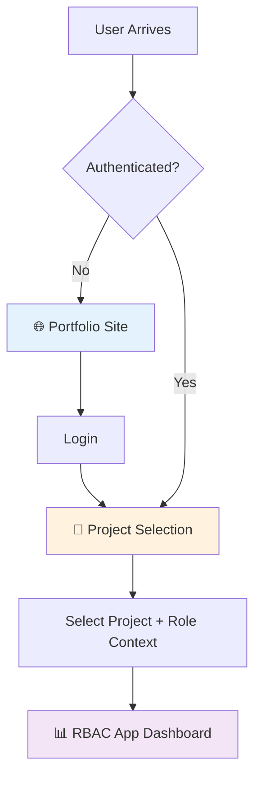
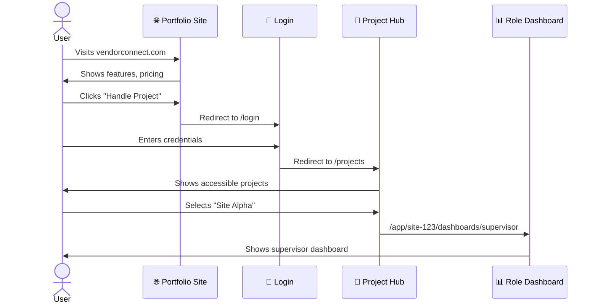
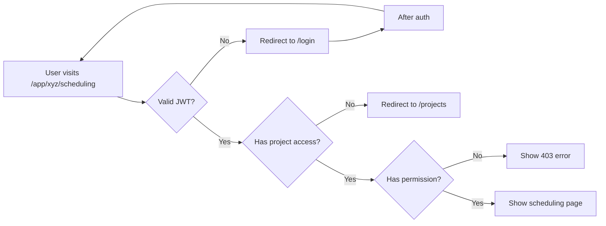

<<<<<<< HEAD
# VendorConnect - Production Architecture Plan

## 🎯 Executive Summary

This document outlines the transformation of VendorConnect from a basic Next.js starter into a **production-grade, multi-tenant ERP system** for construction project management with role-based access control (RBAC), vendor coordination, warehouse management, and scheduling capabilities.

---

## 📊 Current State Analysis

### What We Have Now
- **Framework**: Next.js 16.0.10 (App Router)
- **UI Library**: TailwindCSS v4 & PostCSS
- **TypeScript**: Enabled
- **Structure**: Basic starter template
  - `src/app/page.tsx` - Landing page
  - `src/app/layout.tsx` - Root layout
  - `src/app/globals.css` - Global styles

### Current Issues
❌ No authentication layer  
❌ No RBAC implementation  
❌ No API routes  
❌ No database models  
❌ No multi-project support  
❌ No separate portfolio/app sections  
❌ No role-specific dashboards  

---

## 🧱 Mental Model (3 Worlds Concept)



### The 3 Worlds

| World | Purpose | Auth Required | User Type |
|-------|---------|---------------|-----------|
| 🌐 **Portfolio** | Marketing, trust building, SEO | ❌ No | Anonymous visitors |
| 🔐 **Auth Gate** | Login + Project selection | ⚠️ Partial | Authenticated users |
| 📊 **RBAC App** | Actual ERP functionality | ✅ Yes | Project members with roles |

> [!IMPORTANT]
> **These 3 worlds must NEVER mix.** Each has distinct layout, navigation, and security boundaries.

---

## 🏗️ Target Architecture

### Directory Structure (Production-Ready)

```
src/
└── app/
    ├── (portfolio)/                    ← 🌐 PUBLIC MARKETING SITE
    │   ├── layout.tsx                   ← Portfolio-specific layout
    │   ├── page.tsx                     ← Landing/Home
    │   ├── features/page.tsx            ← Feature showcase
    │   ├── pricing/page.tsx             ← Pricing plans
    │   ├── about/page.tsx               ← Company info
    │   └── contact/page.tsx             ← Contact form
    │
    ├── login/                           ← 🔐 AUTH ENTRY POINT
    │   └── page.tsx                     ← Authentication UI
    │
    ├── projects/                        ← 📁 PROJECT SELECTION HUB
    │   └── page.tsx                     ← Project cards + creation
    │
    ├── app/                             ← 📊 PROTECTED ERP ZONE
    │   └── [projectId]/                 ← Dynamic project context
    │       ├── layout.tsx               ← App shell (sidebar + topbar)
    │       │
    │       ├── dashboards/              ← ROLE-SPECIFIC DASHBOARDS
    │       │   ├── admin/page.tsx
    │       │   ├── project-head/page.tsx
    │       │   ├── supervisor/page.tsx
    │       │   ├── vendor/page.tsx
    │       │   ├── warehouse/page.tsx
    │       │   └── driver/page.tsx
    │       │
    │       ├── scheduling/              ← FEATURE MODULES
    │       │   ├── page.tsx
    │       │   └── [scheduleId]/page.tsx
    │       ├── machines/
    │       │   ├── page.tsx
    │       │   └── [machineId]/page.tsx
    │       ├── warehouse/
    │       │   ├── page.tsx
    │       │   └── inventory/page.tsx
    │       ├── vendors/
    │       │   ├── page.tsx
    │       │   └── [vendorId]/page.tsx
    │       ├── users/
    │       │   └── page.tsx
    │       ├── reports/
    │       │   └── page.tsx
    │       ├── alerts/
    │       │   └── page.tsx
    │       └── settings/
    │           └── page.tsx
    │
    └── api/                             ← 🔌 BACKEND API ROUTES
        ├── auth/
        │   ├── login/route.ts
        │   ├── logout/route.ts
        │   └── refresh/route.ts
        ├── projects/
        │   ├── route.ts                 ← List/Create projects
        │   └── [projectId]/
        │       ├── route.ts
        │       └── members/route.ts
        ├── users/route.ts
        ├── scheduling/route.ts
        ├── machines/route.ts
        ├── warehouse/route.ts
        ├── vendors/route.ts
        ├── reports/route.ts
        └── alerts/route.ts
```

---

## 🎨 UX Flow (User Journey)

### Flow 1: First-Time Visitor → Active User



### Flow 2: Returning User (Direct Access)



---

## 🔐 Security Architecture

### Layer 1: Middleware (Global Guard)

```typescript
// src/middleware.ts
export function middleware(request: NextRequest) {
  const { pathname } = request.nextUrl;
  
  // Public routes - no auth needed
  if (pathname.startsWith('/api/auth') || 
      pathname === '/login' ||
      pathname.startsWith('/_next') ||
      !pathname.startsWith('/app/')) {
    return NextResponse.next();
  }
  
  // Protected routes - validate JWT
  const token = request.cookies.get('auth_token');
  if (!token) {
    return NextResponse.redirect(new URL('/login', request.url));
  }
  
  // Validate project access & role
  return validateProjectAccess(token, pathname);
}
```

### Layer 2: API Route Guards

Every API route validates:
1. ✅ JWT token exists & valid
2. ✅ User has project membership
3. ✅ User role has required permission
4. ✅ Rate limiting (prevent abuse)

### Layer 3: Component-Level Guards

```tsx
<ProtectedRoute requiredRole="admin">
  <UserManagementPage />
</ProtectedRoute>
```

---

## 📅 Implementation Roadmap

### Phase 1: Foundation (Weeks 1-2)
- [ ] Database schema design
- [ ] Authentication system (JWT + refresh tokens)
- [ ] Basic user model & API routes
- [ ] Project model & multi-tenancy setup

### Phase 2: Portfolio Site (Week 3)
- [ ] Portfolio layout with navbar
- [ ] Landing page (hero, features, CTA)
- [ ] Features page
- [ ] Pricing page
- [ ] Contact form

### Phase 3: Auth Flow (Week 4)
- [ ] Login page UI
- [ ] Registration flow
- [ ] Password reset
- [ ] Email verification
- [ ] Session management

### Phase 4: Project Hub (Week 5)
- [ ] Project selection UI
- [ ] Create new project (admin/project-head only)
- [ ] Invite members to project
- [ ] Role assignment UI

### Phase 5: App Shell (Week 6)
- [ ] App layout with sidebar + topbar
- [ ] RBAC navigation logic
- [ ] Project context provider
- [ ] User menu & logout

### Phase 6: Role Dashboards (Weeks 7-9)
- [ ] Admin dashboard
- [ ] Project Head dashboard
- [ ] Supervisor dashboard
- [ ] Vendor dashboard
- [ ] Warehouse dashboard
- [ ] Driver dashboard

### Phase 7: Feature Modules (Weeks 10-14)
- [ ] Scheduling system
- [ ] Machine management
- [ ] Warehouse inventory
- [ ] Vendor coordination
- [ ] User management
- [ ] Reports & analytics
- [ ] Real-time alerts

### Phase 8: Polish & Production (Weeks 15-16)
- [ ] Performance optimization
- [ ] Mobile responsiveness
- [ ] Error handling & logging
- [ ] Automated tests
- [ ] Documentation
- [ ] Deployment pipeline

---

## 🧪 Technology Stack

| Layer | Technology | Purpose |
|-------|-----------|----------|
| **Frontend** | Next.js 16 (App Router) | React framework with SSR/SSG |
| **Styling** | TailwindCSS v4 | Utility-first CSS |
| **Language** | TypeScript 5 | Type safety |
| **State** | React Context + Zustand | Global state management |
| **Forms** | React Hook Form + Zod | Form validation |
| **Database** | PostgreSQL / Supabase | Relational data |
| **Auth** | NextAuth.js / Clerk | Authentication provider |
| **ORM** | Prisma / Drizzle | Database ORM |
| **Realtime** | Pusher / Socket.io | Live updates |
| **File Storage** | AWS S3 / Cloudflare R2 | Document uploads |
| **Email** | SendGrid / Resend | Transactional emails |
| **Analytics** | PostHog / Mixpanel | User analytics |
| **Deployment** | Vercel / Railway | Hosting platform |

---

## 🎯 Success Metrics

### Technical Metrics
- ⚡ Page load < 2 seconds
- 🔒 100% auth coverage on protected routes
- 📱 Mobile responsive (all screen sizes)
- ♿ WCAG 2.1 AA accessibility
- 🧪 80%+ test coverage

### Business Metrics
- 👥 Multi-tenant support (unlimited projects)
- 🔑 6 distinct role types
- 📊 Real-time dashboard updates
- 📈 Scalable to 10,000+ users per project

---

## 🚀 Future Enhancements

> [!TIP]
> These are planned for post-MVP iterations

- **Mobile App**: React Native / MAUI wrapper
- **Offline Mode**: Progressive Web App with service workers
- **Advanced Analytics**: Predictive insights with ML
- **Custom Roles**: Role builder for enterprises
- **White-labeling**: Custom branding per tenant
- **API Gateway**: Public API for third-party integrations
- **Audit Logs**: Complete activity tracking
- **Multi-language**: i18n support

---

## 📚 Related Documents

- [Portfolio Architecture](./portfolio.md) - Marketing site design
- [Dashboard Specifications](./dashboards.md) - RBAC dashboard details
- [API Functions](./functions.md) - Backend API documentation
- [Data Models](./models.md) - Database schema
- [UI Components](./ui.md) - Component library

---

**Last Updated**: 2025-12-14  
**Version**: 1.0  
**Status**: 🟡 Planning Phase
=======
# VendorConnect - Production Architecture Plan

## 🎯 Executive Summary

This document outlines the transformation of VendorConnect from a basic Next.js starter into a **production-grade, multi-tenant ERP system** for construction project management with role-based access control (RBAC), vendor coordination, warehouse management, and scheduling capabilities.

---

## 📊 Current State Analysis

### What We Have Now
- **Framework**: Next.js 16.0.10 (App Router)
- **UI Library**: TailwindCSS v4 & PostCSS
- **TypeScript**: Enabled
- **Structure**: Basic starter template
  - `src/app/page.tsx` - Landing page
  - `src/app/layout.tsx` - Root layout
  - `src/app/globals.css` - Global styles

### Current Issues
❌ No authentication layer  
❌ No RBAC implementation  
❌ No API routes  
❌ No database models  
❌ No multi-project support  
❌ No separate portfolio/app sections  
❌ No role-specific dashboards  

---

## 🧱 Mental Model (3 Worlds Concept)


### The 3 Worlds

| World | Purpose | Auth Required | User Type |
|-------|---------|---------------|-----------|
| 🌐 **Portfolio** | Marketing, trust building, SEO | ❌ No | Anonymous visitors |
| 🔐 **Auth Gate** | Login + Project selection | ⚠️ Partial | Authenticated users |
| 📊 **RBAC App** | Actual ERP functionality | ✅ Yes | Project members with roles |

> [!IMPORTANT]
> **These 3 worlds must NEVER mix.** Each has distinct layout, navigation, and security boundaries.

---

## 🏗️ Target Architecture

### Directory Structure (Production-Ready)

```
src/
└── app/
    ├── (portfolio)/                    ← 🌐 PUBLIC MARKETING SITE
    │   ├── layout.tsx                   ← Portfolio-specific layout
    │   ├── page.tsx                     ← Landing/Home
    │   ├── features/page.tsx            ← Feature showcase
    │   ├── pricing/page.tsx             ← Pricing plans
    │   ├── about/page.tsx               ← Company info
    │   └── contact/page.tsx             ← Contact form
    │
    ├── login/                           ← 🔐 AUTH ENTRY POINT
    │   └── page.tsx                     ← Authentication UI
    │
    ├── projects/                        ← 📁 PROJECT SELECTION HUB
    │   └── page.tsx                     ← Project cards + creation
    │
    ├── app/                             ← 📊 PROTECTED ERP ZONE
    │   └── [projectId]/                 ← Dynamic project context
    │       ├── layout.tsx               ← App shell (sidebar + topbar)
    │       │
    │       ├── dashboards/              ← ROLE-SPECIFIC DASHBOARDS
    │       │   ├── admin/page.tsx
    │       │   ├── project-head/page.tsx
    │       │   ├── supervisor/page.tsx
    │       │   ├── vendor/page.tsx
    │       │   ├── warehouse/page.tsx
    │       │   └── driver/page.tsx
    │       │
    │       ├── scheduling/              ← FEATURE MODULES
    │       │   ├── page.tsx
    │       │   └── [scheduleId]/page.tsx
    │       ├── machines/
    │       │   ├── page.tsx
    │       │   └── [machineId]/page.tsx
    │       ├── warehouse/
    │       │   ├── page.tsx
    │       │   └── inventory/page.tsx
    │       ├── vendors/
    │       │   ├── page.tsx
    │       │   └── [vendorId]/page.tsx
    │       ├── users/
    │       │   └── page.tsx
    │       ├── reports/
    │       │   └── page.tsx
    │       ├── alerts/
    │       │   └── page.tsx
    │       └── settings/
    │           └── page.tsx
    │
    └── api/                             ← 🔌 BACKEND API ROUTES
        ├── auth/
        │   ├── login/route.ts
        │   ├── logout/route.ts
        │   └── refresh/route.ts
        ├── projects/
        │   ├── route.ts                 ← List/Create projects
        │   └── [projectId]/
        │       ├── route.ts
        │       └── members/route.ts
        ├── users/route.ts
        ├── scheduling/route.ts
        ├── machines/route.ts
        ├── warehouse/route.ts
        ├── vendors/route.ts
        ├── reports/route.ts
        └── alerts/route.ts
```

---

## 🎨 UX Flow (User Journey)

### Flow 1: First-Time Visitor → Active User


### Flow 2: Returning User (Direct Access)


---

## 🔐 Security Architecture

### Layer 1: Middleware (Global Guard)

```typescript
// src/middleware.ts
export function middleware(request: NextRequest) {
  const { pathname } = request.nextUrl;
  
  // Public routes - no auth needed
  if (pathname.startsWith('/api/auth') || 
      pathname === '/login' ||
      pathname.startsWith('/_next') ||
      !pathname.startsWith('/app/')) {
    return NextResponse.next();
  }
  
  // Protected routes - validate JWT
  const token = request.cookies.get('auth_token');
  if (!token) {
    return NextResponse.redirect(new URL('/login', request.url));
  }
  
  // Validate project access & role
  return validateProjectAccess(token, pathname);
}
```

### Layer 2: API Route Guards

Every API route validates:
1. ✅ JWT token exists & valid
2. ✅ User has project membership
3. ✅ User role has required permission
4. ✅ Rate limiting (prevent abuse)

### Layer 3: Component-Level Guards

```tsx
<ProtectedRoute requiredRole="admin">
  <UserManagementPage />
</ProtectedRoute>
```

---

## 📅 Implementation Roadmap

### Phase 1: Foundation (Weeks 1-2)
- [ ] Database schema design
- [ ] Authentication system (JWT + refresh tokens)
- [ ] Basic user model & API routes
- [ ] Project model & multi-tenancy setup

### Phase 2: Portfolio Site (Week 3)
- [ ] Portfolio layout with navbar
- [ ] Landing page (hero, features, CTA)
- [ ] Features page
- [ ] Pricing page
- [ ] Contact form

### Phase 3: Auth Flow (Week 4)
- [ ] Login page UI
- [ ] Registration flow
- [ ] Password reset
- [ ] Email verification
- [ ] Session management

### Phase 4: Project Hub (Week 5)
- [ ] Project selection UI
- [ ] Create new project (admin/project-head only)
- [ ] Invite members to project
- [ ] Role assignment UI

### Phase 5: App Shell (Week 6)
- [ ] App layout with sidebar + topbar
- [ ] RBAC navigation logic
- [ ] Project context provider
- [ ] User menu & logout

### Phase 6: Role Dashboards (Weeks 7-9)
- [ ] Admin dashboard
- [ ] Project Head dashboard
- [ ] Supervisor dashboard
- [ ] Vendor dashboard
- [ ] Warehouse dashboard
- [ ] Driver dashboard

### Phase 7: Feature Modules (Weeks 10-14)
- [ ] Scheduling system
- [ ] Machine management
- [ ] Warehouse inventory
- [ ] Vendor coordination
- [ ] User management
- [ ] Reports & analytics
- [ ] Real-time alerts

### Phase 8: Polish & Production (Weeks 15-16)
- [ ] Performance optimization
- [ ] Mobile responsiveness
- [ ] Error handling & logging
- [ ] Automated tests
- [ ] Documentation
- [ ] Deployment pipeline

---

## 🧪 Technology Stack

| Layer | Technology | Purpose |
|-------|-----------|----------|
| **Frontend** | Next.js 16 (App Router) | React framework with SSR/SSG |
| **Styling** | TailwindCSS v4 | Utility-first CSS |
| **Language** | TypeScript 5 | Type safety |
| **State** | React Context + Zustand | Global state management |
| **Forms** | React Hook Form + Zod | Form validation |
| **Database** | PostgreSQL / Supabase | Relational data |
| **Auth** | NextAuth.js / Clerk | Authentication provider |
| **ORM** | Prisma / Drizzle | Database ORM |
| **Realtime** | Pusher / Socket.io | Live updates |
| **File Storage** | AWS S3 / Cloudflare R2 | Document uploads |
| **Email** | SendGrid / Resend | Transactional emails |
| **Analytics** | PostHog / Mixpanel | User analytics |
| **Deployment** | Vercel / Railway | Hosting platform |

---

## 🎯 Success Metrics

### Technical Metrics
- ⚡ Page load < 2 seconds
- 🔒 100% auth coverage on protected routes
- 📱 Mobile responsive (all screen sizes)
- ♿ WCAG 2.1 AA accessibility
- 🧪 80%+ test coverage

### Business Metrics
- 👥 Multi-tenant support (unlimited projects)
- 🔑 6 distinct role types
- 📊 Real-time dashboard updates
- 📈 Scalable to 10,000+ users per project

---

## 🚀 Future Enhancements

> [!TIP]
> These are planned for post-MVP iterations

- **Mobile App**: React Native / MAUI wrapper
- **Offline Mode**: Progressive Web App with service workers
- **Advanced Analytics**: Predictive insights with ML
- **Custom Roles**: Role builder for enterprises
- **White-labeling**: Custom branding per tenant
- **API Gateway**: Public API for third-party integrations
- **Audit Logs**: Complete activity tracking
- **Multi-language**: i18n support

---

## 📚 Related Documents

- [Portfolio Architecture](./portfolio.md) - Marketing site design
- [Dashboard Specifications](./dashboards.md) - RBAC dashboard details
- [API Functions](./functions.md) - Backend API documentation
- [Data Models](./models.md) - Database schema
- [UI Components](./ui.md) - Component library

---

**Last Updated**: 2025-12-14  
**Version**: 1.0  
**Status**: 🟡 Planning Phase
>>>>>>> 1e7c767fd985a8b365fdb5ec78cc5cecdee02c84
