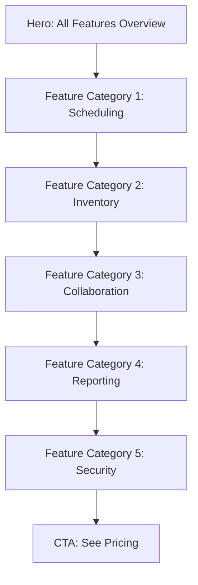

<<<<<<< HEAD
# Portfolio Site Architecture

## 🌐 Overview

The portfolio section is the **public-facing marketing site** for VendorConnect. It serves to build trust, explain features, and convert visitors into authenticated users. This section requires **NO authentication** and is optimized for SEO and performance.

---

## 🎯 Purpose & Goals

### Primary Objectives
1. **Government Credibility**: Establish VendorConnect as a specialized platform for national infrastructure corridors
2. **Stakeholder Trust**: Build confidence with DFCCIL, RVNL, NHAI, and EPC contractors
3. **SEO Performance**: Rank for infrastructure corridor management, freight corridor coordination
4. **Speed**: Lightning-fast page loads (< 1.5s) - critical for government sites
5. **Professional Design**: Government-grade UI with formal, authoritative aesthetics

### Target Audience
- 🏛️ **Government Project Heads** (DFCCIL, RVNL, NHAI)
- 🏗️ **EPC Project Managers** (Larsen & Toubro, Tata Projects)
- 👷 **Site Supervisors** (Railway & Highway infrastructure)
- � **Logistics Coordinators** (Multi-corridor material management)
- � **Vendor & Subcontractor Teams** (Executing packages across sections)

---

## 📁 File Structure

```
src/app/(portfolio)/
├── layout.tsx                  ← Portfolio-specific layout (navbar + footer)
├── page.tsx                    ← Landing page (/)
├── features/
│   └── page.tsx                ← Feature showcase (/features)
├── pricing/
│   └── page.tsx                ← Pricing tiers (/pricing)
├── about/
│   └── page.tsx                ← Company story (/about)
├── contact/
│   └── page.tsx                ← Contact form (/contact)
└── blog/                       ← Future: Content marketing
    ├── page.tsx
    └── [slug]/page.tsx
```

---

## 🎨 Layout Design

### Portfolio Layout Component

```tsx
// src/app/(portfolio)/layout.tsx
import { PortfolioNavbar } from '@/components/portfolio/Navbar';
import { PortfolioFooter } from '@/components/portfolio/Footer';

export default function PortfolioLayout({
  children,
}: {
  children: React.ReactNode;
}) {
  return (
    <div className="min-h-screen flex flex-col">
      <PortfolioNavbar />
      <main className="flex-1">
        {children}
      </main>
      <PortfolioFooter />
    </div>
  );
}
```

### Navbar Structure

```
┌─────────────────────────────────────────────────────────────┐
│  [VendorConnect Logo]    Features  Pricing  About  Contact  │
│                                         [Handle Project] →  │
└─────────────────────────────────────────────────────────────┘
```

**Components**:
- Logo (left, links to `/`)
- Navigation links (center)
- **"Handle Project"** button (right) → redirects to `/login`

> [!IMPORTANT]
> The "Handle Project" button is the **primary CTA** across all portfolio pages. It must be visually prominent (primary color, high contrast).

### Footer Structure

```
┌─────────────────────────────────────────────────────────────┐
│  Product              Company              Resources         │
│  • Features           • About              • Documentation   │
│  • Pricing            • Contact            • API Docs        │
│  • Updates            • Careers            • Support         │
│                                                               │
│  ────────────────────────────────────────────────────────── │
│  © 2025 VendorConnect  |  Privacy  |  Terms  |  Security    │
└─────────────────────────────────────────────────────────────┘
```

---

## 📄 Page-by-Page Breakdown

### 1. Landing Page (`/`)

> [!IMPORTANT]
> **Positioning Strategy**: VendorConnect is positioned as a **specialized government-grade coordination platform** for national infrastructure projects, not a generic construction tool.

---

#### A. Hero Section

```tsx
<HeroSection className="bg-gradient-to-br from-blue-900 via-blue-800 to-slate-900 text-white">
  <div className="container mx-auto px-6 py-20">
    {/* Main Headline */}
    <h1 className="text-5xl md:text-6xl font-bold leading-tight mb-6">
      Integrated Project Coordination for<br />
      <span className="text-blue-300">National Infrastructure Corridors</span>
    </h1>
    
    {/* Subheading */}
    <p className="text-xl md:text-2xl text-blue-100 mb-4 max-w-4xl">
      A centralized digital platform to manage vendors, supervisors, machinery, 
      materials, and daily work execution for large-scale railway and highway 
      infrastructure projects.
    </p>
    
    {/* Context Line (Credibility) */}
    <p className="text-lg text-blue-200 mb-8 max-w-3xl">
      Designed for Dedicated Freight Corridors, Expressways, and EPC-led 
      construction projects involving multiple stakeholders.
    </p>
    
    {/* CTA Buttons */}
    <div className="flex flex-col sm:flex-row gap-4">
      <Button 
        size="large" 
        variant="primary" 
        href="/login"
        className="bg-blue-500 hover:bg-blue-600"
      >
        Handle Project
      </Button>
      <Button 
        size="large" 
        variant="outline" 
        href="#capabilities"
        className="border-blue-300 text-blue-100 hover:bg-blue-800"
      >
        View System Capabilities
      </Button>
    </div>
    
    {/* Dashboard Preview Image */}
    <div className="mt-12">
      <Image 
        src="/dashboard-corridor-preview.png" 
        alt="VendorConnect Corridor Dashboard"
        width={1200}
        height={700}
        className="rounded-xl shadow-2xl border border-blue-700"
      />
    </div>
  </div>
</HeroSection>
```

**Design Notes**:
- Dark blue gradient background (government/infrastructure theme)
- Bold, authoritative typography
- Emphasize "National Infrastructure" and "Corridors"
- Dashboard screenshot should show multi-project corridor view

---

#### B. Project Context Section (CRITICAL FOR CREDIBILITY)

```tsx
<ProjectContextSection className="py-20 bg-slate-50">
  <div className="container mx-auto px-6">
    <div className="text-center mb-12">
      <h2 className="text-4xl font-bold text-slate-900 mb-4">
        Ongoing Corridor Scope
      </h2>
      <p className="text-xl text-slate-600">
        Designed for India's largest infrastructure projects
      </p>
    </div>
    
    <div className="grid grid-cols-1 lg:grid-cols-2 gap-8 mb-12">
      {/* Left Column: Project Type & Stakeholders */}
      <Card className="p-8">
        <div className="mb-8">
          <h3 className="text-2xl font-bold text-slate-900 mb-4 flex items-center">
            <Train className="mr-3 h-6 w-6 text-blue-600" />
            Project Type
          </h3>
          <p className="text-lg text-slate-700">
            Dedicated Freight & Highway Infrastructure Corridor
          </p>
        </div>
        
        <div>
          <h3 className="text-2xl font-bold text-slate-900 mb-4 flex items-center">
            <Building2 className="mr-3 h-6 w-6 text-blue-600" />
            Primary Stakeholders
          </h3>
          <ul className="space-y-3">
            <li className="flex items-start">
              <CheckCircle className="mr-2 h-5 w-5 text-green-600 mt-1 flex-shrink-0" />
              <span className="text-slate-700">
                <strong className="text-slate-900">DFCCIL</strong> - 
                Dedicated Freight Corridor Corporation of India Ltd.
              </span>
            </li>
            <li className="flex items-start">
              <CheckCircle className="mr-2 h-5 w-5 text-green-600 mt-1 flex-shrink-0" />
              <span className="text-slate-700">
                <strong className="text-slate-900">RVNL</strong> - 
                Rail Vikas Nigam Limited
              </span>
            </li>
            <li className="flex items-start">
              <CheckCircle className="mr-2 h-5 w-5 text-green-600 mt-1 flex-shrink-0" />
              <span className="text-slate-700">
                <strong className="text-slate-900">L&T</strong> - 
                Larsen & Toubro (EPC Contractor)
              </span>
            </li>
            <li className="flex items-start">
              <CheckCircle className="mr-2 h-5 w-5 text-green-600 mt-1 flex-shrink-0" />
              <span className="text-slate-700">
                <strong className="text-slate-900">Tata Projects</strong> - 
                EPC Contractor
              </span>
            </li>
            <li className="flex items-start">
              <CheckCircle className="mr-2 h-5 w-5 text-green-600 mt-1 flex-shrink-0" />
              <span className="text-slate-700">
                <strong className="text-slate-900">NHAI</strong> - 
                National Highways Authority of India
              </span>
            </li>
          </ul>
        </div>
      </Card>
      
      {/* Right Column: Geographical Span */}
      <Card className="p-8">
        <h3 className="text-2xl font-bold text-slate-900 mb-4 flex items-center">
          <MapPin className="mr-3 h-6 w-6 text-blue-600" />
          Geographical Span
        </h3>
        
        <div className="mb-6">
          <h4 className="text-lg font-semibold text-slate-800 mb-3">
            Eastern Freight Corridor Alignment
          </h4>
          <div className="space-y-2">
            {['Kolkata', 'Greater Noida (Khurja)', 'Meerut', 'Saharanpur', 'Ambala', 'Ludhiana'].map((city) => (
              <div key={city} className="flex items-center">
                <div className="w-2 h-2 rounded-full bg-blue-600 mr-3"></div>
                <span className="text-slate-700">{city}</span>
              </div>
            ))}
          </div>
        </div>
        
        <div>
          <h4 className="text-lg font-semibold text-slate-800 mb-3">
            Running parallel to:
          </h4>
          <ul className="space-y-2 text-slate-700">
            <li className="flex items-center">
              <Highway className="mr-2 h-4 w-4 text-slate-500" />
              National Highways
            </li>
            <li className="flex items-center">
              <Route className="mr-2 h-4 w-4 text-slate-500" />
              Expressway infrastructure
            </li>
            <li className="flex items-center">
              <Factory className="mr-2 h-4 w-4 text-slate-500" />
              Logistics & industrial zones
            </li>
          </ul>
        </div>
      </Card>
    </div>
    
    {/* Map Visualization (Optional - can be added later) */}
    <div className="mt-8 text-center">
      <Image 
        src="/corridor-map.png" 
        alt="Eastern Freight Corridor Map"
        width={1100}
        height={400}
        className="rounded-lg shadow-lg mx-auto"
      />
      <p className="text-sm text-slate-500 mt-2">
        Eastern Freight Corridor - Multi-package execution zones
      </p>
    </div>
  </div>
</ProjectContextSection>
```

**Design Notes**:
- Use official logos of DFCCIL, RVNL, L&T, NHAI (with permission)
- Government color scheme: blues, grays, whites
- Clean, professional, trustworthy design
- Include corridor route map for visual credibility

---

#### C. Project Scale Section

```tsx
<ProjectScaleSection className="py-20 bg-white">
  <div className="container mx-auto px-6">
    <h2 className="text-4xl font-bold text-slate-900 text-center mb-12">
      Project Scale & Complexity
    </h2>
    
    <div className="grid grid-cols-1 md:grid-cols-2 gap-8">
      {/* Estimated Project Scale */}
      <Card className="p-8 border-2 border-blue-200">
        <h3 className="text-2xl font-bold text-slate-900 mb-6 flex items-center">
          <BarChart3 className="mr-3 h-6 w-6 text-blue-600" />
          Estimated Project Scale
        </h3>
        <ul className="space-y-4">
          <li className="flex items-start">
            <div className="w-1.5 h-1.5 rounded-full bg-blue-600 mr-3 mt-2"></div>
            <span className="text-slate-700">
              <strong className="text-slate-900">Multi-package EPC execution</strong> 
              across corridor segments
            </span>
          </li>
          <li className="flex items-start">
            <div className="w-1.5 h-1.5 rounded-full bg-blue-600 mr-3 mt-2"></div>
            <span className="text-slate-700">
              <strong className="text-slate-900">Corridor-based planning</strong> 
              with section-wise project tracking
            </span>
          </li>
          <li className="flex items-start">
            <div className="w-1.5 h-1.5 rounded-full bg-blue-600 mr-3 mt-2"></div>
            <span className="text-slate-700">
              <strong className="text-slate-900">Multi-agency coordination</strong> 
              between government bodies and EPC contractors
            </span>
          </li>
          <li className="flex items-start">
            <div className="w-1.5 h-1.5 rounded-full bg-blue-600 mr-3 mt-2"></div>
            <span className="text-slate-700">
              <strong className="text-slate-900">High-volume vendor & machinery deployment</strong> 
              across distributed sites
            </span>
          </li>
        </ul>
      </Card>
      
      {/* Operational Challenges */}
      <Card className="p-8 border-2 border-orange-200">
        <h3 className="text-2xl font-bold text-slate-900 mb-6 flex items-center">
          <AlertTriangle className="mr-3 h-6 w-6 text-orange-600" />
          Operational Challenges
        </h3>
        <ul className="space-y-4">
          <li className="flex items-start">
            <AlertCircle className="mr-3 h-5 w-5 text-orange-600 mt-0.5 flex-shrink-0" />
            <span className="text-slate-700">
              Multiple contractors working in parallel on adjacent packages
            </span>
          </li>
          <li className="flex items-start">
            <AlertCircle className="mr-3 h-5 w-5 text-orange-600 mt-0.5 flex-shrink-0" />
            <span className="text-slate-700">
              Shared logistics corridors requiring centralized coordination
            </span>
          </li>
          <li className="flex items-start">
            <AlertCircle className="mr-3 h-5 w-5 text-orange-600 mt-0.5 flex-shrink-0" />
            <span className="text-slate-700">
              Daily coordination between railway, highway, and site teams
            </span>
          </li>
          <li className="flex items-start">
            <AlertCircle className="mr-3 h-5 w-5 text-orange-600 mt-0.5 flex-shrink-0" />
            <span className="text-slate-700">
              Machine & material dependency across multiple locations
            </span>
          </li>
        </ul>
        
        <div className="mt-6 p-4 bg-blue-50 rounded-lg border border-blue-200">
          <p className="text-blue-900 font-semibold text-center">
            VendorConnect is built to address exactly this complexity.
          </p>
        </div>
      </Card>
    </div>
  </div>
</ProjectScaleSection>
```

**Design Notes**:
- Use warning colors (orange) for challenges to highlight pain points
- Blue accents for scale/solutions
- Clear visual hierarchy

---

#### D. System Capabilities Section (Feature Grid - Government Tone)

```tsx
<SystemCapabilitiesSection id="capabilities" className="py-20 bg-slate-50">
  <div className="container mx-auto px-6">
    <div className="text-center mb-12">
      <h2 className="text-4xl font-bold text-slate-900 mb-4">
        System Capabilities
      </h2>
      <p className="text-xl text-slate-600 max-w-3xl mx-auto">
        Purpose-built features for corridor-level infrastructure coordination
      </p>
    </div>
    
    <div className="grid grid-cols-1 md:grid-cols-2 lg:grid-cols-3 gap-8">
      {/* Feature 1: Corridor-Level Work Planning */}
      <FeatureCard className="p-8 bg-white hover:shadow-xl transition-shadow">
        <div className="w-12 h-12 rounded-lg bg-blue-100 flex items-center justify-center mb-4">
          <Calendar className="h-6 w-6 text-blue-600" />
        </div>
        <h3 className="text-xl font-bold text-slate-900 mb-3">
          🗓 Corridor-Level Work Planning
        </h3>
        <p className="text-slate-600 mb-4">
          Plan and monitor daily activities across:
        </p>
        <ul className="space-y-2 text-slate-700">
          <li className="flex items-start">
            <span className="text-blue-600 mr-2">•</span>
            Railway works
          </li>
          <li className="flex items-start">
            <span className="text-blue-600 mr-2">•</span>
            Highway & expressway packages
          </li>
          <li className="flex items-start">
            <span className="text-blue-600 mr-2">•</span>
            Parallel execution zones
          </li>
        </ul>
        <p className="text-sm text-slate-500 mt-4 italic">
          Each project section operates independently while reporting into 
          a unified corridor dashboard.
        </p>
      </FeatureCard>
      
      {/* Feature 2: Role-Based Stakeholder Access */}
      <FeatureCard className="p-8 bg-white hover:shadow-xl transition-shadow">
        <div className="w-12 h-12 rounded-lg bg-green-100 flex items-center justify-center mb-4">
          <Users className="h-6 w-6 text-green-600" />
        </div>
        <h3 className="text-xl font-bold text-slate-900 mb-3">
          👥 Role-Based Stakeholder Access (RBAC)
        </h3>
        <p className="text-slate-600 mb-4">
          Access strictly based on responsibility:
        </p>
        <ul className="space-y-2 text-slate-700">
          <li className="flex items-start">
            <Shield className="h-4 w-4 text-green-600 mr-2 mt-1 flex-shrink-0" />
            Project Head (DFCCIL / RVNL)
          </li>
          <li className="flex items-start">
            <Shield className="h-4 w-4 text-green-600 mr-2 mt-1 flex-shrink-0" />
            EPC Project Manager (L&T / Tata)
          </li>
          <li className="flex items-start">
            <Shield className="h-4 w-4 text-green-600 mr-2 mt-1 flex-shrink-0" />
            Site Supervisor
          </li>
          <li className="flex items-start">
            <Shield className="h-4 w-4 text-green-600 mr-2 mt-1 flex-shrink-0" />
            Vendor / Subcontractor
          </li>
          <li className="flex items-start">
            <Shield className="h-4 w-4 text-green-600 mr-2 mt-1 flex-shrink-0" />
            Warehouse / Logistics Team
          </li>
        </ul>
        <p className="text-sm text-slate-500 mt-4 italic">
          Ensures information control, auditability, and accountability.
        </p>
      </FeatureCard>
      
      {/* Feature 3: Machinery & Resource Allocation */}
      <FeatureCard className="p-8 bg-white hover:shadow-xl transition-shadow">
        <div className="w-12 h-12 rounded-lg bg-orange-100 flex items-center justify-center mb-4">
          <Truck className="h-6 w-6 text-orange-600" />
        </div>
        <h3 className="text-xl font-bold text-slate-900 mb-3">
          🏗️ Machinery & Resource Allocation
        </h3>
        <ul className="space-y-2 text-slate-700">
          <li className="flex items-start">
            <span className="text-orange-600 mr-2">✓</span>
            Machine assignment per site and date
          </li>
          <li className="flex items-start">
            <span className="text-orange-600 mr-2">✓</span>
            Operator / driver mapping
          </li>
          <li className="flex items-start">
            <span className="text-orange-600 mr-2">✓</span>
            Availability & utilization tracking
          </li>
          <li className="flex items-start">
            <span className="text-orange-600 mr-2">✓</span>
            Conflict prevention across parallel packages
          </li>
        </ul>
      </FeatureCard>
      
      {/* Feature 4: Material & Warehouse Coordination */}
      <FeatureCard className="p-8 bg-white hover:shadow-xl transition-shadow">
        <div className="w-12 h-12 rounded-lg bg-purple-100 flex items-center justify-center mb-4">
          <Package className="h-6 w-6 text-purple-600" />
        </div>
        <h3 className="text-xl font-bold text-slate-900 mb-3">
          📦 Material & Warehouse Coordination
        </h3>
        <ul className="space-y-2 text-slate-700">
          <li className="flex items-start">
            <span className="text-purple-600 mr-2">✓</span>
            Track inward / outward movement
          </li>
          <li className="flex items-start">
            <span className="text-purple-600 mr-2">✓</span>
            Site-wise consumption visibility
          </li>
          <li className="flex items-start">
            <span className="text-purple-600 mr-2">✓</span>
            Early alerts for shortages
          </li>
          <li className="flex items-start">
            <span className="text-purple-600 mr-2">✓</span>
            Shared logistics planning with highway projects
          </li>
        </ul>
      </FeatureCard>
      
      {/* Feature 5: Location & Section-Based Tracking */}
      <FeatureCard className="p-8 bg-white hover:shadow-xl transition-shadow">
        <div className="w-12 h-12 rounded-lg bg-red-100 flex items-center justify-center mb-4">
          <MapPin className="h-6 w-6 text-red-600" />
        </div>
        <h3 className="text-xl font-bold text-slate-900 mb-3">
          📍 Location & Section-Based Tracking
        </h3>
        <ul className="space-y-2 text-slate-700">
          <li className="flex items-start">
            <span className="text-red-600 mr-2">✓</span>
            Segment-wise project structure
          </li>
          <li className="flex items-start">
            <span className="text-red-600 mr-2">✓</span>
            Location tagging (e.g., Khurja Section, Ambala Section)
          </li>
          <li className="flex items-start">
            <span className="text-red-600 mr-2">✓</span>
            Section-specific alerts and reports
          </li>
        </ul>
      </FeatureCard>
      
      {/* Feature 6: Alerts & Issue Reporting */}
      <FeatureCard className="p-8 bg-white hover:shadow-xl transition-shadow">
        <div className="w-12 h-12 rounded-lg bg-yellow-100 flex items-center justify-center mb-4">
          <Bell className="h-6 w-6 text-yellow-600" />
        </div>
        <h3 className="text-xl font-bold text-slate-900 mb-3">
          🔔 Alerts & Issue Reporting
        </h3>
        <ul className="space-y-2 text-slate-700">
          <li className="flex items-start">
            <span className="text-yellow-600 mr-2">✓</span>
            Machine breakdown alerts
          </li>
          <li className="flex items-start">
            <span className="text-yellow-600 mr-2">✓</span>
            Material delay notifications
          </li>
          <li className="flex items-start">
            <span className="text-yellow-600 mr-2">✓</span>
            Site issue escalation
          </li>
          <li className="flex items-start">
            <span className="text-yellow-600 mr-2">✓</span>
            Section-specific broadcast alerts
          </li>
        </ul>
      </FeatureCard>
      
      {/* Feature 7: Daily Progress & Reporting */}
      <FeatureCard className="p-8 bg-white hover:shadow-xl transition-shadow">
        <div className="w-12 h-12 rounded-lg bg-teal-100 flex items-center justify-center mb-4">
          <BarChart className="h-6 w-6 text-teal-600" />
        </div>
        <h3 className="text-xl font-bold text-slate-900 mb-3">
          📊 Daily Progress & Reporting
        </h3>
        <ul className="space-y-2 text-slate-700">
          <li className="flex items-start">
            <span className="text-teal-600 mr-2">✓</span>
            Supervisor daily work logs
          </li>
          <li className="flex items-start">
            <span className="text-teal-600 mr-2">✓</span>
            Vendor progress submission
          </li>
          <li className="flex items-start">
            <span className="text-teal-600 mr-2">✓</span>
            Corridor-level summary reports
          </li>
          <li className="flex items-start">
            <span className="text-teal-600 mr-2">✓</span>
            Excel export for official review
          </li>
        </ul>
      </FeatureCard>
    </div>
  </div>
</SystemCapabilitiesSection>
```

**Design Notes**:
- Use different color accents for each capability (improves scannability)
- Government-appropriate language (formal, professional)
- Specific stakeholder mentions (DFCCIL, RVNL, L&T, etc.)
- Emphasize "corridor", "section", "package" terminology

---

#### E. Use Cases Section (Infrastructure-Specific)

```tsx
<UseCasesSection className="py-20 bg-white">
  <div className="container mx-auto px-6">
    <h2 className="text-4xl font-bold text-slate-900 text-center mb-12">
      Built for Infrastructure Stakeholders
    </h2>
    
    <div className="grid grid-cols-1 lg:grid-cols-3 gap-8">
      <UseCase
        icon={<Building2 className="h-12 w-12 text-blue-600" />}
        title="For DFCCIL / RVNL Project Heads"
        description="Monitor corridor-wide progress across all packages, track multi-contractor coordination, and generate consolidated reports for senior management."
        image="/screenshots/project-head-corridor-dashboard.png"
      />
      
      <UseCase
        icon={<HardHat className="h-12 w-12 text-orange-600" />}
        title="For EPC Contractors (L&T / Tata)"
        description="Manage package-specific execution, coordinate with vendor teams, track machinery utilization, and submit daily progress reports to the nodal agency."
        image="/screenshots/epc-contractor-dashboard.png"
      />
      
      <UseCase
        icon={<Warehouse className="h-12 w-12 text-purple-600" />}
        title="For Warehouse & Logistics Teams"
        description="Track material movements across multiple sites, manage shared logistics corridors, and ensure timely delivery to railway and highway work zones."
        image="/screenshots/warehouse-logistics-dashboard.png"
      />
    </div>
  </div>
</UseCasesSection>
```

---

#### F. CTA Section (Final Conversion)

```tsx
<CTASection className="py-20 bg-gradient-to-r from-blue-900 to-blue-800 text-white">
  <div className="container mx-auto px-6 text-center">
    <h2 className="text-4xl font-bold mb-4">
      Ready to Coordinate Your Infrastructure Corridor?
    </h2>
    <p className="text-xl text-blue-100 mb-8 max-w-2xl mx-auto">
      Join the digital transformation of India's national infrastructure projects
    </p>
    <div className="flex flex-col sm:flex-row gap-4 justify-center">
      <Button 
        size="large" 
        variant="primary" 
        href="/login"
        className="bg-white text-blue-900 hover:bg-blue-50"
      >
        Handle Project
      </Button>
      <Button 
        size="large" 
        variant="outline" 
        href="/contact"
        className="border-white text-white hover:bg-blue-800"
      >
        Schedule a Demo
      </Button>
    </div>
    
    {/* Optional: Stakeholder Logos */}
    <div className="mt-12 pt-8 border-t border-blue-700">
      <p className="text-sm text-blue-200 mb-4">Designed for</p>
      <div className="flex flex-wrap justify-center items-center gap-8 opacity-80">
        {/* Add actual logos here with proper permissions */}
        <div className="text-white font-semibold">DFCCIL</div>
        <div className="text-white font-semibold">RVNL</div>
        <div className="text-white font-semibold">NHAI</div>
        <div className="text-white font-semibold">L&T</div>
        <div className="text-white font-semibold">Tata Projects</div>
      </div>
    </div>
  </div>
</CTASection>
```


---

### 2. Features Page (`/features`)

**Structure**:



**Details for Each Feature**:
- Icon
- Name
- 2-3 sentence description
- Screenshot or demo video
- Link to documentation (future)

**Example**:

```tsx
<FeatureDetail>
  <FeatureIcon><Calendar size={48} /></FeatureIcon>
  <FeatureTitle>Smart Scheduling</FeatureTitle>
  <FeatureDescription>
    Automatically assign tasks based on vendor availability, 
    machine capacity, and material stock. Conflict detection 
    prevents double-booking and delays.
  </FeatureDescription>
  <FeatureScreenshot src="/features/scheduling.png" />
  <FeatureLink href="/docs/scheduling">Learn More →</FeatureLink>
</FeatureDetail>
```

---

### 3. Pricing Page (`/pricing`)

**Pricing Tiers**:

| Tier | Price | Target Audience |
|------|-------|-----------------|
| **Starter** | Free | Single project, up to 5 users |
| **Professional** | $99/month | Up to 3 projects, 25 users |
| **Enterprise** | Custom | Unlimited projects, custom roles |

**Design**:

```tsx
<PricingGrid>
  <PricingCard tier="starter">
    <TierName>Starter</TierName>
    <Price>Free</Price>
    <Features>
      ✅ 1 project
      ✅ 5 team members
      ✅ Basic dashboards
      ✅ Email support
      ❌ Custom roles
      ❌ API access
    </Features>
    <CTAButton href="/login">Start Free</CTAButton>
  </PricingCard>
  
  <PricingCard tier="professional" featured>
    <Badge>Most Popular</Badge>
    <TierName>Professional</TierName>
    <Price>$99<span>/month</span></Price>
    <Features>
      ✅ Up to 3 projects
      ✅ 25 team members
      ✅ Advanced analytics
      ✅ Priority support
      ✅ API access
      ❌ White-labeling
    </Features>
    <CTAButton href="/login">Start Trial</CTAButton>
  </PricingCard>
  
  <PricingCard tier="enterprise">
    <TierName>Enterprise</TierName>
    <Price>Custom</Price>
    <Features>
      ✅ Unlimited projects
      ✅ Unlimited users
      ✅ Custom roles
      ✅ Dedicated support
      ✅ White-labeling
      ✅ SLA guarantees
    </Features>
    <CTAButton href="/contact">Contact Sales</CTAButton>
  </PricingCard>
</PricingGrid>
```

**FAQ Section**:
- "Can I switch plans later?" → Yes
- "Is there a free trial?" → 14 days for Professional
- "What payment methods?" → Credit card, invoice (Enterprise)

---

### 4. About Page (`/about`)

**Sections**:
1. **Mission Statement**: Why VendorConnect exists
2. **Team**: Founders + key members (photos + bios)
3. **Story**: How the idea came to be
4. **Values**: Transparency, reliability, innovation
5. **Milestones**: Timeline of company growth

---

### 5. Contact Page (`/contact`)

**Form Fields**:
```tsx
<ContactForm>
  <Input name="name" label="Your Name" required />
  <Input name="email" label="Email Address" type="email" required />
  <Input name="company" label="Company (optional)" />
  <Select name="inquiry_type" label="Inquiry Type">
    <option>Sales</option>
    <option>Support</option>
    <option>Partnership</option>
    <option>Other</option>
  </Select>
  <Textarea name="message" label="Message" rows={6} required />
  <Button type="submit">Send Message</Button>
</ContactForm>
```

**Additional Info**:
- Email: support@vendorconnect.com
- Phone: +1 (555) 123-4567
- Business hours: Mon-Fri 9am-6pm EST

---

## 🎨 Design System for Portfolio

### Color Palette

```css
:root {
  --portfolio-primary: #2563eb;      /* Blue - trust, professionalism */
  --portfolio-secondary: #f59e0b;    /* Amber - construction theme */
  --portfolio-accent: #10b981;       /* Green - success, growth */
  --portfolio-neutral-900: #111827;  /* Dark text */
  --portfolio-neutral-200: #e5e7eb;  /* Light backgrounds */
}
```

### Typography

```css
h1 { font-size: 3.5rem; font-weight: 800; line-height: 1.1; }
h2 { font-size: 2.5rem; font-weight: 700; line-height: 1.2; }
h3 { font-size: 1.875rem; font-weight: 600; line-height: 1.3; }
body { font-size: 1.125rem; line-height: 1.75; }
```

### Spacing System

```css
.section-padding { padding: 6rem 0; }  /* Desktop */
.section-padding { padding: 3rem 0; }  /* Mobile */
.container { max-width: 1280px; margin: 0 auto; padding: 0 1.5rem; }
```

---

## 🚀 Performance Optimization

### Next.js Optimizations

1. **Static Generation**: All portfolio pages use `generateStaticParams`
2. **Image Optimization**: All images use `next/image` with proper sizes
3. **Font Loading**: Use `next/font` for automatic font optimization
4. **Code Splitting**: Lazy load heavy components

```tsx
// Example: Lazy load testimonials slider
const TestimonialsSlider = dynamic(
  () => import('@/components/portfolio/TestimonialsSlider'),
  { ssr: false }
);
```

### SEO Configuration

```tsx
// src/app/(portfolio)/page.tsx
export const metadata: Metadata = {
  title: 'VendorConnect - Infrastructure Corridor Project Coordination Platform',
  description: 'Digital coordination platform for national infrastructure corridors. Manage railway freight corridors, expressways, and EPC-led construction projects with multi-stakeholder coordination.',
  keywords: [
    'infrastructure corridor management',
    'freight corridor coordination',
    'DFCCIL project management',
    'RVNL ERP',
    'EPC project coordination',
    'railway infrastructure',
    'highway corridor tracking',
    'multi-package execution',
    'vendor coordination platform',
    'government infrastructure software'
  ],
  openGraph: {
    title: 'VendorConnect - Infrastructure Corridor Coordination',
    description: 'Purpose-built platform for national infrastructure projects including freight corridors, expressways, and multi-stakeholder EPC execution.',
    images: ['/og-corridor-dashboard.png'],
    type: 'website',
  },
  twitter: {
    card: 'summary_large_image',
    title: 'VendorConnect - Infrastructure Corridors',
    description: 'Digital coordination for freight corridors, expressways, and EPC projects',
    images: ['/twitter-corridor-preview.png'],
  },
};
```


### Analytics Tracking

```tsx
// Track button clicks
<Button
  href="/login"
  onClick={() => analytics.track('CTA Clicked', { location: 'hero' })}
>
  Get Started
</Button>
```

---

## 📱 Mobile Responsiveness

### Breakpoints

```css
/* Mobile: < 640px */
/* Tablet: 640px - 1024px */
/* Desktop: > 1024px */
```

### Mobile-Specific Adjustments

1. **Navbar**: Hamburger menu on mobile
2. **Hero**: Stack image below text
3. **Feature Grid**: 1 column on mobile, 2 on tablet, 3 on desktop
4. **CTA Buttons**: Full-width on mobile

---

## ♿ Accessibility (WCAG 2.1 AA)

- [ ] All images have `alt` text
- [ ] Color contrast ratio ≥ 4.5:1
- [ ] Keyboard navigation support
- [ ] ARIA labels for interactive elements
- [ ] Focus indicators visible
- [ ] Semantic HTML (`<nav>`, `<main>`, `<section>`)

---

## 🧪 A/B Testing Opportunities

1. **Headline variations**: Test different value propositions
2. **CTA button text**: "Get Started" vs "Start Free Trial"
3. **Hero image**: Screenshot vs illustration
4. **Social proof placement**: Above vs below fold

---

## 📊 Success Metrics

### Key Performance Indicators (KPIs)

| Metric | Target | Current |
|--------|--------|---------|
| Bounce Rate | < 40% | TBD |
| Avg. Session Duration | > 2 min | TBD |
| CTA Click Rate | > 15% | TBD |
| Mobile Traffic | > 50% | TBD |
| Page Load Time | < 1.5s | TBD |

---

## 🔮 Future Enhancements

- [ ] **Blog**: SEO-driven content marketing
- [ ] **Case Studies**: Detailed customer success stories
- [ ] **Video Demos**: Product walkthroughs
- [ ] **Live Chat**: Intercom or similar
- [ ] **Changelog**: Public feature update log
- [ ] **Comparison Page**: VendorConnect vs competitors

---

## 📚 Related Components

### Component Library Location

```
src/components/portfolio/
├── Navbar.tsx
├── Footer.tsx
├── HeroSection.tsx
├── FeatureGrid.tsx
├── FeatureCard.tsx
├── UseCases.tsx
├── Testimonials.tsx
├── CTASection.tsx
├── PricingCard.tsx
└── ContactForm.tsx
```

See [ui.md](./ui.md) for detailed component specifications.

---

**Last Updated**: 2025-12-14  
**Version**: 2.0 (Infrastructure Corridor Positioning)  
**Status**: 🟡 Planning Phase

=======
# Portfolio Site Architecture

## 🌐 Overview

The portfolio section is the **public-facing marketing site** for VendorConnect. It serves to build trust, explain features, and convert visitors into authenticated users. This section requires **NO authentication** and is optimized for SEO and performance.

---

## 🎯 Purpose & Goals

### Primary Objectives
1. **Government Credibility**: Establish VendorConnect as a specialized platform for national infrastructure corridors
2. **Stakeholder Trust**: Build confidence with DFCCIL, RVNL, NHAI, and EPC contractors
3. **SEO Performance**: Rank for infrastructure corridor management, freight corridor coordination
4. **Speed**: Lightning-fast page loads (< 1.5s) - critical for government sites
5. **Professional Design**: Government-grade UI with formal, authoritative aesthetics

### Target Audience
- 🏛️ **Government Project Heads** (DFCCIL, RVNL, NHAI)
- 🏗️ **EPC Project Managers** (Larsen & Toubro, Tata Projects)
- 👷 **Site Supervisors** (Railway & Highway infrastructure)
- � **Logistics Coordinators** (Multi-corridor material management)
- � **Vendor & Subcontractor Teams** (Executing packages across sections)

---

## 📁 File Structure

```
src/app/(portfolio)/
├── layout.tsx                  ← Portfolio-specific layout (navbar + footer)
├── page.tsx                    ← Landing page (/)
├── features/
│   └── page.tsx                ← Feature showcase (/features)
├── pricing/
│   └── page.tsx                ← Pricing tiers (/pricing)
├── about/
│   └── page.tsx                ← Company story (/about)
├── contact/
│   └── page.tsx                ← Contact form (/contact)
└── blog/                       ← Future: Content marketing
    ├── page.tsx
    └── [slug]/page.tsx
```

---

## 🎨 Layout Design

### Portfolio Layout Component

```tsx
// src/app/(portfolio)/layout.tsx
import { PortfolioNavbar } from '@/components/portfolio/Navbar';
import { PortfolioFooter } from '@/components/portfolio/Footer';

export default function PortfolioLayout({
  children,
}: {
  children: React.ReactNode;
}) {
  return (
    <div className="min-h-screen flex flex-col">
      <PortfolioNavbar />
      <main className="flex-1">
        {children}
      </main>
      <PortfolioFooter />
    </div>
  );
}
```

### Navbar Structure

```
┌─────────────────────────────────────────────────────────────┐
│  [VendorConnect Logo]    Features  Pricing  About  Contact  │
│                                         [Handle Project] →  │
└─────────────────────────────────────────────────────────────┘
```

**Components**:
- Logo (left, links to `/`)
- Navigation links (center)
- **"Handle Project"** button (right) → redirects to `/login`

> [!IMPORTANT]
> The "Handle Project" button is the **primary CTA** across all portfolio pages. It must be visually prominent (primary color, high contrast).

### Footer Structure

```
┌─────────────────────────────────────────────────────────────┐
│  Product              Company              Resources         │
│  • Features           • About              • Documentation   │
│  • Pricing            • Contact            • API Docs        │
│  • Updates            • Careers            • Support         │
│                                                               │
│  ────────────────────────────────────────────────────────── │
│  © 2025 VendorConnect  |  Privacy  |  Terms  |  Security    │
└─────────────────────────────────────────────────────────────┘
```

---

## 📄 Page-by-Page Breakdown

### 1. Landing Page (`/`)

> [!IMPORTANT]
> **Positioning Strategy**: VendorConnect is positioned as a **specialized government-grade coordination platform** for national infrastructure projects, not a generic construction tool.

---

#### A. Hero Section

```tsx
<HeroSection className="bg-gradient-to-br from-blue-900 via-blue-800 to-slate-900 text-white">
  <div className="container mx-auto px-6 py-20">
    {/* Main Headline */}
    <h1 className="text-5xl md:text-6xl font-bold leading-tight mb-6">
      Integrated Project Coordination for<br />
      <span className="text-blue-300">National Infrastructure Corridors</span>
    </h1>
    
    {/* Subheading */}
    <p className="text-xl md:text-2xl text-blue-100 mb-4 max-w-4xl">
      A centralized digital platform to manage vendors, supervisors, machinery, 
      materials, and daily work execution for large-scale railway and highway 
      infrastructure projects.
    </p>
    
    {/* Context Line (Credibility) */}
    <p className="text-lg text-blue-200 mb-8 max-w-3xl">
      Designed for Dedicated Freight Corridors, Expressways, and EPC-led 
      construction projects involving multiple stakeholders.
    </p>
    
    {/* CTA Buttons */}
    <div className="flex flex-col sm:flex-row gap-4">
      <Button 
        size="large" 
        variant="primary" 
        href="/login"
        className="bg-blue-500 hover:bg-blue-600"
      >
        Handle Project
      </Button>
      <Button 
        size="large" 
        variant="outline" 
        href="#capabilities"
        className="border-blue-300 text-blue-100 hover:bg-blue-800"
      >
        View System Capabilities
      </Button>
    </div>
    
    {/* Dashboard Preview Image */}
    <div className="mt-12">
      <Image 
        src="/dashboard-corridor-preview.png" 
        alt="VendorConnect Corridor Dashboard"
        width={1200}
        height={700}
        className="rounded-xl shadow-2xl border border-blue-700"
      />
    </div>
  </div>
</HeroSection>
```

**Design Notes**:
- Dark blue gradient background (government/infrastructure theme)
- Bold, authoritative typography
- Emphasize "National Infrastructure" and "Corridors"
- Dashboard screenshot should show multi-project corridor view

---

#### B. Project Context Section (CRITICAL FOR CREDIBILITY)

```tsx
<ProjectContextSection className="py-20 bg-slate-50">
  <div className="container mx-auto px-6">
    <div className="text-center mb-12">
      <h2 className="text-4xl font-bold text-slate-900 mb-4">
        Ongoing Corridor Scope
      </h2>
      <p className="text-xl text-slate-600">
        Designed for India's largest infrastructure projects
      </p>
    </div>
    
    <div className="grid grid-cols-1 lg:grid-cols-2 gap-8 mb-12">
      {/* Left Column: Project Type & Stakeholders */}
      <Card className="p-8">
        <div className="mb-8">
          <h3 className="text-2xl font-bold text-slate-900 mb-4 flex items-center">
            <Train className="mr-3 h-6 w-6 text-blue-600" />
            Project Type
          </h3>
          <p className="text-lg text-slate-700">
            Dedicated Freight & Highway Infrastructure Corridor
          </p>
        </div>
        
        <div>
          <h3 className="text-2xl font-bold text-slate-900 mb-4 flex items-center">
            <Building2 className="mr-3 h-6 w-6 text-blue-600" />
            Primary Stakeholders
          </h3>
          <ul className="space-y-3">
            <li className="flex items-start">
              <CheckCircle className="mr-2 h-5 w-5 text-green-600 mt-1 flex-shrink-0" />
              <span className="text-slate-700">
                <strong className="text-slate-900">DFCCIL</strong> - 
                Dedicated Freight Corridor Corporation of India Ltd.
              </span>
            </li>
            <li className="flex items-start">
              <CheckCircle className="mr-2 h-5 w-5 text-green-600 mt-1 flex-shrink-0" />
              <span className="text-slate-700">
                <strong className="text-slate-900">RVNL</strong> - 
                Rail Vikas Nigam Limited
              </span>
            </li>
            <li className="flex items-start">
              <CheckCircle className="mr-2 h-5 w-5 text-green-600 mt-1 flex-shrink-0" />
              <span className="text-slate-700">
                <strong className="text-slate-900">L&T</strong> - 
                Larsen & Toubro (EPC Contractor)
              </span>
            </li>
            <li className="flex items-start">
              <CheckCircle className="mr-2 h-5 w-5 text-green-600 mt-1 flex-shrink-0" />
              <span className="text-slate-700">
                <strong className="text-slate-900">Tata Projects</strong> - 
                EPC Contractor
              </span>
            </li>
            <li className="flex items-start">
              <CheckCircle className="mr-2 h-5 w-5 text-green-600 mt-1 flex-shrink-0" />
              <span className="text-slate-700">
                <strong className="text-slate-900">NHAI</strong> - 
                National Highways Authority of India
              </span>
            </li>
          </ul>
        </div>
      </Card>
      
      {/* Right Column: Geographical Span */}
      <Card className="p-8">
        <h3 className="text-2xl font-bold text-slate-900 mb-4 flex items-center">
          <MapPin className="mr-3 h-6 w-6 text-blue-600" />
          Geographical Span
        </h3>
        
        <div className="mb-6">
          <h4 className="text-lg font-semibold text-slate-800 mb-3">
            Eastern Freight Corridor Alignment
          </h4>
          <div className="space-y-2">
            {['Kolkata', 'Greater Noida (Khurja)', 'Meerut', 'Saharanpur', 'Ambala', 'Ludhiana'].map((city) => (
              <div key={city} className="flex items-center">
                <div className="w-2 h-2 rounded-full bg-blue-600 mr-3"></div>
                <span className="text-slate-700">{city}</span>
              </div>
            ))}
          </div>
        </div>
        
        <div>
          <h4 className="text-lg font-semibold text-slate-800 mb-3">
            Running parallel to:
          </h4>
          <ul className="space-y-2 text-slate-700">
            <li className="flex items-center">
              <Highway className="mr-2 h-4 w-4 text-slate-500" />
              National Highways
            </li>
            <li className="flex items-center">
              <Route className="mr-2 h-4 w-4 text-slate-500" />
              Expressway infrastructure
            </li>
            <li className="flex items-center">
              <Factory className="mr-2 h-4 w-4 text-slate-500" />
              Logistics & industrial zones
            </li>
          </ul>
        </div>
      </Card>
    </div>
    
    {/* Map Visualization (Optional - can be added later) */}
    <div className="mt-8 text-center">
      <Image 
        src="/corridor-map.png" 
        alt="Eastern Freight Corridor Map"
        width={1100}
        height={400}
        className="rounded-lg shadow-lg mx-auto"
      />
      <p className="text-sm text-slate-500 mt-2">
        Eastern Freight Corridor - Multi-package execution zones
      </p>
    </div>
  </div>
</ProjectContextSection>
```

**Design Notes**:
- Use official logos of DFCCIL, RVNL, L&T, NHAI (with permission)
- Government color scheme: blues, grays, whites
- Clean, professional, trustworthy design
- Include corridor route map for visual credibility

---

#### C. Project Scale Section

```tsx
<ProjectScaleSection className="py-20 bg-white">
  <div className="container mx-auto px-6">
    <h2 className="text-4xl font-bold text-slate-900 text-center mb-12">
      Project Scale & Complexity
    </h2>
    
    <div className="grid grid-cols-1 md:grid-cols-2 gap-8">
      {/* Estimated Project Scale */}
      <Card className="p-8 border-2 border-blue-200">
        <h3 className="text-2xl font-bold text-slate-900 mb-6 flex items-center">
          <BarChart3 className="mr-3 h-6 w-6 text-blue-600" />
          Estimated Project Scale
        </h3>
        <ul className="space-y-4">
          <li className="flex items-start">
            <div className="w-1.5 h-1.5 rounded-full bg-blue-600 mr-3 mt-2"></div>
            <span className="text-slate-700">
              <strong className="text-slate-900">Multi-package EPC execution</strong> 
              across corridor segments
            </span>
          </li>
          <li className="flex items-start">
            <div className="w-1.5 h-1.5 rounded-full bg-blue-600 mr-3 mt-2"></div>
            <span className="text-slate-700">
              <strong className="text-slate-900">Corridor-based planning</strong> 
              with section-wise project tracking
            </span>
          </li>
          <li className="flex items-start">
            <div className="w-1.5 h-1.5 rounded-full bg-blue-600 mr-3 mt-2"></div>
            <span className="text-slate-700">
              <strong className="text-slate-900">Multi-agency coordination</strong> 
              between government bodies and EPC contractors
            </span>
          </li>
          <li className="flex items-start">
            <div className="w-1.5 h-1.5 rounded-full bg-blue-600 mr-3 mt-2"></div>
            <span className="text-slate-700">
              <strong className="text-slate-900">High-volume vendor & machinery deployment</strong> 
              across distributed sites
            </span>
          </li>
        </ul>
      </Card>
      
      {/* Operational Challenges */}
      <Card className="p-8 border-2 border-orange-200">
        <h3 className="text-2xl font-bold text-slate-900 mb-6 flex items-center">
          <AlertTriangle className="mr-3 h-6 w-6 text-orange-600" />
          Operational Challenges
        </h3>
        <ul className="space-y-4">
          <li className="flex items-start">
            <AlertCircle className="mr-3 h-5 w-5 text-orange-600 mt-0.5 flex-shrink-0" />
            <span className="text-slate-700">
              Multiple contractors working in parallel on adjacent packages
            </span>
          </li>
          <li className="flex items-start">
            <AlertCircle className="mr-3 h-5 w-5 text-orange-600 mt-0.5 flex-shrink-0" />
            <span className="text-slate-700">
              Shared logistics corridors requiring centralized coordination
            </span>
          </li>
          <li className="flex items-start">
            <AlertCircle className="mr-3 h-5 w-5 text-orange-600 mt-0.5 flex-shrink-0" />
            <span className="text-slate-700">
              Daily coordination between railway, highway, and site teams
            </span>
          </li>
          <li className="flex items-start">
            <AlertCircle className="mr-3 h-5 w-5 text-orange-600 mt-0.5 flex-shrink-0" />
            <span className="text-slate-700">
              Machine & material dependency across multiple locations
            </span>
          </li>
        </ul>
        
        <div className="mt-6 p-4 bg-blue-50 rounded-lg border border-blue-200">
          <p className="text-blue-900 font-semibold text-center">
            VendorConnect is built to address exactly this complexity.
          </p>
        </div>
      </Card>
    </div>
  </div>
</ProjectScaleSection>
```

**Design Notes**:
- Use warning colors (orange) for challenges to highlight pain points
- Blue accents for scale/solutions
- Clear visual hierarchy

---

#### D. System Capabilities Section (Feature Grid - Government Tone)

```tsx
<SystemCapabilitiesSection id="capabilities" className="py-20 bg-slate-50">
  <div className="container mx-auto px-6">
    <div className="text-center mb-12">
      <h2 className="text-4xl font-bold text-slate-900 mb-4">
        System Capabilities
      </h2>
      <p className="text-xl text-slate-600 max-w-3xl mx-auto">
        Purpose-built features for corridor-level infrastructure coordination
      </p>
    </div>
    
    <div className="grid grid-cols-1 md:grid-cols-2 lg:grid-cols-3 gap-8">
      {/* Feature 1: Corridor-Level Work Planning */}
      <FeatureCard className="p-8 bg-white hover:shadow-xl transition-shadow">
        <div className="w-12 h-12 rounded-lg bg-blue-100 flex items-center justify-center mb-4">
          <Calendar className="h-6 w-6 text-blue-600" />
        </div>
        <h3 className="text-xl font-bold text-slate-900 mb-3">
          🗓 Corridor-Level Work Planning
        </h3>
        <p className="text-slate-600 mb-4">
          Plan and monitor daily activities across:
        </p>
        <ul className="space-y-2 text-slate-700">
          <li className="flex items-start">
            <span className="text-blue-600 mr-2">•</span>
            Railway works
          </li>
          <li className="flex items-start">
            <span className="text-blue-600 mr-2">•</span>
            Highway & expressway packages
          </li>
          <li className="flex items-start">
            <span className="text-blue-600 mr-2">•</span>
            Parallel execution zones
          </li>
        </ul>
        <p className="text-sm text-slate-500 mt-4 italic">
          Each project section operates independently while reporting into 
          a unified corridor dashboard.
        </p>
      </FeatureCard>
      
      {/* Feature 2: Role-Based Stakeholder Access */}
      <FeatureCard className="p-8 bg-white hover:shadow-xl transition-shadow">
        <div className="w-12 h-12 rounded-lg bg-green-100 flex items-center justify-center mb-4">
          <Users className="h-6 w-6 text-green-600" />
        </div>
        <h3 className="text-xl font-bold text-slate-900 mb-3">
          👥 Role-Based Stakeholder Access (RBAC)
        </h3>
        <p className="text-slate-600 mb-4">
          Access strictly based on responsibility:
        </p>
        <ul className="space-y-2 text-slate-700">
          <li className="flex items-start">
            <Shield className="h-4 w-4 text-green-600 mr-2 mt-1 flex-shrink-0" />
            Project Head (DFCCIL / RVNL)
          </li>
          <li className="flex items-start">
            <Shield className="h-4 w-4 text-green-600 mr-2 mt-1 flex-shrink-0" />
            EPC Project Manager (L&T / Tata)
          </li>
          <li className="flex items-start">
            <Shield className="h-4 w-4 text-green-600 mr-2 mt-1 flex-shrink-0" />
            Site Supervisor
          </li>
          <li className="flex items-start">
            <Shield className="h-4 w-4 text-green-600 mr-2 mt-1 flex-shrink-0" />
            Vendor / Subcontractor
          </li>
          <li className="flex items-start">
            <Shield className="h-4 w-4 text-green-600 mr-2 mt-1 flex-shrink-0" />
            Warehouse / Logistics Team
          </li>
        </ul>
        <p className="text-sm text-slate-500 mt-4 italic">
          Ensures information control, auditability, and accountability.
        </p>
      </FeatureCard>
      
      {/* Feature 3: Machinery & Resource Allocation */}
      <FeatureCard className="p-8 bg-white hover:shadow-xl transition-shadow">
        <div className="w-12 h-12 rounded-lg bg-orange-100 flex items-center justify-center mb-4">
          <Truck className="h-6 w-6 text-orange-600" />
        </div>
        <h3 className="text-xl font-bold text-slate-900 mb-3">
          🏗️ Machinery & Resource Allocation
        </h3>
        <ul className="space-y-2 text-slate-700">
          <li className="flex items-start">
            <span className="text-orange-600 mr-2">✓</span>
            Machine assignment per site and date
          </li>
          <li className="flex items-start">
            <span className="text-orange-600 mr-2">✓</span>
            Operator / driver mapping
          </li>
          <li className="flex items-start">
            <span className="text-orange-600 mr-2">✓</span>
            Availability & utilization tracking
          </li>
          <li className="flex items-start">
            <span className="text-orange-600 mr-2">✓</span>
            Conflict prevention across parallel packages
          </li>
        </ul>
      </FeatureCard>
      
      {/* Feature 4: Material & Warehouse Coordination */}
      <FeatureCard className="p-8 bg-white hover:shadow-xl transition-shadow">
        <div className="w-12 h-12 rounded-lg bg-purple-100 flex items-center justify-center mb-4">
          <Package className="h-6 w-6 text-purple-600" />
        </div>
        <h3 className="text-xl font-bold text-slate-900 mb-3">
          📦 Material & Warehouse Coordination
        </h3>
        <ul className="space-y-2 text-slate-700">
          <li className="flex items-start">
            <span className="text-purple-600 mr-2">✓</span>
            Track inward / outward movement
          </li>
          <li className="flex items-start">
            <span className="text-purple-600 mr-2">✓</span>
            Site-wise consumption visibility
          </li>
          <li className="flex items-start">
            <span className="text-purple-600 mr-2">✓</span>
            Early alerts for shortages
          </li>
          <li className="flex items-start">
            <span className="text-purple-600 mr-2">✓</span>
            Shared logistics planning with highway projects
          </li>
        </ul>
      </FeatureCard>
      
      {/* Feature 5: Location & Section-Based Tracking */}
      <FeatureCard className="p-8 bg-white hover:shadow-xl transition-shadow">
        <div className="w-12 h-12 rounded-lg bg-red-100 flex items-center justify-center mb-4">
          <MapPin className="h-6 w-6 text-red-600" />
        </div>
        <h3 className="text-xl font-bold text-slate-900 mb-3">
          📍 Location & Section-Based Tracking
        </h3>
        <ul className="space-y-2 text-slate-700">
          <li className="flex items-start">
            <span className="text-red-600 mr-2">✓</span>
            Segment-wise project structure
          </li>
          <li className="flex items-start">
            <span className="text-red-600 mr-2">✓</span>
            Location tagging (e.g., Khurja Section, Ambala Section)
          </li>
          <li className="flex items-start">
            <span className="text-red-600 mr-2">✓</span>
            Section-specific alerts and reports
          </li>
        </ul>
      </FeatureCard>
      
      {/* Feature 6: Alerts & Issue Reporting */}
      <FeatureCard className="p-8 bg-white hover:shadow-xl transition-shadow">
        <div className="w-12 h-12 rounded-lg bg-yellow-100 flex items-center justify-center mb-4">
          <Bell className="h-6 w-6 text-yellow-600" />
        </div>
        <h3 className="text-xl font-bold text-slate-900 mb-3">
          🔔 Alerts & Issue Reporting
        </h3>
        <ul className="space-y-2 text-slate-700">
          <li className="flex items-start">
            <span className="text-yellow-600 mr-2">✓</span>
            Machine breakdown alerts
          </li>
          <li className="flex items-start">
            <span className="text-yellow-600 mr-2">✓</span>
            Material delay notifications
          </li>
          <li className="flex items-start">
            <span className="text-yellow-600 mr-2">✓</span>
            Site issue escalation
          </li>
          <li className="flex items-start">
            <span className="text-yellow-600 mr-2">✓</span>
            Section-specific broadcast alerts
          </li>
        </ul>
      </FeatureCard>
      
      {/* Feature 7: Daily Progress & Reporting */}
      <FeatureCard className="p-8 bg-white hover:shadow-xl transition-shadow">
        <div className="w-12 h-12 rounded-lg bg-teal-100 flex items-center justify-center mb-4">
          <BarChart className="h-6 w-6 text-teal-600" />
        </div>
        <h3 className="text-xl font-bold text-slate-900 mb-3">
          📊 Daily Progress & Reporting
        </h3>
        <ul className="space-y-2 text-slate-700">
          <li className="flex items-start">
            <span className="text-teal-600 mr-2">✓</span>
            Supervisor daily work logs
          </li>
          <li className="flex items-start">
            <span className="text-teal-600 mr-2">✓</span>
            Vendor progress submission
          </li>
          <li className="flex items-start">
            <span className="text-teal-600 mr-2">✓</span>
            Corridor-level summary reports
          </li>
          <li className="flex items-start">
            <span className="text-teal-600 mr-2">✓</span>
            Excel export for official review
          </li>
        </ul>
      </FeatureCard>
    </div>
  </div>
</SystemCapabilitiesSection>
```

**Design Notes**:
- Use different color accents for each capability (improves scannability)
- Government-appropriate language (formal, professional)
- Specific stakeholder mentions (DFCCIL, RVNL, L&T, etc.)
- Emphasize "corridor", "section", "package" terminology

---

#### E. Use Cases Section (Infrastructure-Specific)

```tsx
<UseCasesSection className="py-20 bg-white">
  <div className="container mx-auto px-6">
    <h2 className="text-4xl font-bold text-slate-900 text-center mb-12">
      Built for Infrastructure Stakeholders
    </h2>
    
    <div className="grid grid-cols-1 lg:grid-cols-3 gap-8">
      <UseCase
        icon={<Building2 className="h-12 w-12 text-blue-600" />}
        title="For DFCCIL / RVNL Project Heads"
        description="Monitor corridor-wide progress across all packages, track multi-contractor coordination, and generate consolidated reports for senior management."
        image="/screenshots/project-head-corridor-dashboard.png"
      />
      
      <UseCase
        icon={<HardHat className="h-12 w-12 text-orange-600" />}
        title="For EPC Contractors (L&T / Tata)"
        description="Manage package-specific execution, coordinate with vendor teams, track machinery utilization, and submit daily progress reports to the nodal agency."
        image="/screenshots/epc-contractor-dashboard.png"
      />
      
      <UseCase
        icon={<Warehouse className="h-12 w-12 text-purple-600" />}
        title="For Warehouse & Logistics Teams"
        description="Track material movements across multiple sites, manage shared logistics corridors, and ensure timely delivery to railway and highway work zones."
        image="/screenshots/warehouse-logistics-dashboard.png"
      />
    </div>
  </div>
</UseCasesSection>
```

---

#### F. CTA Section (Final Conversion)

```tsx
<CTASection className="py-20 bg-gradient-to-r from-blue-900 to-blue-800 text-white">
  <div className="container mx-auto px-6 text-center">
    <h2 className="text-4xl font-bold mb-4">
      Ready to Coordinate Your Infrastructure Corridor?
    </h2>
    <p className="text-xl text-blue-100 mb-8 max-w-2xl mx-auto">
      Join the digital transformation of India's national infrastructure projects
    </p>
    <div className="flex flex-col sm:flex-row gap-4 justify-center">
      <Button 
        size="large" 
        variant="primary" 
        href="/login"
        className="bg-white text-blue-900 hover:bg-blue-50"
      >
        Handle Project
      </Button>
      <Button 
        size="large" 
        variant="outline" 
        href="/contact"
        className="border-white text-white hover:bg-blue-800"
      >
        Schedule a Demo
      </Button>
    </div>
    
    {/* Optional: Stakeholder Logos */}
    <div className="mt-12 pt-8 border-t border-blue-700">
      <p className="text-sm text-blue-200 mb-4">Designed for</p>
      <div className="flex flex-wrap justify-center items-center gap-8 opacity-80">
        {/* Add actual logos here with proper permissions */}
        <div className="text-white font-semibold">DFCCIL</div>
        <div className="text-white font-semibold">RVNL</div>
        <div className="text-white font-semibold">NHAI</div>
        <div className="text-white font-semibold">L&T</div>
        <div className="text-white font-semibold">Tata Projects</div>
      </div>
    </div>
  </div>
</CTASection>
```


---

### 2. Features Page (`/features`)

**Structure**:


**Details for Each Feature**:
- Icon
- Name
- 2-3 sentence description
- Screenshot or demo video
- Link to documentation (future)

**Example**:

```tsx
<FeatureDetail>
  <FeatureIcon><Calendar size={48} /></FeatureIcon>
  <FeatureTitle>Smart Scheduling</FeatureTitle>
  <FeatureDescription>
    Automatically assign tasks based on vendor availability, 
    machine capacity, and material stock. Conflict detection 
    prevents double-booking and delays.
  </FeatureDescription>
  <FeatureScreenshot src="/features/scheduling.png" />
  <FeatureLink href="/docs/scheduling">Learn More →</FeatureLink>
</FeatureDetail>
```

---

### 3. Pricing Page (`/pricing`)

**Pricing Tiers**:

| Tier | Price | Target Audience |
|------|-------|-----------------|
| **Starter** | Free | Single project, up to 5 users |
| **Professional** | $99/month | Up to 3 projects, 25 users |
| **Enterprise** | Custom | Unlimited projects, custom roles |

**Design**:

```tsx
<PricingGrid>
  <PricingCard tier="starter">
    <TierName>Starter</TierName>
    <Price>Free</Price>
    <Features>
      ✅ 1 project
      ✅ 5 team members
      ✅ Basic dashboards
      ✅ Email support
      ❌ Custom roles
      ❌ API access
    </Features>
    <CTAButton href="/login">Start Free</CTAButton>
  </PricingCard>
  
  <PricingCard tier="professional" featured>
    <Badge>Most Popular</Badge>
    <TierName>Professional</TierName>
    <Price>$99<span>/month</span></Price>
    <Features>
      ✅ Up to 3 projects
      ✅ 25 team members
      ✅ Advanced analytics
      ✅ Priority support
      ✅ API access
      ❌ White-labeling
    </Features>
    <CTAButton href="/login">Start Trial</CTAButton>
  </PricingCard>
  
  <PricingCard tier="enterprise">
    <TierName>Enterprise</TierName>
    <Price>Custom</Price>
    <Features>
      ✅ Unlimited projects
      ✅ Unlimited users
      ✅ Custom roles
      ✅ Dedicated support
      ✅ White-labeling
      ✅ SLA guarantees
    </Features>
    <CTAButton href="/contact">Contact Sales</CTAButton>
  </PricingCard>
</PricingGrid>
```

**FAQ Section**:
- "Can I switch plans later?" → Yes
- "Is there a free trial?" → 14 days for Professional
- "What payment methods?" → Credit card, invoice (Enterprise)

---

### 4. About Page (`/about`)

**Sections**:
1. **Mission Statement**: Why VendorConnect exists
2. **Team**: Founders + key members (photos + bios)
3. **Story**: How the idea came to be
4. **Values**: Transparency, reliability, innovation
5. **Milestones**: Timeline of company growth

---

### 5. Contact Page (`/contact`)

**Form Fields**:
```tsx
<ContactForm>
  <Input name="name" label="Your Name" required />
  <Input name="email" label="Email Address" type="email" required />
  <Input name="company" label="Company (optional)" />
  <Select name="inquiry_type" label="Inquiry Type">
    <option>Sales</option>
    <option>Support</option>
    <option>Partnership</option>
    <option>Other</option>
  </Select>
  <Textarea name="message" label="Message" rows={6} required />
  <Button type="submit">Send Message</Button>
</ContactForm>
```

**Additional Info**:
- Email: support@vendorconnect.com
- Phone: +1 (555) 123-4567
- Business hours: Mon-Fri 9am-6pm EST

---

## 🎨 Design System for Portfolio

### Color Palette

```css
:root {
  --portfolio-primary: #2563eb;      /* Blue - trust, professionalism */
  --portfolio-secondary: #f59e0b;    /* Amber - construction theme */
  --portfolio-accent: #10b981;       /* Green - success, growth */
  --portfolio-neutral-900: #111827;  /* Dark text */
  --portfolio-neutral-200: #e5e7eb;  /* Light backgrounds */
}
```

### Typography

```css
h1 { font-size: 3.5rem; font-weight: 800; line-height: 1.1; }
h2 { font-size: 2.5rem; font-weight: 700; line-height: 1.2; }
h3 { font-size: 1.875rem; font-weight: 600; line-height: 1.3; }
body { font-size: 1.125rem; line-height: 1.75; }
```

### Spacing System

```css
.section-padding { padding: 6rem 0; }  /* Desktop */
.section-padding { padding: 3rem 0; }  /* Mobile */
.container { max-width: 1280px; margin: 0 auto; padding: 0 1.5rem; }
```

---

## 🚀 Performance Optimization

### Next.js Optimizations

1. **Static Generation**: All portfolio pages use `generateStaticParams`
2. **Image Optimization**: All images use `next/image` with proper sizes
3. **Font Loading**: Use `next/font` for automatic font optimization
4. **Code Splitting**: Lazy load heavy components

```tsx
// Example: Lazy load testimonials slider
const TestimonialsSlider = dynamic(
  () => import('@/components/portfolio/TestimonialsSlider'),
  { ssr: false }
);
```

### SEO Configuration

```tsx
// src/app/(portfolio)/page.tsx
export const metadata: Metadata = {
  title: 'VendorConnect - Infrastructure Corridor Project Coordination Platform',
  description: 'Digital coordination platform for national infrastructure corridors. Manage railway freight corridors, expressways, and EPC-led construction projects with multi-stakeholder coordination.',
  keywords: [
    'infrastructure corridor management',
    'freight corridor coordination',
    'DFCCIL project management',
    'RVNL ERP',
    'EPC project coordination',
    'railway infrastructure',
    'highway corridor tracking',
    'multi-package execution',
    'vendor coordination platform',
    'government infrastructure software'
  ],
  openGraph: {
    title: 'VendorConnect - Infrastructure Corridor Coordination',
    description: 'Purpose-built platform for national infrastructure projects including freight corridors, expressways, and multi-stakeholder EPC execution.',
    images: ['/og-corridor-dashboard.png'],
    type: 'website',
  },
  twitter: {
    card: 'summary_large_image',
    title: 'VendorConnect - Infrastructure Corridors',
    description: 'Digital coordination for freight corridors, expressways, and EPC projects',
    images: ['/twitter-corridor-preview.png'],
  },
};
```


### Analytics Tracking

```tsx
// Track button clicks
<Button
  href="/login"
  onClick={() => analytics.track('CTA Clicked', { location: 'hero' })}
>
  Get Started
</Button>
```

---

## 📱 Mobile Responsiveness

### Breakpoints

```css
/* Mobile: < 640px */
/* Tablet: 640px - 1024px */
/* Desktop: > 1024px */
```

### Mobile-Specific Adjustments

1. **Navbar**: Hamburger menu on mobile
2. **Hero**: Stack image below text
3. **Feature Grid**: 1 column on mobile, 2 on tablet, 3 on desktop
4. **CTA Buttons**: Full-width on mobile

---

## ♿ Accessibility (WCAG 2.1 AA)

- [ ] All images have `alt` text
- [ ] Color contrast ratio ≥ 4.5:1
- [ ] Keyboard navigation support
- [ ] ARIA labels for interactive elements
- [ ] Focus indicators visible
- [ ] Semantic HTML (`<nav>`, `<main>`, `<section>`)

---

## 🧪 A/B Testing Opportunities

1. **Headline variations**: Test different value propositions
2. **CTA button text**: "Get Started" vs "Start Free Trial"
3. **Hero image**: Screenshot vs illustration
4. **Social proof placement**: Above vs below fold

---

## 📊 Success Metrics

### Key Performance Indicators (KPIs)

| Metric | Target | Current |
|--------|--------|---------|
| Bounce Rate | < 40% | TBD |
| Avg. Session Duration | > 2 min | TBD |
| CTA Click Rate | > 15% | TBD |
| Mobile Traffic | > 50% | TBD |
| Page Load Time | < 1.5s | TBD |

---

## 🔮 Future Enhancements

- [ ] **Blog**: SEO-driven content marketing
- [ ] **Case Studies**: Detailed customer success stories
- [ ] **Video Demos**: Product walkthroughs
- [ ] **Live Chat**: Intercom or similar
- [ ] **Changelog**: Public feature update log
- [ ] **Comparison Page**: VendorConnect vs competitors

---

## 📚 Related Components

### Component Library Location

```
src/components/portfolio/
├── Navbar.tsx
├── Footer.tsx
├── HeroSection.tsx
├── FeatureGrid.tsx
├── FeatureCard.tsx
├── UseCases.tsx
├── Testimonials.tsx
├── CTASection.tsx
├── PricingCard.tsx
└── ContactForm.tsx
```

See [ui.md](./ui.md) for detailed component specifications.

---

**Last Updated**: 2025-12-14  
**Version**: 2.0 (Infrastructure Corridor Positioning)  
**Status**: 🟡 Planning Phase

>>>>>>> 1e7c767fd985a8b365fdb5ec78cc5cecdee02c84
